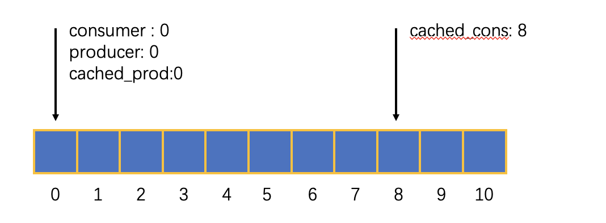
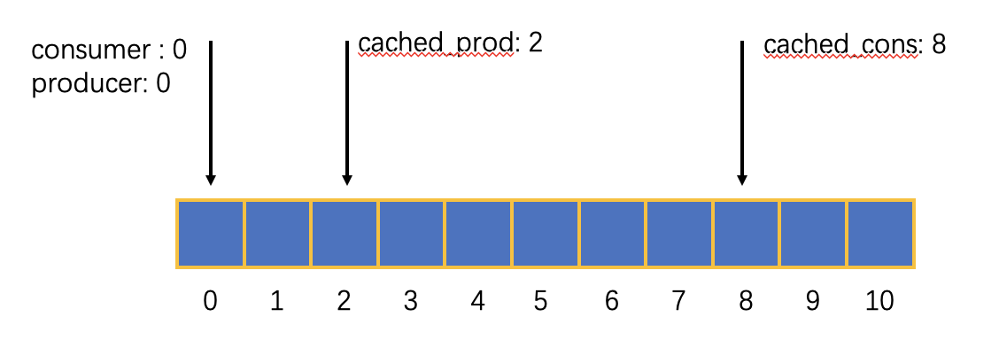
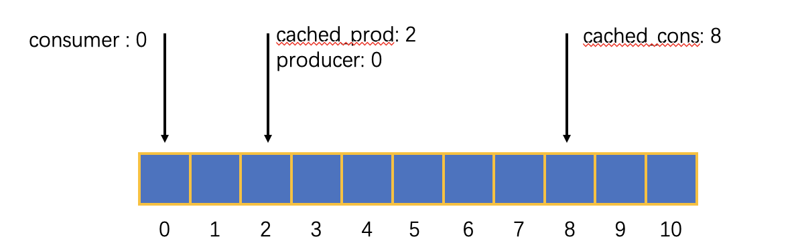
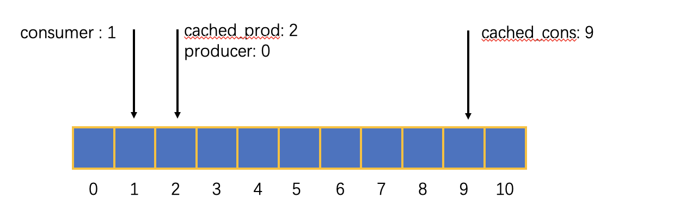
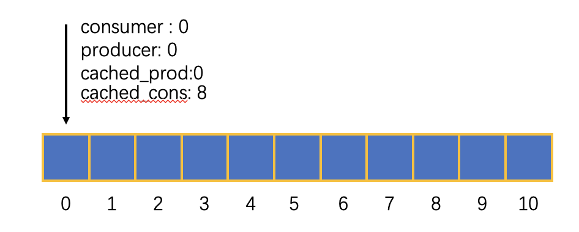
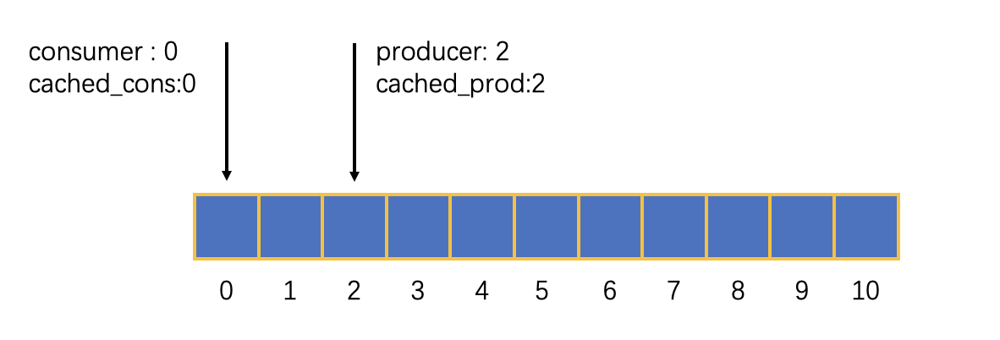
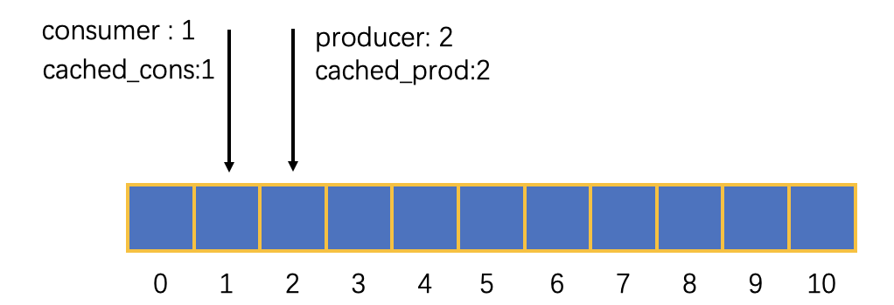
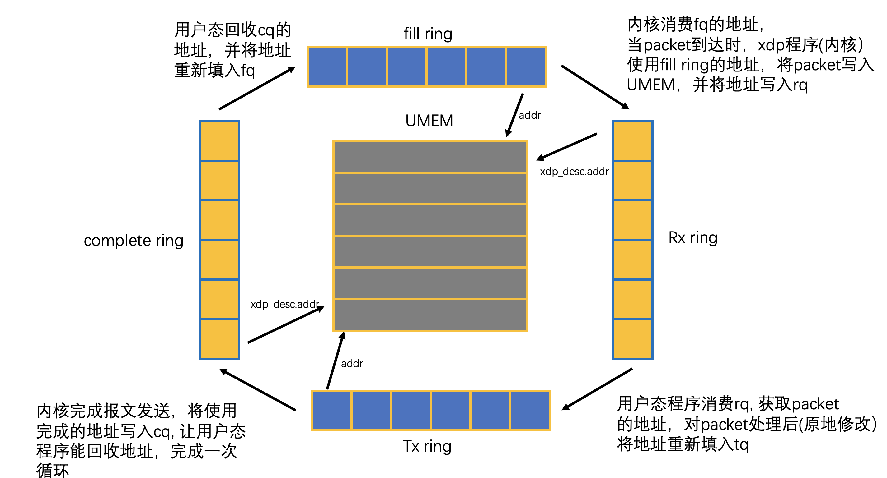
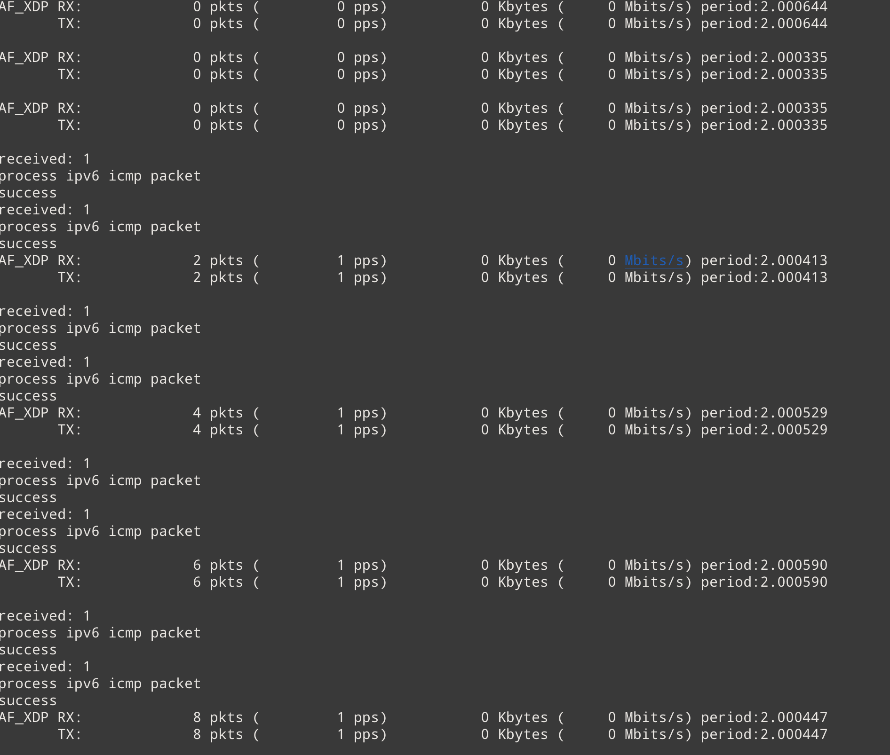
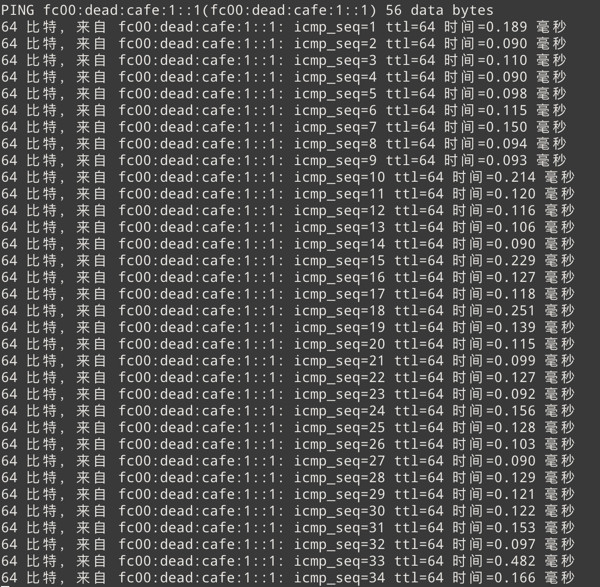

# AF_XDP初步探索

## AF_XDP原理

**概述** 

AF_XDP是一类特殊的socket也被称为XSK, 是为了高性能包处理，提出的一项技术，AF_XDP配合XDP使用。

XSK 建立之后需要绑定在**特定的网卡的特定的特定队列**上， 同时在该设备上加载 xdp 程序。当网络包到达的时候，xdp程序可以根据网络包的内容，选择将packet直接重定向到XSK中，绕过内核网络栈，实现在用户态进行包处理。和DPDK不同的是，如果网络设备的驱动支持，AF_XDP技术可以通过映射用户态和内核态的内存，实现无需将packet拷贝到用户态(ZERO_COPY模式)，进一步提升处理效率。

除了在接受路径上对packet进行重定向之外，也可以通过 XSK 绕过内核网络栈直接将packet发送出去。

因此结合我们项目的需求，我认为利用AF_XDP实现双网络栈从而对 mptcp进行优化是可行的。但是这种优化有一个问题，必须借助XSK, 因此感觉**无法对用户层完全透明** 。

**具体原理** 

AF_XDP 的核心是下面这几个概念： 

### UMEM 

UMEM是一块虚拟的连续的内存区域，UMEM具有以下几个特点： 

1. UMEM 由一个个内存块(chunks)组成, 一个内存块称为一个frame。 一个frame的大小通常是4kB。
2. 每一个XSK都需要attach到一块UMEM上，而一块UMEM可以attach多个XSK, 也就是同一 UMEM可以由多个XSK共享。
3. XSK接收到的packet (通过XDP程序重定向）, 要发送的packet。内容都保存在UMEM中。

### RINGS

UMEM一共有 4 种 ring。ring是一块环形的缓冲区，是一个单生产者单消费者的环形队列。(这意味着如果使用多线程，需要application自己实现同步操作)

整体上来说有两种ring,  生产者ring 和消费者ring。这种ring的类型是根据用户态程序扮演的角色来划分的

* 生产者ring, 用户态程序是生产者往 ring写数据, 内核是消费者.（tx ring, fill ring) 
* 消费者ring, 用户态程序是消费者消费ring的数据, 内核是生产者

源码中的定义如下： 

```c
/* Do not access these members directly. Use the functions below. */
#define DEFINE_XSK_RING(name) \
struct name { \
	__u32 cached_prod; \
	__u32 cached_cons; \
	__u32 mask; \
	__u32 size; \
	__u32 *producer; \
	__u32 *consumer; \
	void *ring; \
	__u32 *flags; \
}

DEFINE_XSK_RING(xsk_ring_prod);
DEFINE_XSK_RING(xsk_ring_cons);
```

对于生产者ring 和 消费者 ring 除了结构体名称不同之外，其余都相同。

数据结构含义如下： 

* cached_prod:  缓存的生产者下标 
* producer:  当前的生产者的位置
* cached_cons: 缓存的消费者下标 
* consumer: 当前的消费者位置
* ring :  环形队列数据区， 环形队列本质上是一个数组，数组长度是用户设定的环形队列的长度，数组的元素是指向 UMEM 的地址（这里的地址指的是相对于UMEM, 所以ring保存的是一个便宜量） 
* size : 环形队列的长度, 所有 ring 的大小都必须是 2 的次方
* mask : 对 idx (后文解释)取掩摸计算数组的下标， mask = size - 1. 、
* flags : 一些设置的flag 

#### 生产者ring 

用户态程序扮演生产者的角色，为了完成一次 produce, 用户态程序需要： 

1. reserver(提前缓存要生产的数目)
2. 往ring里写数据（UMEM的偏移量）
3. submit， 完成一次生产

这三个步骤，操作 cached_prod, cached_cons, producer 指针。并且有相应的帮助函数： 

```c
static inline __u32 xsk_prod_nb_free(struct xsk_ring_prod *r, __u32 nb)
{
	__u32 free_entries = r->cached_cons - r->cached_prod;

	if (free_entries >= nb)
		return free_entries;

	/* Refresh the local tail pointer.
	 * cached_cons is r->size bigger than the real consumer pointer so
	 * that this addition can be avoided in the more frequently
	 * executed code that computs free_entries in the beginning of
	 * this function. Without this optimization it whould have been
	 * free_entries = r->cached_prod - r->cached_cons + r->size.
	 */
	r->cached_cons = *r->consumer + r->size;

	return r->cached_cons - r->cached_prod;
}

static inline size_t xsk_ring_prod__reserve(struct xsk_ring_prod *prod,
					    size_t nb, __u32 *idx)
{
	if (xsk_prod_nb_free(prod, nb) < nb)
		return 0;

	*idx = prod->cached_prod;
	prod->cached_prod += nb;

	return nb;
}

static inline void xsk_ring_prod__submit(struct xsk_ring_prod *prod, size_t nb)
{
	/* Make sure everything has been written to the ring before indicating
	 * this to the kernel by writing the producer pointer.
	 */
	libbpf_smp_wmb();

	*prod->producer += nb;
}
```


**xsk_prod_nb_free** 

* param: 

  1. xsk_ring_prod *r : ring 指针

  2. __u32 nb： number of blocks (用户给定的 frame数目)

* return: 
	实际可供生产者使用的帧数量(也可以理解成队列的元素个数)

该函数给定 nb， 并返回指定队列的实际可用的帧数目。因为可用的帧数目其实是由返回值决定的，nb的主要作用是刷新 cached_cons （之后解释） 

**xsk_ring_prod__reserve**

* param: 

  1. xsk_ring_prod *prod : ring指针

  2.  size_t nb: 用户希望预留的 fram数目

  3.   __u32 *idx: 值返回参数，如果reserve成功，idx被设置为第一个可用的地址（地址idx到数组下标还需要经过mask转化）

* return:
	0 或 nb, 0 ： reserve失败， nb reserve成功

该函数首先调用 xsk_prod_nb_free 获取当前可用的 frames 数目，如果 frames < nb ，返回 0预分配失败。否则讲idx值设置为 prod->cached_prod, 并且将 cached_prod的值往前移nb（因为是只是预分配，所以操作cached_prod)

**xsk_ring_prod__submit** 

* param: 
  1. xsk_ring_prod *prod: ring的指针

* nb: 实际生产的数量

该函数在预分配之后，用户态程序往ring中生产了 nb 个frame后，调用该函数提交生产的数目，该函数操作 produce指针前移nb, 真正完成一次生产。 这里的 ` libbpf_smp_wmb()` 指的是内存栅栏，在源码中的定义为:`asm volatile("" : : : "memory")` 。(以下为个人理解）这是编译器级别的内存栅栏，这句话有两个作用，1. 确保 `libbpf_smp_wmp`之后的代码不会因为编译器优化放到`libbpf_smp_wmp`之前执行（禁止编译器进行乱序优化） 2. 确保读取的变量读取的是内存的最新的值，而不是寄存器或者是cached中的值。 在这里 `xsk_ring_prod__submit`是 static inline类型的函数，当内联展开的时候 `libbpf_smp_wmp`确保指令不会被乱序执行。同时producer指向的地址同时被用户态程序和内核态程序使用（将内核台地址使用mmap 映射到用户态），内存栅栏也确保submit的时候能读到最新的值。

**生产者ring的工作过程** 

现在阐述 producer ring 具体是如何工作。

假设 `ring->size = 8`  因此数组的下标从 0 到 7 

那么 `ring->mask = 0x7 (ring->size-1) `

为了方便表述符号规定如下: 

* `consumer` = `*ring->consuemr`
* `producer`=`*ring->producer`
* `cached_prod `= `ring->cached_prod`
* `cached_cons` = `ring->cached_cons` 

**初始化** 



对于生产者ring来说，稍微难理解的是 `cached_cons`的作用，我个人理解 `cached_cons`的作用起到了标识ring尾部的效果，这样就可以利用 `cached_cons 和 cached_prod` 来计算当前可供生产者使用的 frames。

初始化的时候 cached_cons 被设置为： `consumer + ring->size = 0 + 8 = 8` ， 第 15 行保证  `cached_cons =  consuemr + size` , 第15行代码是为了当用户申请的 nb 数目较大，但是根据 cached_cons 和 cached_prod 计算得到的frames < nb （这可能是因为 cached_cons 没有及时更新导致的），因此第 15 行的代码会刷新 `cached_cons`将其重新设置到尾部，并再次进行计算。

现在调用一次： `xsk_ring_prod__reserve(ring, 2, &idx)` ，用户态程序想要生产两个frame,  首先进行预分配(reserve)

**after reserve 2 frames**

 

可以看到， `cached_prod`往前走了2步，这意味着如果此时调用 `xsk_prod_nb_free` 返回 6 （8-2），因为前两个frame虽然还没有被填入数据，但是已经被预分配出去了，所以剩下的可供生产的 frames 为 6。

值返回参数 idx， 值被设置为 0 ， 也就是一开始 cached_prod 指向的位置。因此只需要一个for循环，递增idx即可生产数据了。

有一个问题，idx的类型是 u32, 因此当 idx > 7时，显然是不能把 idx 直接当作数据下标来使用。 因此实际的下标为 ： `idx & mask` 

就本例来说， 加入 idx = 9 , `9 & 0x7 = 1 ` 因此 idx = 1 和 idx = 9 指向数组的同一个元素。这里相比于使用取摸法，选择了 mask 与的方式来实现环形队列，按位与的效率比取模操作效率要高，但前提是数组的大小是 2 的次方。因此，AF_XDP要求 ring 的 size 必须是 2 的次方。 

现在生产了两个数据，调用 `xsk_ring_prod__submit(ring, 2)`

**after submit** 



这步操作比较简单，将 producer 前移 nb(2)

对于生产者ring, 内核是消费者（内核消费的代码我没有看）， 内核消费ring, 并更新 consumer 和 cached_cons。 

现在假设内核消费了一个数据： 

**after kernel consume 1 frame** 



可以看到，kernel 将 consumer 和 cached_cons 都往前移一位。 此时如果调用 `xsk_prod_nb_free` 将返回 7 （因为内核只消费了一个数据) 。这就是生产者ring 的一次完整的生产过程

#### 消费者ring 

和生产者ring相反，用户态程序充当消费者，为了完成一次consume, 需要： 

1. peek, 预消费, 获取当前能够消费的frames的数目
2. 消费数据
3. release, 释放已经消费过的frames(生产者能够重新生产)

类似的，相关的帮助函数如下： 

```c
static inline __u32 xsk_cons_nb_avail(struct xsk_ring_cons *r, __u32 nb)
{
	__u32 entries = r->cached_prod - r->cached_cons;

	if (entries == 0) {
		r->cached_prod = *r->producer;
		entries = r->cached_prod - r->cached_cons;
	}

	return (entries > nb) ? nb : entries;
}

static inline size_t xsk_ring_cons__peek(struct xsk_ring_cons *cons,
					 size_t nb, __u32 *idx)
{
	size_t entries = xsk_cons_nb_avail(cons, nb);

	if (entries > 0) {
		/* Make sure we do not speculatively read the data before
		 * we have received the packet buffers from the ring.
		 */
		libbpf_smp_rmb();

		*idx = cons->cached_cons;
		cons->cached_cons += entries;
	}

	return entries;
}

static inline void xsk_ring_cons__release(struct xsk_ring_cons *cons, size_t nb)
{
	/* Make sure data has been read before indicating we are done
	 * with the entries by updating the consumer pointer.
	 */
	libbpf_smp_rwmb();

	*cons->consumer += nb;
}
```

**xsk_cons_nb_avail**

* param: 

  1. xsk_ring_cons *r :  ring的指针
  2. nb : 用户需要消费的frames的数目

* return : 

  返回当前可供消费的frames数目， 如果实际可消费frames数目 > nb 返回 nb, 否则返回实际的数目

该函数给定nb, 返回实际可以被消费的frame数目。 

**xsk_ring_cons__peek** 

* param :

  1. struct xsk_ring_cons *cons  ：ring指针
  2. nb : 用户希望 peek 的 frames的数目
  3. idx : 值返回参数，函数返回值，idx的值是第一个可以消费frame的地址（用法和 produce ring 的 idx 类似） 

* return : 

  含义与**xsk_cons_nb_avail** 返回值相同

用户调用该函数，预消费nb个frame的数据，该函数修改 cached_cons ,  将可以消费的第一个地址的值赋给idx(之后可以用一个for循环递增idx，然后消费数据)

**xsk_ring_cons__release** 

* param :
  1. cons : ring的指针
  2. nb :  用户实际已经消费完成的，可以释放的frame的数目

当用户态程序，预消费(xsk_ring_cons__peek)之后，实际消费之后，调用该函数完成消费。

**消费者ring工作过程** 

使用的定义和生产者ring类似。

**初始化** 



和生产者ring有所不同，用户态程序充当的消费者角色， cached_cons在这里没有标识尾部的作用。因此初始化 consumer, producer, cached_prod, cached_cons 均为 0 

**内核生产了2个frame之后** 



**after peak** 

用户态程序peek了一个frame 


**after release** 

消费过程， idx 的含义和生产者ring类似。



### UMEM 4种特殊的 RING

#### Fill Ring

fill ring 是生产者ring,  用户态程序往fill ring中写入可用的 addr (UMEM的偏移，后文的地址如无特殊说明指的都是偏移)， 内核消费 fill ring， 将fill ring提供的地址用于接受路径。因此，fill ring的作用是将地址的所有权从用户态转移到内核态。 一个 UMEM**有且只有一个**fill ring。 如果用户态程序不往 fill ring 生产数据，那么 XSK将接收不到任何数据。

FILL RING是生产者ring ,生产的步骤 （reserve, produce, submit) 在前文生产者ring详细提及。在具体生产的时候，我们获取idx, 并调用函数 ： 

```c
static inline __u64 *xsk_ring_prod__fill_addr(struct xsk_ring_prod *fill,
					      __u32 idx)
{
	__u64 *addrs = (__u64 *)fill->ring;

	return &addrs[idx & fill->mask];
}
```

该函数输入 idx , 并返回数组对应的元素的指针，用户态程序写入可用的地址（偏移量）即可。

#### Complete Ring

Complete ring 是消费者ring , 和 fill ring 相反。内核是生产者，往该 ring 写入使用完成了可以供用户态再次使用的地址，用户态程序消费该ring, 并回收地址。complete ring 将发送路径（tx ring) 使用完成的地址的归属权从内核态转移到用户态。一个UMEM**有且只有一个complete ring**。

Complete ring 和 fill ring 彼此互补，在实际使用，往往需要用户态程序实现地址管理和分配，在用户态程序初始阶段将空闲的地址写入fill ring。随着程序的运行，用户态程序不断消费complete ring, 回收地址，并在合适的时机将回收的地址再次写入fill ring ， 实现一个循环。

Complete ring 是消费者ring, 实际使用需要遵循消费的步骤（peek , 消费， release)。 在具体消费的时候，我们获取idx，并调用函数： 

```c
static inline const __u64 *
xsk_ring_cons__comp_addr(const struct xsk_ring_cons *comp, __u32 idx)
{
	const __u64 *addrs = (const __u64 *)comp->ring;

	return &addrs[idx & comp->mask];
}
```

该函数返回 ring 数组对应元素的指针，值得注意的是该指针被const 修饰，意味着我们只能获取地址，不能修改内容。

#### Rx Ring 

Rx ring 是消费者ring, 如果xdp程序将packet重定向到该XSK, 那么内核往该Ring写入数据。用户态程序消费该ring，获取packet的内容并处理packet。这意味着，对于XSK，接收packet不是通过recv实现的，而是通过消费rx ring 实现的。XSK可以配合 poll select epoll 使用，当poll返回的时候意味着有数据到达，此时消费rx ring 。每一个xdp socket (XSK) 都必须要有一个 rx ring 或者 tx ring 。

rx ring 的元素定义如下： 

```c
struct xdp_desc {
	__u64 addr;    // UMEM 偏移
	__u32 len;     // packet 长度，因为packet不一定占满整个 frame 
	__u32 options;
};
```

rx ring 消费需要遵循 peek, consume , release

在具体消费的时候，调用该函数： 

```c
static inline const struct xdp_desc *
xsk_ring_cons__rx_desc(const struct xsk_ring_cons *rx, __u32 idx)
{
	const struct xdp_desc *descs = (const struct xdp_desc *)rx->ring;

	return &descs[idx & rx->mask];
}
```

返回 xdp_desc的指针。

可以使用下面这个函数获取 packet的指针： 

```c
static inline void *xsk_umem__get_data(void *umem_area, __u64 addr)
{
	return &((char *)umem_area)[addr];
}
```

配合 len 即可访问 packet。 

#### tx ring 

Tx ring是生产者ring， Tx ring 作用于发送路径，用户态向tx ring写入**xdp_desc** 结构体(包含地址addr 和 长度len), 内核消费tx ring。有别于rx ring, 生产完成时候，用户态程序还需要主动调用 `sendto` 才能触发内核发送packet。eg : 

`sendto(xsk_socket__fd(xsk->xsk), NULL, 0, MSG_DONTWAIT, NULL, 0);` 

XSK 发送数据和普通的 socket 不同，sendto 只是一个触发动作，真正要发送的内容由用户态向tx ring 写入的 xdp_desc结构体制定，该结构体的addr指向 UMEM的一块内存区域，也就是packet的地址，len指定了要发送的packet的长度。

还有一个问题需要解决：XSK是如何对packet进行处理的？ 在 rx ring中我们提到，消费rx ring可以获取 packet的地址。因此在接收到packet之后，我们可以直接在原有的packet上进行修改（原地修改），然后再将改地址和新的packet长度重新写回  tx ring。这样可以减少一次packet拷贝，进一步提升效率。每一个xdp socket (XSK) 都必须要有一个 rx ring 或者 tx ring 

tx ring 的元素定义如下：(和  rx ring 是一样的) 

```c
struct xdp_desc {
	__u64 addr;
	__u32 len;
	__u32 options;
};
```

tx ring 的生产同样也需要 reserve, produce , submit 

在具体生产的时候，调用该函数： 

```c
static inline struct xdp_desc *xsk_ring_prod__tx_desc(struct xsk_ring_prod *tx,
						      __u32 idx)
{
	struct xdp_desc *descs = (struct xdp_desc *)tx->ring;

	return &descs[idx & tx->mask];
}

```

输入idx, 返回 tx ring 元素的指针。

### AF_XDP原理图

下图阐述了，ring 元素和 UMEM的关系，以及四种ring的数据流动




下图阐述了， ring 和 XSK以及 UMEM的关系


* 一个XSK 必须有一个 tx ring 或者 rx ring 
* 多个XSK 可以共享同一个UMEM
* 同一个UMEM只能有一个 fill ring 和 completion ring 
* ring 的元素是指向 UMEM 的地址（偏移） 

## 如何使用AF_XDP

为了使用 AF_XDP, 我们需要： 

1. 内核态的 xdp程序，也就是attach到特定设备的， 类型为 xdp的 BPF(ebpf)程序。 xdp程序负责根据packet的内容，将packet重定向到xsk 
2. 用户态的 xsk 程序，创建xsk, 创建umem,  和 ring，并将其绑定，然后消费ring , 完成对packet的接收和处理

### 内核态xdp程序

这不是本文叙述的观点，因此强调一下重点。

重点在于 xdp 程序的返回码是重定向类型的返回码

eg : 

```c 
/* A set entry here means that the correspnding queue_id
     * has an active AF_XDP socket bound to it. */
    if (bpf_map_lookup_elem(&xsks_map, &index))
        return bpf_redirect_map(&xsks_map, index, 0);
```

```c
/*
 * bpf_redirect_map
 *
 * 	Redirect the packet to the endpoint referenced by *map* at
 * 	index *key*. Depending on its type, this *map* can contain
 * 	references to net devices (for forwarding packets through other
 * 	ports), or to CPUs (for redirecting XDP frames to another CPU;
 * 	but this is only implemented for native XDP (with driver
 * 	support) as of this writing).
 *
 * 	The lower two bits of *flags* are used as the return code if
 * 	the map lookup fails. This is so that the return value can be
 * 	one of the XDP program return codes up to XDP_TX, as chosen by
 * 	the caller. Any higher bits in the *flags* argument must be
 * 	unset.
 *
 * 	When used to redirect packets to net devices, this helper
 * 	provides a high performance increase over **bpf_redirect**\ ().
 * 	This is due to various implementation details of the underlying
 * 	mechanisms, one of which is the fact that **bpf_redirect_map**\
 * 	() tries to send packet as a "bulk" to the device.
 *
 * Returns
 * 	**XDP_REDIRECT** on success, or **XDP_ABORTED** on error.
 */
static int (*bpf_redirect_map)(void *map, __u32 key, __u64 flags) = (void *) 51;
```

我们提到， XSK是需要绑定在特定设备的特定队列上的，为了实现重定向， XDP程序需要

1. 查找 xsks_map, 查找的key 是 index 即该packet对应的queue 
2. bpf_redirect_map 调用函数，进行重定向，如果找不到这个queue, 我们可以指定行为（drop 或者是 pass 交给内核网络栈处理）

### 用户态的XSK程序

我们可以将用户态的 XSK 程序划分为 ： 

1. XSK 初始化（ 包括 UMEM初始化，设置 fq, cq，XSK初始化，设置 rq fq, 并将其绑定...) 
2. 向 fill ring  生产数据
3. 消费 rx ring 的数据
4. 向 tx ring 生产数据
5. 消费complete ring 的数据

#### XSK初始化

XSK初始化，如果没有xsk提供的帮助函数(./tools/lib/bpf/xsk.h)，是非常繁琐且复杂的。如果详细了解可以阅读，(./tools/lib/bpf/xsk.h, ./tools/lib/bpf/xsk.c ) (./samples/bpf/xdpsock_user.c)  ps: linux 源代码下。这里篇幅所限，不做详细解释，下文主要是基于 xsk.h 的帮助函数，解释函数参数的含义，和使用方法。

1. **创建并设置UMEM**

```c
struct xsk_umem_config {
	__u32 fill_size;
	__u32 comp_size;
	__u32 frame_size;
	__u32 frame_headroom;
	__u32 flags;
};

//从源码来看，config默认配置如下： 
//	  cfg->fill_size = XSK_RING_PROD__DEFAULT_NUM_DESCS;    2048
//    cfg->comp_size = XSK_RING_CONS__DEFAULT_NUM_DESCS;    2048
//    cfg->frame_size = XSK_UMEM__DEFAULT_FRAME_SIZE;       4096 4kB(1<<12)
//    cfg->frame_headroom = XSK_UMEM__DEFAULT_FRAME_HEADROOM; 0
//    cfg->flags = XSK_UMEM__DEFAULT_FLAGS; 0
//    flags的取值我还没有找到文档和用法

struct xsk_umem {
	struct xsk_ring_prod *fill;
	struct xsk_ring_cons *comp;
	char *umem_area;
	struct xsk_umem_config config;
	int fd;
	int refcount;
};

#define DEFINE_XSK_RING(name) \
struct name { \
	__u32 cached_prod; \
	__u32 cached_cons; \
	__u32 mask; \
	__u32 size; \
	__u32 *producer; \
	__u32 *consumer; \
	void *ring; \
	__u32 *flags; \
}

DEFINE_XSK_RING(xsk_ring_prod);
DEFINE_XSK_RING(xsk_ring_cons);

/* Set config to NULL to get the default configuration. */
LIBBPF_API int xsk_umem__create(struct xsk_umem **umem,
				void *umem_area, __u64 size,
				struct xsk_ring_prod *fill,
				struct xsk_ring_cons *comp,
				const struct xsk_umem_config *config);
```

**xk_umem_config** 

1. fill_size: fill ring 的长度
2. comp_size: complete ring 的长度
3. frame_size : frame的大小，单位为 byte
4. frame_headroom:   packet 实际存放的起始地址是  addr(frame) + frame_headroom,  如果我们需要对packet进一步包装（外面再套一层）那么就可以设置该参数
5. Flags: 选项，默认是 0 ， 我目前还没找到相关的文档

**xsk_umem__create**

参数： 

**struct xsk_umem \*\*umem** :  值返回参数， 如果成功了 umem 被设置为 xsk_umem__create 函数创建的 xsk_umem 指针

说明一下 xsk_umem结构体

1. fill : 描述fill ring 的指针，如果成功 fill 被设置为参数传入的 fill(直接把地址填进去
2. comp: 描述complete ring 的指针， 其余同fill 
3. umem_area :  UMEM的指针，也就是UMEM的起始地址
4.  struct xsk_umem_config config:  创建UMEM使用的配置
5. fd：XSK的描述符。  调用该函数的时候，该函数会同时创建类型AF_XDP的socket(因为一个umem至少要绑定一个socket)
6. refcount:  引用计数，用来标识该umem被引用次数，调用该函数，该值被设为1 。 引用计数主要是为了用来判断当前和该UMEM绑定的socket数目。（这个主要在多个socket 绑定同一个 umem 的时候使用） 


## 实验结果

程序运行效果




