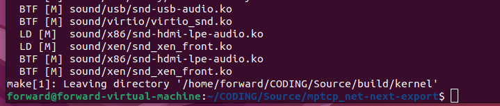

# 编译内核

## 传统编译(X86)

在虚拟机上利用Makefile直接编译安装内核

安装一些必要的依赖

```bash
sudo apt-get install build-essential libncurses-dev bison flex libssl-dev libelf-dev
```

对照内核文档检查[Minimal Requirements](https://www.kernel.org/doc/html/latest/process/changes.html#changes)

检查过程中补充了以下内容

``` bash
sudo apt-get install pahole
sudo apt-get install jfsutils
sudo apt-get install reiserfsprogs
sudo apt-get install xfsprogs
sudo apt-get install btrfs-progs
sudo apt-get install quota
sudo apt-get install nfs-common
sudo apt-get install udev
```

(mcelog未安装)

```bash
make O=/home/forward/CODING/Source/build/kernel menuconfig
make O=/home/forward/CODING/Source/build/kernel -j 4
```

遇到问题：


修改.config文件，`CONFIG_SYSTEM_TRUSTED_KEYS`、`CONFIG_SYSTEM_REVOCATION_KEYS`置为空


12：15开始编译，13:40结束。编译完成后：



之后，安装内核模块：

```bash
sudo make O=/home/forward/CODING/Source/build/kernel modules_install
```


最后，安装内核本身：

```bash
sudo make O=/home/forward/CODING/Source/build/kernel install
```

更改grub，重启内核后，选择对应内核版本：


### 参考

https://www.kernel.org/doc/html/latest/admin-guide/README.html?highlight=documentation+process+changes+rst

https://www.kernel.org/doc/html/latest/process/changes.html#changes

https://zhuanlan.zhihu.com/p/453345990

https://cloud.tencent.com/developer/article/1114403

## make deb-pkg

打包生成deb：

在make时候加上deb-pkg即可在上一级目录生成对应`.deb`文件，此处为服务器上打包成功截图：


### 参考

https://www.listera.top/deepinbian-yi-xin-nei-he/

https://unix.stackexchange.com/questions/238469/difference-between-make-kpkg-and-make-deb-pkg

https://www.cnblogs.com/wwang/archive/2011/01/07/1929486.html


## 交叉编译(X86->arm64)

### Ubuntu18.04

下载安装工具链

http://releases.linaro.org/components/toolchain/binaries/latest-7/aarch64-linux-gnu/


对应服务器Ubuntu18.04 gcc7.5的版本选用图中工具链

拷贝默认配置：

```bash
cp ./arch/arm64/configs/defconfig .config
```

配置选项：

```bash
make ARCH=arm64 CROSS_COMPILE=aarch64-linux-gnu- menuconfig
```


编译打包deb：

```bash
make -j8 deb-pkg ARCH=arm64 CROSS_COMPILE=aarch64-linux-gnu-
```


### Ubuntu 22.04.1

由于一开始在服务器Ubuntu18.04上交叉编译未能成功，退而使用虚拟机Ubuntu22.04.1进行编译

安装最新的交叉编译工具链

https://developer.arm.com/downloads/-/arm-gnu-toolchain-downloads


之后按照同样的步骤进行编译：

```bash
make ARCH=arm64 CROSS_COMPILE=aarch64-none-linux-gnu- menuconfig
```

```bash
make -j4 deb-pkg ARCH=arm64 CROSS_COMPILE=aarch64-none-linux-gnu-
```

成功编译：


并在树莓派上安装了相应的deb文件：


[修改grub](https://blog.csdn.net/bby1987/article/details/104264285)后重启，**未能使用**已安装的内核版本

目前估计是树莓派固件不支持 导致无法升级

也有可能是 直接编译Linux内核源码无法适用于树莓派


### 参考

https://zhuanlan.zhihu.com/p/115173146

https://blog.csdn.net/Luckiers/article/details/124531266

https://segmentfault.com/a/1190000020955640

https://www.cnblogs.com/cqwo/p/15420530.html

https://xuchengpeng.com/cross-compile-arm64-kernel.html


## 问题记录

常见问题：


https://blog.csdn.net/qq_36393978/article/details/118157426


交叉编译问题：

 


其中，缺少auto.conf问题，在Ubuntu22.04上未出现，在Ubuntu18.04上也不影响后续编译

而`Detected assembler with broken ...`问题，由于**命令**问题，未能使用正确的交叉编译工具链，应为`CORSS_COMPILE`！！！

这也是之前在服务器上未能成功编译的根本原因