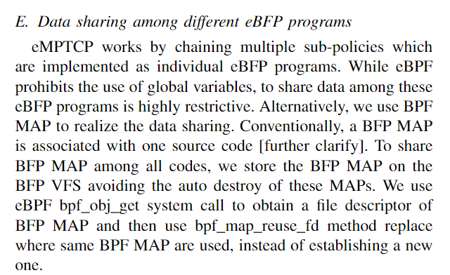

## BPF MAP 的机制

正常来说在，一个源文件中的多个BPF程序可以共享同一个BPF MAP，例如对于一下的代码（在一个源文件中） 

```c
struct {
    __uint(type, BPF_MAP_TYPE_PROG_ARRAY);
    __type(key, int);
    __type(value, int);
    __uint(max_entries, MAX_XDP_ACTION_NUM);
} xdp_actions SEC(".maps");
//xdp_actions是一个BPF MAP 

SEC("xdp")
int xdp_prog1(void *ctx) {
    bpf_map_lookup_elem(&xdp_actions ,.....)；  //使用 bpf map 
}

SEC("xdp")
int xdp_prog2(void *ctx) {
    bpf_map_lookup_elem(&xdp_actions ,.....)   //使用 bpf map 
}
```

有一个BPF MAP， 和两个 xdp 程序，这两个程序无需做额外的操作就可以共享这个BPF MAP 

原理：

1. 在使用 llvm 编译该源文件的时候，在使用到bpf map 的地方（通过指针 &xdp_actions)  并不是填入一个地址，而是填一个占位符。
2. 当加载 编译后的 .o文件时， 加载器会扫描源文件中的 BPF MAP ，并且在用户态创建该map, 并获得文件描述符 fd（例如这里的 xdp_actions就会有一个文件描述符)
3. 加载器扫描 .o文件，对于所有使用到这个 Bpf map 的地方，用2 获得的fd 替换 1中的占位符。

但是，如果BPF程序分散在多个源文件中，eg 

src 1: 

```c
struct {
    __uint(type, BPF_MAP_TYPE_PROG_ARRAY);
    __type(key, int);
    __type(value, int);
    __uint(max_entries, MAX_XDP_ACTION_NUM);
} xdp_actions SEC(".maps");
//xdp_actions是一个BPF MAP 

SEC("xdp")
int xdp_prog1(void *ctx) {
    bpf_map_lookup_elem(&xdp_actions ,.....)   //使用 bpf map 
}
```

src 2: 

```	c
struct {
    __uint(type, BPF_MAP_TYPE_PROG_ARRAY);
    __type(key, int);
    __type(value, int);
    __uint(max_entries, MAX_XDP_ACTION_NUM);
} xdp_actions SEC(".maps");
//xdp_actions是一个BPF MAP 

SEC("xdp")
int xdp_prog2(void *ctx) {
    bpf_map_lookup_elem(&xdp_actions ,.....)   //使用 bpf map 
}
```

在正常的编译，加载流程下（1中的流程），这两个 prog不会共享同一个 map, 会使用不同的map。

也就是说会有两个 xdp_actions

因此为了实现多个源文件共享同一个 bpf map。我们需要在

`当加载 编译后的 .o文件时， 加载器会扫描源文件中的 BPF MAP ，并且在用户态创建该map, 并获得文件描述符 fd（例如这里的 xdp_actions就会有一个文件描述符)`

做这一步的时候，让多个 .o文件的 xdp_actions使用同一个 fd。

我们的做法是（以上面的代码为例）

1. 加载 src1.o时，创建 xdp_actions, 获取 fd,  并将其 pin 到 bpf 虚拟文件系统(pin 并不是必须的，pin的目的是为了，在加载例程结束之后，其它的用户态进程能够通过 BPF VFS(虚拟文件系统)获取该BPF MAP的文件描述符)
2. 在加载 src2.o之前， 使用 libbpf 的 bpf_map__reuse_fd API,  使用 第一步中获取的 fd 来作为 src2.o 中 xdp_actions的fd，而不是创建它
3. 这样两个 程序可以共享同一个bpf map 


用一句话简单概括：分散在不同文件里的 BPF 程序不能直接共享同一个 BPF MAP, 需用通过 

bpf_map__reuse_fd 复用不同文件中的 BPF MAP FD，从而实现共享。


