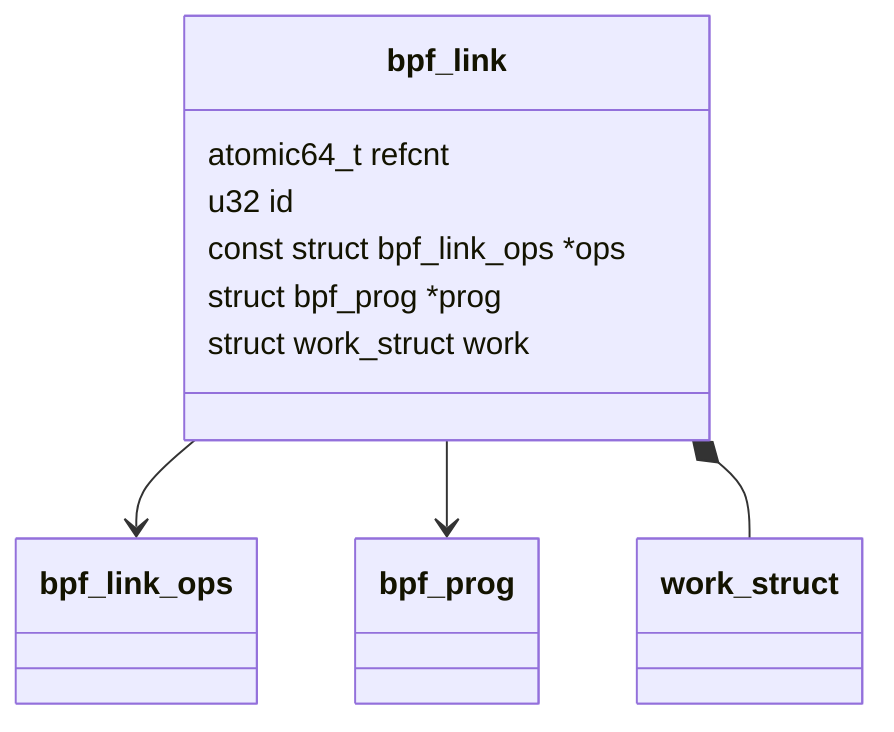

# BPF Link Kernel 

## 数据结构

### struct bpf_link 




```c
struct bpf_link {
	atomic64_t refcnt;
	u32 id;
	enum bpf_link_type type;
	const struct bpf_link_ops *ops;
	struct bpf_prog *prog;
	struct work_struct work;
};

```


## 函数逻辑

### bpf_link_init 

`void bpf_link_init(struct bpf_link *link, enum bpf_link_type type,  const struct bpf_link_ops *ops, struct bpf_prog *prog) `

```c
void bpf_link_init(struct bpf_link *link, enum bpf_link_type type,
		   const struct bpf_link_ops *ops, struct bpf_prog *prog)
{
	atomic64_set(&link->refcnt, 1);   //设置引用计数
	link->type = type;
	link->id = 0;
	link->ops = ops;
	link->prog = prog;   //和prog建立关系
}
```

**ops** : 不同类型的prog有不同类型的 bpf_link_ops, 例如 对于 struct_op 来说 为： `bpf_struct_ops_link_lops` 

## 编程技巧

