## eBPF内核文档阅读笔记(based on linux 5.19)

### 验证器

**不能load未赋值的寄存器** 

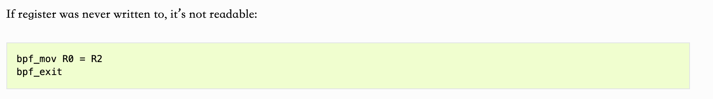

**load/store指令只能用于特定的寄存器类型** 

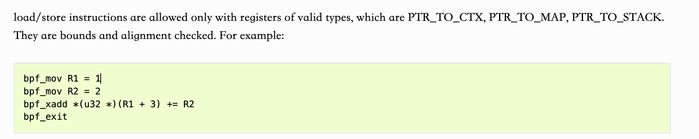

**不同的eBPF程序支持不同的函数集**

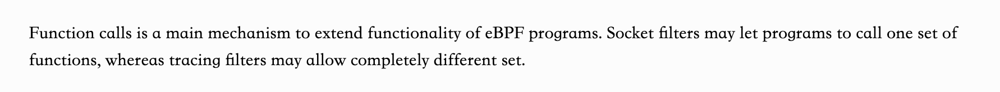

**eBPF程序会追踪每一个寄存器的取值范围，包括标量的取值和指针的Offset** 

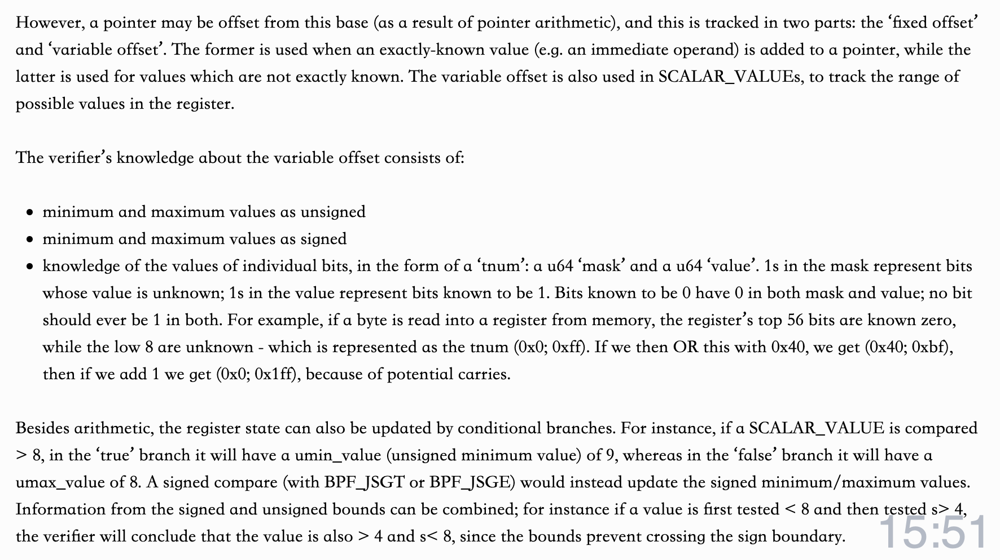

**eBPF程序对于指针寄存器的variable offset 保存id, 共享检查状态** (暂时这么理解)

暂时理解为，如果一个拥有 variable offset 的指针寄存器 check了，它的copy由于拥有相同的Id,也被check了

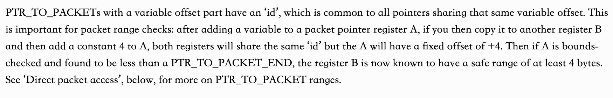

**eBPF验证器使用Directly Packet Access验证的例子** 

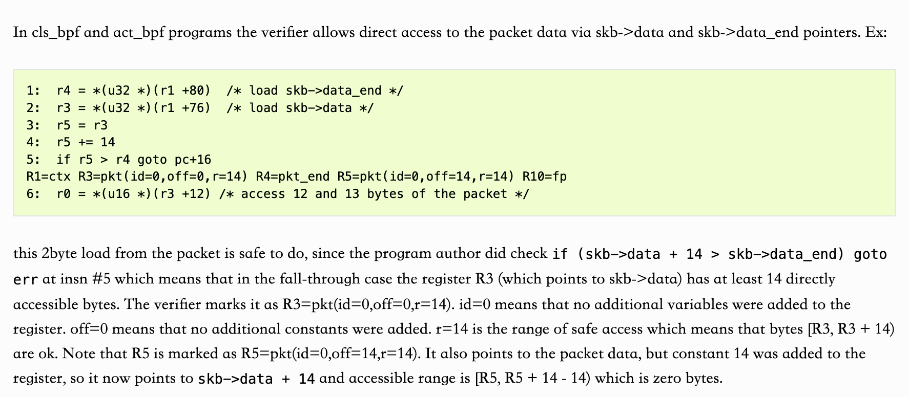

这里也体现了，验证了R5之后 R3也一起被验证了

**Directly Memory Access的验证范围问题(很重要感觉经常犯错出现）**

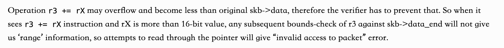

* 意味着 Directly Memory Access 在验证的时候是可以使用变量的，也就是上面提到的 variable offset 
* 但是 rx不能大于 16 字节，否则会导致溢出，r3 < data ，导致无法验证范围，这也是 **invalid access to packet** 的报错原因之一。

**eBPF验证器的剪枝逻辑**

如果之前验证过了没问题，那么在同等条件或者更严格条件下进行验证也没有问题

`regsafe().  states_equal().`

### eBPF验证器常见错误

**不可达的指令** 

(如果是用 presdo-C 然后 LLVM编译器编译一般不会出现这样的事情)

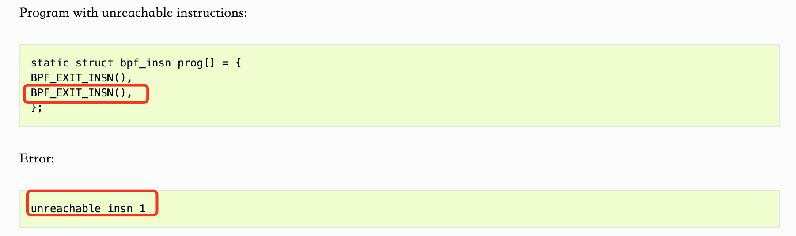

**read没有初始化的寄存器** 

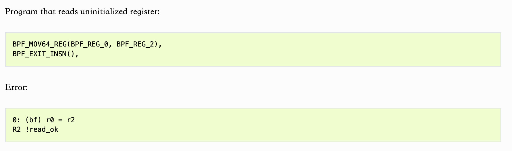

**没有返回值，没有设置R0** 

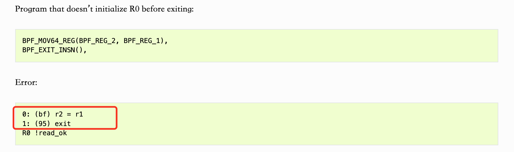

**Stack指针越界** 

堆栈往往位于最底部，所以offset范围是 [-MAX_STACK, R10)

**堆栈没有赋值就传递地址** 

(常见，struct 没有用 __builtin_memset初始化)

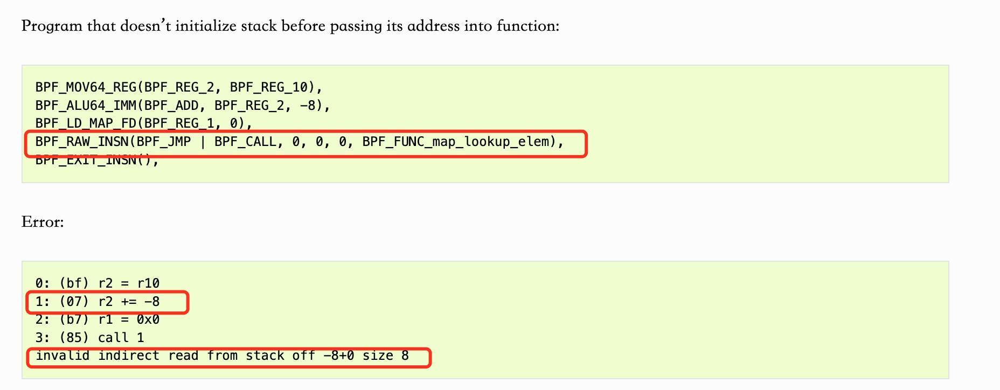

**BPF map fd为0**

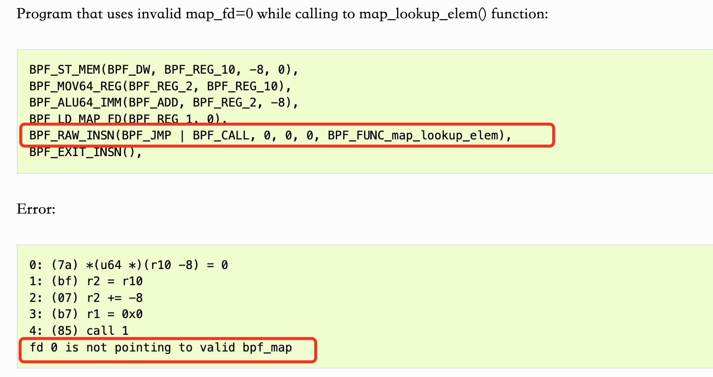

**没有检查bpf_map_lookup 的返回值** 

原因是执行lookup 之后会把寄存器的指针类型设置为 **PTR_TO_MAP_VALUE_OR_NULL** 不允许对该指针执行算数操作，即 5里的 r0 + 0

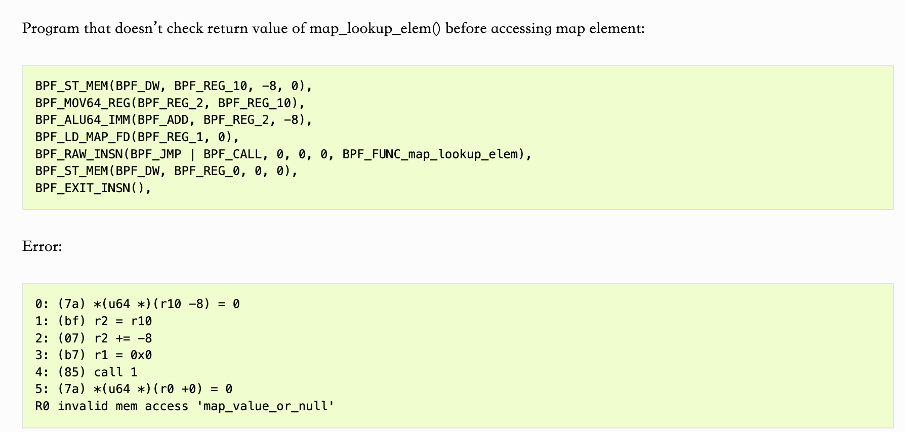

**访问没有对齐** 

这里读 8 个字节，但是 却是 r0 + 4， 没有内存对齐（正确的对齐例如 r0 + 8) 

所以说 eBPF也会检查访问的对齐

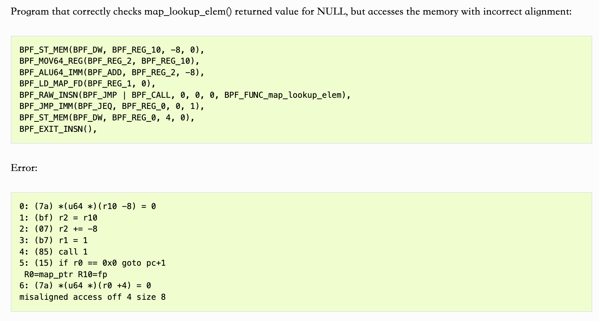

**Socket Ptr相关** 

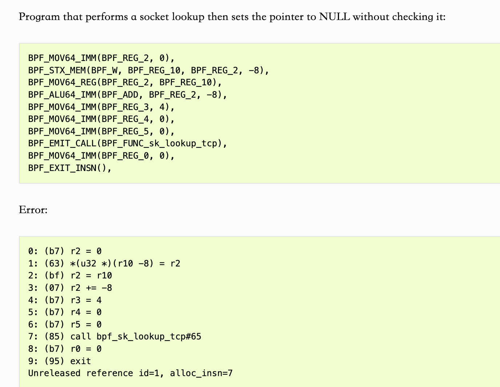

socket Ptr check之后 reference 会加一。这里没有check直接设置为NULL 可能导致 引用泄漏(个人理解)

同样的没有check也会报错。

