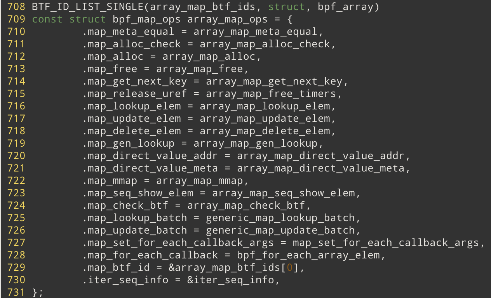

# Map Ops of BPF_MAP_TYPE_ARRAY

## 数据结构

### array_map 实现的ops



### bpf_array

```c

struct bpf_array {
	struct bpf_map map;
	u32 elem_size;
	u32 index_mask;
	struct bpf_array_aux *aux;
	union {
		char value[0] __aligned(8);
		void *ptrs[0] __aligned(8);
		void __percpu *pptrs[0] __aligned(8);
	};
};
```

### bpf_array_aux

```c
struct bpf_array_aux {
	/* Programs with direct jumps into programs part of this array. */
	struct list_head poke_progs;
	struct bpf_map *map;
	struct mutex poke_mutex;
	struct work_struct work;
};
```

## 代码逻辑

### **array_map_alloc_check**

该函数比较简单，负责对MAP创建的flags进行检查。部分类型的FLAG只有部分类型的MAP才能使用

```c
int array_map_alloc_check(union bpf_attr *attr)
{
	bool percpu = attr->map_type == BPF_MAP_TYPE_PERCPU_ARRAY;
	int numa_node = bpf_map_attr_numa_node(attr);

	/* check sanity of attributes */
	if (attr->max_entries == 0 || attr->key_size != 4 ||
	    attr->value_size == 0 ||
	    attr->map_flags & ~ARRAY_CREATE_FLAG_MASK ||
	    !bpf_map_flags_access_ok(attr->map_flags) ||
	    (percpu && numa_node != NUMA_NO_NODE))
		return -EINVAL;

	if (attr->map_type != BPF_MAP_TYPE_ARRAY &&
	    attr->map_flags & (BPF_F_MMAPABLE | BPF_F_INNER_MAP))
		return -EINVAL;

	if (attr->map_type != BPF_MAP_TYPE_PERF_EVENT_ARRAY &&
	    attr->map_flags & BPF_F_PRESERVE_ELEMS)
		return -EINVAL;

	if (attr->value_size > KMALLOC_MAX_SIZE)
		/* if value_size is bigger, the user space won't be able to
		 * access the elements.
		 */
		return -E2BIG;

	return 0;
}
```

### array_map_alloc

->  `bool percpu = attr->map_type == BPF_MAP_TYPE_PERCPU_ARRAY;`

-> `int numa_node = bpf_map_attr_numa_node(attr);`

-> `u32 elem_size, index_mask, max_entries; u64 array_size, mask64; struct bpf_array *array; `   声明临时变量

-> `bool bypass_spec_v1 = bpf_bypass_spec_v1();` **??这个bypass_spec_v1有什么用**

​	--> `return perfmon_capable();`

-> `elem_size = round_up(attr->value_size, 8);`  和BPF_HASH类似，向上取整到8的倍数

-> `max_entries = attr->max_entries;` 

-> manually `roundup_pow_of_tow()` 

​	--> `mask64 = fls_long(max_entries - 1);`  

​	--> `mask64 = 1ULL << mask64;` 

​	-->`mask64 -= 1;`

-> `index_mask = mask64` 

-> `if  (!bypass_spec_v1)  ` **??why**

​	--> `max_entries = index_mask + 1;`

​	--> `check for overflow` 

-> `array_size = sizeof(*array);` 

-> `if (percpu) `  计算percpu array 的 array size 

​	--> `array_size += (u64) max_entries * sizeof(void *);`    和 BPF_HASH类似，如果类型是percpu的话，那么value size是一个指针

-> `else`  非percpu array 的array size

​	--> `if (attr->map_flags & BPF_F_MMAPABLE)` **对于mmapable的需要地址根据page size对齐**

​		---> `array_size = PAGE_ALIGN(array_size);`

​		---> `array_size += PAGE_ALIGN((u64) max_entries * elem_size);` 

​	--> `else` 

​		---> `array_size += (u64) max_entries * elem_size;` 

-> `if (attr->map_flags & BPF_F_MMAPABLE) `  分配 mmapable的memory 

​	--> `void *data = bpf_map_area_mmapable_alloc(array_size, numa_node);`  (size 可以直接使用)

​	--> `array = data + PAGE_ALIGN(sizeof(struct bpf_array)) -  offsetof(struct bpf_array, value);` 因为在前面计算大小的时候，对sizeof(array) 按照 page_size进行对其，所以这里选择从第二个page作为array value的开始，从而计算出array的实际地址(浪费了一部分内存, 相对应的在free的时候需要根据 array的地址 计算出 data的地址)

-> `else` 

​	--> `array = bpf_map_area_alloc(array_size, numa_node);` 

-> `array->index_mask = index_mask;` 

-> `array->map.bypass_spec_v1 = bypass_spec_v1;` 

-> `bpf_map_init_from_attr(&array->map, attr);` 设置通用的 map属性，**自己写map的时候 最后也记得调用一下这个帮助函数**

-> `array->elem_size = elem_size;` 

-> `if (percpu && bpf_array_alloc_percpu(array))` 

​	--> `bpf_array_alloc_percpu(array)`

​		---> `for (i = 0; i < array->map.max_entries; i++) ` 

​			----> `ptr = bpf_map_alloc_percpu(&array->map, array->elem_size, 8, GFP_USER | __GFP_NOWARN);` 分配 percpu内存

​			----> `	array->pptrs[i] = ptr;`  记录 offset  

-> `return &array->map` 

### array_map_free

-> `struct bpf_array *array = container_of(map, struct bpf_array, map);` 

-> free kptrs in maps  **释放map里保存的 kptr**  **??kptr机制**

-> `if (array->map.map_type == BPF_MAP_TYPE_PERCPU_ARRAY)` 

​	--> `bpf_array_free_percpu(array);` 

​		---> `for (i = 0; i < array->map.max_entries; i++) ` 

​			----> `free_percpu(array->pptrs[i]);` **调用 free_percpu 来释放 alloc的percpu变量**

​			----> `cond_resched()` 

-> `if (array->map.map_flags & BPF_F_MMAPABLE)` 

​	--> `bpf_map_area_free(array_map_vmalloc_addr(array));` 

​		---> `(void *)round_down((unsigned long)array, PAGE_SIZE);`  根据array的地址按照page_size向下取整计算一开始分配的data 

-> `else` 

​	--> `bpf_map_area_free(array);` **可以调用该函数来释放分配的内存**

### array_map_lookup_elem

-> `struct bpf_array *array = container_of(map, struct bpf_array, map);` 

-> `u32 index = *(u32 *)key;` 获取array的index 

-> ` return array->value + array->elem_size * (index & array->index_mask);`  返回array的地址 可以看到是没有做什么并发保护的，并且也没有使用RCU机制，**??因此推测还是必须要使用 bpf_spin_lock才能保证同步**

### percpu_array_map_lookup_elem

### percpu_array_map_lookup_percpu_elem

### array_map_update_elem

-> `struct bpf_array *array = container_of(map, struct bpf_array, map);`

-> `u32 index = *(u32 *)key; char *val;`

-> `if (array->map.map_type == BPF_MAP_TYPE_PERCPU_ARRAY)` 

​	--> `memcpy(this_cpu_ptr(array->pptrs[index & array->index_mask]), value, map->value_size);` `this_cpu_ptr`将offset转化为 percpu section里的指针

-> `else` 

​	--> `val = array->value + array->elem_size * (index & array->index_mask);` 计算指针的位置

​	-->`if (map_flags & BPF_F_LOCK)`

​		---> `copy_map_value_locked(map, val, value, false);`  

​			----> `lock = dst + map->spin_lock_off;`  使用保存在map中的 spinlock

​			----> `preempt_disable();` 关闭抢占

​			----> `__bpf_spin_lock_irqsave(lock);` 

​			----> `copy_map_value(map, dst, src);`  **之后可以调用该函数来复制**

​			----> `__bpf_spin_unlock_irqrestore(lock);` 

​			----> `preempt_enable();` 

​	--> `else` 

​		---> `copy_map_value(map, val, value);` 

​	--> `	check_and_free_fields(array, val);`  **释放 timmer 和 kptr**

-> `return 0` 

### array_map_delete_elem 

```c
static int array_map_delete_elem(struct bpf_map *map, void *key)
{
	return -EINVAL;
}
```

### array_map_check_btf

### array_map_seq_show_elem 

