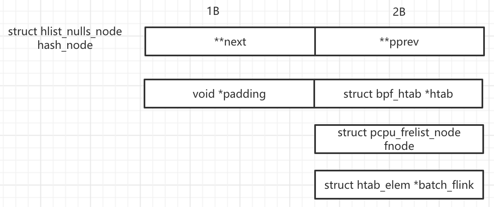
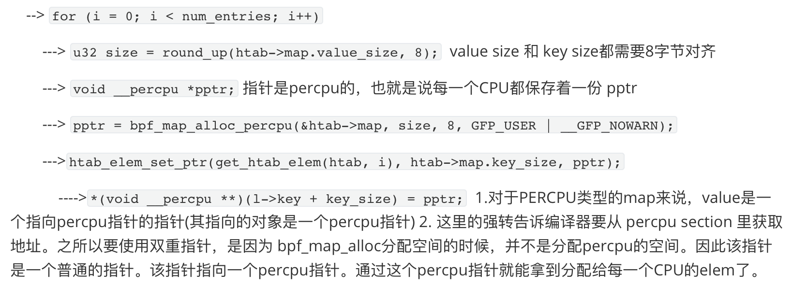

# Map Ops of BPF_MAP_TYPE_HASH 

## 数据结构

bpf_maps_ops 定义在 `./kernel/bpf/hashtab.c` 中


从 BTF_ID_LIST_SINGLE 来看， BPF_MAP_TYPE_HASH 对应一种 BTF id (BTF 文档里的最后一部分，有时间再check一下), 同一类的内核数据结构的BTF可以使用链表或者 set 组织起来。

### struct bucket

```c 
struct bucket {
	struct hlist_nulls_head head;
	union {
		raw_spinlock_t raw_lock;
		spinlock_t     lock;
	};
};
```

对hash进行同步操作的时候，对bucket上锁？

### struct bpf_htab 

```c
struct bpf_htab {
	struct bpf_map map;
	struct bucket *buckets;
	void *elems;
	union {
		struct pcpu_freelist freelist;
		struct bpf_lru lru;
	};
	struct htab_elem *__percpu *extra_elems;
	atomic_t count;	/* number of elements in this hashtable */
	u32 n_buckets;	/* number of hash buckets */
	u32 elem_size;	/* size of each element in bytes */
	u32 hashrnd;
	struct lock_class_key lockdep_key;
	int __percpu *map_locked[HASHTAB_MAP_LOCK_COUNT];
};

```

**struct lock_class_key lockdep_key;** 

动态锁，在使用之前需要先调用`lockdep_register_key(&htab->lockdep_key);`   注册。在free之前需要调用 `lockdep_unregister_key(&htab->lockdep_key);` 

**u32 hashrnd** 

哈希表的随机种子。如果设置了`BPF_F_ZERO_SEED`那么 hashrnd 为 0 

**struct htab_elem *__percpu *extra_elems;**

对于BPF_MAP类型是 `BPF_MAP_TYPE_PERCPU_HASH` `BPF_MAP_TYPE_LRU_PERCPU_HASH` `BPF_MAP_TYPE_LRU_HASH` **不使用该字段**

只给普通的HASH使用.

在 bpf_map_update的时候使用

extra_elems是一个指向 struct htab_elem* 的指针（指向指针的指针）。其指向的对象 struct htab_elem* 是一个percpu 对象

**struct pcpu_freelist freelist;** 

由非LRU类型的HASH使用

### struct pcpu_freelist

```c
struct pcpu_freelist {
	struct pcpu_freelist_head __percpu *freelist;
	struct pcpu_freelist_head extralist;
};
```

### struct pcpu_freelist_head 

```c
struct pcpu_freelist_head {
	struct pcpu_freelist_node *first;
	raw_spinlock_t lock;
};
```

**lock** 以list为粒度的锁

### struct pcpu_freelist_node

```c
struct pcpu_freelist_node {
	struct pcpu_freelist_node *next;
};
```

### struct htab_elem

```c
/* each htab element is struct htab_elem + key + value */
struct htab_elem {
	union {
		struct hlist_nulls_node hash_node;
		struct {
			void *padding;
			union {
				struct bpf_htab *htab;
				struct pcpu_freelist_node fnode;
				struct htab_elem *batch_flink;
			};
		};
	};
	union {
		struct rcu_head rcu;
		struct bpf_lru_node lru_node;
	};
	u32 hash;
	char key[] __aligned(8);
};
```

union 排布： 



**char key[] __aligned(8);** 

保存着实际的Key和value

如果为Percpu类型 1.对于PERCPU类型的map来说，value是一个指向percpu指针的指针 

### struct bpf_lru 

```c
struct bpf_lru {
	union {
		struct bpf_common_lru common_lru;
		struct bpf_lru_list __percpu *percpu_lru;
	};
	del_from_htab_func del_from_htab;
	void *del_arg;
	unsigned int hash_offset;
	unsigned int nr_scans;
	bool percpu;
};
```

### struct bpf_common_lru 

```c
struct bpf_common_lru {
	struct bpf_lru_list lru_list;
	struct bpf_lru_locallist __percpu *local_list;
};
```

### struct bpf_lru_list 

```c
struct bpf_lru_list {
	struct list_head lists[NR_BPF_LRU_LIST_T];  //3
	unsigned int counts[NR_BPF_LRU_LIST_COUNT];  //2
	/* The next inactive list rotation starts from here */
	struct list_head *next_inactive_rotation;

	raw_spinlock_t lock ____cacheline_aligned_in_smp;
};
```

### struct bpf_lru_locallist 

```c
struct bpf_lru_locallist {
	struct list_head lists[NR_BPF_LRU_LOCAL_LIST_T];
	u16 next_steal;
	raw_spinlock_t lock;
};
```

## 函数逻辑

### htab_map_alloc

`static struct bpf_map *htab_map_alloc(union bpf_attr *attr)`

-> `bool percpu = map_type == BPF_MAP_TYPE_PERCPU_HASH || map_type == BPF_MAP_TYPE_LRU_PERCPU_HASH` 

-> `bool lru = (attr->map_type == BPF_MAP_TYPE_LRU_HASH || attr->map_type == BPF_MAP_TYPE_LRU_PERCPU_HASH);`

-> `bool percpu_lru = (attr->map_flags & BPF_F_NO_COMMON_LRU);`  ps : percpu_lru指的是每一个CPU都有单独的LRU_LIST

->`struct bpf_htab *htab; htab = kzalloc(sizeof(*htab), GFP_USER | __GFP_ACCOUNT)`  分配结构体内存

->`lockdep_register_key(&htab->lockdep_key);`   注册锁，这个地方涉及到同步和死锁检测暂时先放着。

-> `bpf_map_init_from_attr(&htab->map, attr);`  初始化, key_size、value_size等简单的属性，**在自己写map的时候可以调用该函数**

->`if (percpu_lru)` 

​	--> `htab->map.max_entries = roundup(attr->max_entries, num_possible_cpus());` 将max_entries 向上取整为 num_possible_cpus的整数倍。目的是确保每一个 cpu上的 lru list的元素个数相同 ensure each CPU's lru list has >=1 elements. ensure each CPU's lru list has >=1 elements. 

​	--> `if (htab->map.max_entries < attr->max_entries)` 应该是处理可能的溢出问题

​		---> `htab->map.max_entries = rounddown(attr->max_entries, num_possible_cpus());`

-> `	htab->n_buckets = roundup_pow_of_two(htab->map.max_entries);`  /* hash table size must be power of 2 */. 所以桶的个数 >= max_entries 

-> `htab->elem_size = sizeof(struct htab_elem) + round_up(htab->map.key_size, 8);`  **key按照8个字节对齐**

-> `if (percpu) ? htab->elem_size += sizeof(void *); : htab->elem_size += round_up(htab->map.value_size, 8);   ` 如果是percpu类型的变量，其value是一个指向percpu指针的指针。(见prealloc_init说明)

-> `if (htab->n_buckets > U32_MAX / sizeof(struct bucket)) err`**之后要根据bucket的总空间分配大小，这里检查总大小是否越界。也就是说HASH_MAP总个数存在着一个理论上限** 

-> `htab->buckets = bpf_map_area_alloc(htab->n_buckets *
 sizeof(struct bucket), htab->map.numa_node);` 为hash表的桶分配空间

-> `for (i = 0; i < HASHTAB_MAP_LOCK_COUNT; i++) `  初始化 `bpf_htab->map_locked` 每一个CPU一把锁，**??该Lock的作用**

​	--> `htab->map_locked[i] = bpf_map_alloc_percpu(&htab->map, sizeof(int), sizeof(int), GFP_USER)`  **之后给BPF_MAP分配per_cpu内存可以调用这个方法**

-> `htab->map.map_flags & BPF_F_ZERO_SEED ? : htab->hashnrd : get_random_int()`   **内核里使用随机数，可以使用get_random_int**

-> `	htab_init_buckets(htab);` 初始化 buckets

-> `if (!(attr->map_flags & BPF_F_NO_PREALLOC))` `if (prealloc)` 正常我们用的时候不会设置 `BPF_F_NO_REALLOC` 所以这段逻辑正常会被调用,  这里的 prealloc指的应该是是否要预先把BPF_MAP所需要的内存都分配好。

​	--> ` err = prealloc_init(htab);` 见`prealloc_init` 函数逻辑。分配hash其余空间

​	--> `if (!percpu && !lru) err = alloc_extra_elems(htab);  `

​		---> `struct htab_elem *__percpu *pptr`

​		---> `struct htab_elem *l_new` 

​		---> `struct pcpu_freelist_node *l;` 

​		---> `pptr = bpf_map_alloc_percpu(&htab->map, sizeof(struct htab_elem *), 8, GFP_USER | __GFP_NOWARN);`

​		---> `for_each_possible_cpu(cpu)`

​			----> `l = pcpu_freelist_pop(&htab->freelist);`尝试从每一个CPU的freelist 以及全部CPU共享的extra   list 中 pop**一个** elem(fnode)。这里的pop一定会成功，因为在此之前，prealloc_init 额外分配了CPU数目的 elem ,pop will succeed, since prealloc_init() preallocated extra num_possible_cpus elements

​			----> `*per_cpu_ptr(pptr, cpu) = l_new;` 保存改CPU的extra_elem 

​		---> `htab->extra_elems = pptr;`

### prealloc_init 

`static int prealloc_init(struct bpf_htab *htab)` 

-> `u32 num_entries = htab->map.max_entries;` 

-> `if (htab_has_extra_elems(htab))`

​	--> `htab_has_extra_elems(htab)` 

​		---> `return !htab_is_percpu(htab) && !htab_is_lru(htab);`  对于BPF_MAP类型是 `BPF_MAP_TYPE_PERCPU_HASH` `BPF_MAP_TYPE_LRU_PERCPU_HASH` `BPF_MAP_TYPE_LRU_HASH` **不需要用到** extra_elems 这些数据, 也就是只有最普通的HASH需要用到extra elems 

​	--> `num_entries += num_possible_cpus();`   **在alloc_extra_elems中使用，由正常的HASH使用，用来作为填充各个CPU的freelist的“终结值"**

-> `htab->elems = bpf_map_area_alloc((u64)htab->elem_size * num_entries, htab->map.numa_node);` 分配hash实际elem所占用的空间, **从这里也可得知,elem的和buckets的个数基本呈1:1的关系（不完全相同）**

-> `if (htab_is_percpu)`  为 percpu类型的hash tab分配percpu空间

​	--> `for (i = 0; i < num_entries; i++) `

​		---> `u32 size = round_up(htab->map.value_size, 8);`  value size 和 key size都需要8字节对齐

​		---> `void __percpu *pptr;` 指针是percpu的，也就是说每一个CPU都保存着一份 pptr

​		---> `pptr = bpf_map_alloc_percpu(&htab->map, size, 8, GFP_USER | __GFP_NOWARN);`

​		--->`htab_elem_set_ptr(get_htab_elem(htab, i), htab->map.key_size, pptr);` 

​			---->`*(void __percpu **)(l->key + key_size) = pptr;`  1.对于PERCPU类型的map来说，value是一个指向percpu指针的指针(其指向的对象是一个percpu指针) 2. 这里的强转告诉编译器要从 percpu section 里获取地址。之所以要使用双重指针，是因为 bpf_map_alloc分配空间的时候，并不是分配percpu的空间。因此该指针是一个普通的指针。该指针指向一个percpu指针。通过这个percpu指针就能拿到分配给每一个CPU的elem了。

​		---> `cond_resched();` **??主动让出CPU，方式占用太长时间的CPU**

-> `if (htab_is_lru(htab))`

​	--> `err = bpf_lru_init(&htab->lru,  htab->map.map_flags & BPF_F_NO_COMMON_LRU, offsetof(struct htab_elem, hash) - offsetof(struct htab_elem, lru_node), htab_lru_map_delete_node, htab);`  ??lru部分先跳过

-> `else`

​	--> `err = pcpu_freelist_init(&htab->freelist);` 

​		---> `int cpu;`

​		---> `s->freelist = alloc_percpu(struct pcpu_freelist_head);`   freelist 是一个 percpu类型的变量，表示每一个CPU都有一条list 

​		---> `for_each_possible_cpu(cpu) ` 

​			----> `struct pcpu_freelist_head *head = per_cpu_ptr(s->freelist, cpu);`  **可以考虑调用 per_cpu_ptr来获取percpu指针**

​			----> `raw_spin_lock_init(&head->lock); head->first = NULL;` 初始化锁和list 

​		---> `raw_spin_lock_init(&s->extralist.lock); s->extralist.first = NULL` 初始化 htab->freelist.extralist 

-> `if (htab_is_lru(htab))`

​	--> `bpf_lru_populate(&htab->lru, htab->elems, offsetof(struct htab_elem, lru_node),htab->elem_size, num_entries);` **??lru部分先跳过**

-> `else` 

​	--> `pcpu_freelist_populate(&htab->freelist, htab->elems + offsetof(struct htab_elem, fnode),  htab->elem_size, num_entries);`  对正常类型的HASH填充 freelist 

​		---> `void pcpu_freelist_populate(struct pcpu_freelist *s, void *buf, u32 elem_size,u32 nr_elems)` `buf`的地址是htab_elem的fnode

​		---> `struct pcpu_freelist_head *head;` 

​		---> `int i, cpu, pcpu_entries;` 

​		---> `pcpu_entries = nr_elems / num_possible_cpus() + 1;`  每一个CPU上的 s->freelist（每一个CPU一条list）都通过 fnode保存着一部分（pcou_entries)的elems 

​		---> `for_each_possible_cpu(cpu) `

​			----> `again` 

​			----> `head = per_cpu_ptr(s->freelist, cpu);`  获取链表头，从头插入

​			---->  `pcpu_freelist_push_node(head, buf);`  buf指向要插入结点的 fnode的地址

​			----> `i++; buf += elem_size;` 下一个 elem 

​			----> `if (i == nr_elems) break;` 遍历完成所有的elem

​			----> `if (i % pcpu_entries) goto again` 还未遍历完该CPU的elems，每一个CPU负责一部分的elems 

### htab_map_update_elem 

`static int htab_map_update_elem(struct bpf_map *map, void *key, void *value, u64 map_flags)` 


## 编程技巧

### 使用双重指针实现percpu变量



​		


