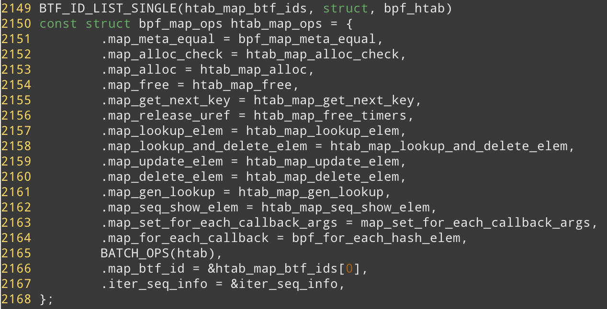

# Map Ops of BPF_MAP_TYPE_HASH 

## 数据结构

bpf_maps_ops 定义在 `./kernel/bpf/hashtab.c` 中



从 BTF_ID_LIST_SINGLE 来看， BPF_MAP_TYPE_HASH 对应一种 BTF id (BTF 文档里的最后一部分，有时间再check一下), 同一类的内核数据结构的BTF可以使用链表或者 set 组织起来。

### struct bucket

```c 
struct bucket {
	struct hlist_nulls_head head;
	union {
		raw_spinlock_t raw_lock;
		spinlock_t     lock;
	};
};
```

对hash进行同步操作的时候，对bucket上锁？

### struct bpf_htab 

```c
struct bpf_htab {
	struct bpf_map map;
	struct bucket *buckets;
	void *elems;
	union {
		struct pcpu_freelist freelist;
		struct bpf_lru lru;
	};
	struct htab_elem *__percpu *extra_elems;
	atomic_t count;	/* number of elements in this hashtable */
	u32 n_buckets;	/* number of hash buckets */
	u32 elem_size;	/* size of each element in bytes */
	u32 hashrnd;
	struct lock_class_key lockdep_key;
	int __percpu *map_locked[HASHTAB_MAP_LOCK_COUNT];
};

```

**struct lock_class_key lockdep_key;** 

动态锁，在使用之前需要先调用`lockdep_register_key(&htab->lockdep_key);`   注册。在free之前需要调用 `lockdep_unregister_key(&htab->lockdep_key);` 

### struct htab_elem

```c
/* each htab element is struct htab_elem + key + value */
struct htab_elem {
	union {
		struct hlist_nulls_node hash_node;
		struct {
			void *padding;
			union {
				struct bpf_htab *htab;
				struct pcpu_freelist_node fnode;
				struct htab_elem *batch_flink;
			};
		};
	};
	union {
		struct rcu_head rcu;
		struct bpf_lru_node lru_node;
	};
	u32 hash;
	char key[] __aligned(8);
};
```

这里union排布的义含

**char key[] __aligned(8);** 

保存着实际的Key和value

## 函数逻辑

### htab_map_alloc

`static struct bpf_map *htab_map_alloc(union bpf_attr *attr)`

-> `bool percpu = map_type == BPF_MAP_TYPE_PERCPU_HASH || map_type == BPF_MAP_TYPE_LRU_PERCPU_HASH` 

-> `bool lru = (attr->map_type == BPF_MAP_TYPE_LRU_HASH || attr->map_type == BPF_MAP_TYPE_LRU_PERCPU_HASH);`

-> `bool percpu_lru = (attr->map_flags & BPF_F_NO_COMMON_LRU);`  ps : percpu_lru指的是每一个CPU都有单独的LRU_LIST

->`struct bpf_htab *htab; htab = kzalloc(sizeof(*htab), GFP_USER | __GFP_ACCOUNT)`  分配结构体内存

->`lockdep_register_key(&htab->lockdep_key);`   注册锁，这个地方涉及到同步和死锁检测暂时先放着。

-> `bpf_map_init_from_attr(&htab->map, attr);`  初始化, key_size、value_size等简单的属性，**在自己写map的时候可以调用该函数**

->`if (percpu_lru)` 

​	--> `htab->map.max_entries = roundup(attr->max_entries, num_possible_cpus());` 将max_entries 向上取整为 num_possible_cpus的整数倍。目的是确保每一个 cpu上的 lru list的元素个数相同 ensure each CPU's lru list has >=1 elements. ensure each CPU's lru list has >=1 elements. 

​	--> `if (htab->map.max_entries < attr->max_entries)` 应该是处理可能的溢出问题

​		---> `htab->map.max_entries = rounddown(attr->max_entries, num_possible_cpus());`

-> `	htab->n_buckets = roundup_pow_of_two(htab->map.max_entries);`  /* hash table size must be power of 2 */. 所以桶的个数 >= max_entries 

-> `htab->elem_size = sizeof(struct htab_elem) + round_up(htab->map.key_size, 8);`  **key按照8个字节对齐**

-> `if (percpu) ? htab->elem_size += sizeof(void *); : htab->elem_size += round_up(htab->map.value_size, 8);   ` **??如果percpu value size是一个指针的大小(8字节)**  

-> `if (htab->n_buckets > U32_MAX / sizeof(struct bucket)) err`**之后要根据bucket的总空间分配大小，这里检查总大小是否越界。也就是说HASH_MAP总个数存在着一个理论上限** 

-> `htab->buckets = bpf_map_area_alloc(htab->n_buckets *
 sizeof(struct bucket), htab->map.numa_node);` 分配空间


## 编程技巧