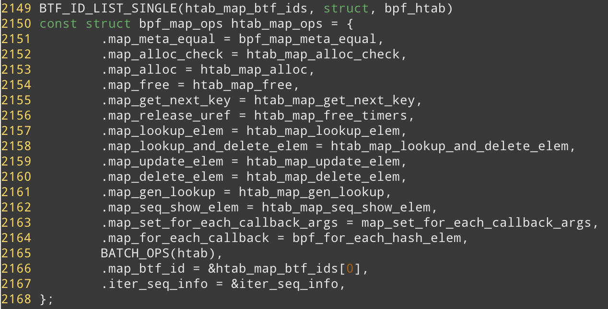

# Map Ops of BPF_MAP_TYPE_HASH 

## 数据结构

bpf_maps_ops 定义在 `./kernel/bpf/hashtab.c` 中

从 BTF_ID_LIST_SINGLE 来看， BPF_MAP_TYPE_HASH 对应一种 BTF id (BTF 文档里的最后一部分，有时间再check一下), 同一类的内核数据结构的BTF可以使用链表或者 set 组织起来。

## 函数逻辑

## 编程技巧