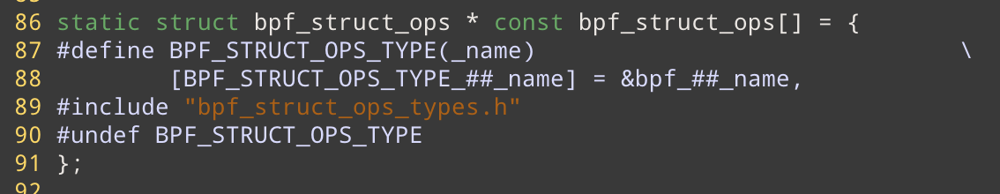
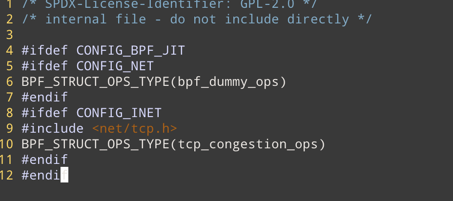
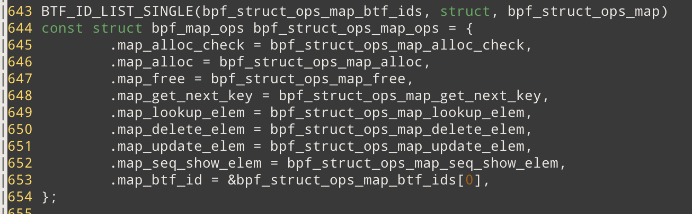
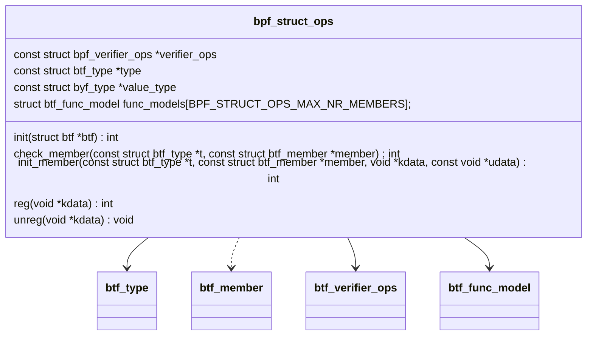
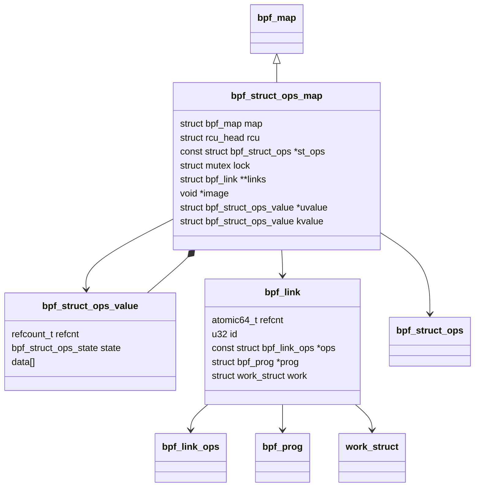
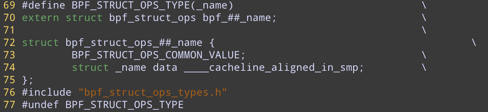

# Map Ops of BPF_MAP_TYPE_STRUCT_OP 

## 数据结构

### 全局数据 bpf_struct_ops 

`./kernel/bpf/bpf_struct_ops.c` 

保存所有的 bpf_struct_op， 按照BTF id 进行索引





目前只实现了 congestion_ops

map_ops实现在 `./kernel/bpf/bpf_struct_ops.c`



### bpf_struct_ops 

BPF使用该数据结构来描述 struct_ops的内核挂载点，一系列的函数指针, 和数据结构



**struct btf_type type** 

**struct btf_type value_type** 

value_type 代表这个 struct_ops 里存着的内核数据结构。例如 bpf_tcp_congestion_ops

### bpf_struct_ops_map 

该数据结构表示一个 STRUCT_OP map。它和 bpf_map的关系就类似，mptcp_sock 和 tcp_sock的关系。（可以简单理解为面向对象的继承）



```c 
struct bpf_struct_ops_map {
	struct bpf_map map;
	struct rcu_head rcu;
	const struct bpf_struct_ops *st_ops;
	/* protect map_update */
	struct mutex lock;
	/* link has all the bpf_links that is populated
	 * to the func ptr of the kernel's struct
	 * (in kvalue.data).
	 */
	struct bpf_link **links;
	/* image is a page that has all the trampolines
	 * that stores the func args before calling the bpf_prog.
	 * A PAGE_SIZE "image" is enough to store all trampoline for
	 * "links[]".
	 */
	void *image;
	/* uvalue->data stores the kernel struct
	 * (e.g. tcp_congestion_ops) that is more useful
	 * to userspace than the kvalue.  For example,
	 * the bpf_prog's id is stored instead of the kernel
	 * address of a func ptr.
	 */
	struct bpf_struct_ops_value *uvalue;
	/* kvalue.data stores the actual kernel's struct
	 * (e.g. tcp_congestion_ops) that will be
	 * registered to the kernel subsystem.
	 */
	struct bpf_struct_ops_value kvalue;
};

```

### struct bpf_struct_ops_value 

```c
struct bpf_struct_ops_value {
	BPF_STRUCT_OPS_COMMON_VALUE;
	char data[] ____cacheline_aligned_in_smp;
};
```

 data保存的就是实际的内核数据结构 (比如tcp_congestion_ops),  以tcp_congestion_ops 为例，其对应数据结构为 : (由宏自动生成结构体定义，见编程技巧)

```c
struct bpf_struct_ops_tcp_congestion_ops {
    BPF_STRUCT_OPS_COMMON_VALUE;
    struct tcp_congestion_ops data ____cacheline_aligned_in_smp;
};
```


## 函数逻辑

### bpf_struct_ops_map_alloc_check

实现很简单

```c 
static int bpf_struct_ops_map_alloc_check(union bpf_attr *attr)
{
	if (attr->key_size != sizeof(unsigned int) || attr->max_entries != 1 ||
	    attr->map_flags || !attr->btf_vmlinux_value_type_id)
		return -EINVAL;
	return 0;
}
```

1. key必须是4 个字节 (int)
2. max_entries 必须为1 （保存要加载的 bpf_struct 的 fd , 例如 bpf_tcp_congestion_ops) 
3. 不能携带任何 map_flags 
4. 必须携带 btf_vmlinux_value_type_id （对应的内核数据结构) 

ps : 这里我感觉部分的check，和map_create里的check重复了

### bpf_struct_ops_map_alloc

`static struct bpf_map *bpf_struct_ops_map_alloc(union bpf_attr *attr)`

给struct_ops类型的map分配内存并初始化

**调用逻辑**

-> `const struct bpf_struct_ops *st_ops;` 

-> `struct bpf_struct_ops_map *st_map;` 

-> `	const struct btf_type *t, *vt;`

-> `struct bpf_map *map;` 

-> `st_ops = bpf_struct_ops_find_value(attr->btf_vmlinux_value_type_id);`

​	--> `for each item in bpf_struct_ops`  STRUCT_OP相关的内核数据结构 **保存在全局数据 bpf_struct_ops中重要的hook点** 

​		---> `if (bpf_struct_ops[i]->value_id == value_id)  return bpf_struct_ops[i];`  `btf_vmlinux_value_type_id` 对应着特定的 `BPF_STRUCT_OPS_TYPE_name` 枚举值，对应着特定的 `struct bpf_name` ，例如name 为 tcp_congestion_ops， 那么枚举变量为`BPF_STRUCT_OPS_TYPE_tcp_congestion_ops`  结构体为 `struct bpf_tcp_congestion_ops` 

-> `vt = st_ops->value_type;`  **(??value_type含义以及value_type在哪里被设置的)** 推测 value_type 对应着 `bpf_struct_ops_##name`结构体，例如`struct bpf_struct_ops_tcp_congestion_ops` 

->`t = st_ops->type` **(??type的含义以及type在哪里被设置的)**  推测： struct_ops实际上只暴露原始内核数据结构的一部分接口(函数），真正暴露出去的部分用，BTF编码后的type来表示。换言之 **type 是 value_type 的一个子集**

-> `st_map_size = sizeof(*st_map) + (vt->size - sizeof(struct bpf_struct_ops_value)); `   `bpf_struct_ops_value` 有一些公用的数据结构，比如 refcnt, 这里的 - 操作就是为了把公共部分去掉。实际上是计算 `st_map->kvalue->data`的空间 （保存对应的内核数据结构，例如 tcp_congestion_ops)

-> `st_map = bpf_map_area_alloc(st_map_size, NUMA_NO_NODE);`   **以后如果自己增加新的MAP类型，可以直接调用这个函数来分配内存**

​	--> `__bpf_map_area_alloc(size, numa_node, false);`    ps : false 指的是 mmapable = false 

​		---> `kmalloc_node or __vmalloc_node_range`  如果所需要的内存空间太大的话，会使用 __vmalloc_node_range

-> `st_map->st_ops = st_ops; map = &st_map->map;`

-> `st_map->uvalue = bpf_map_area_alloc(vt->size, NUMA_NO_NODE);`  为 uvalue分配一块内存 **??这块内存的作用**

->`st_map->links = bpf_map_area_alloc(btf_type_vlen(t) * sizeof(struct bpf_links *), NUMA_NO_NODE);`  这个地方分配的大小验证了我之前对type含义的推测。type->vlen(type结构体的memeber数量) 代表着暴露接口的数量， 每一个接口用一个 `bpf_link`表示（即将一段eBPF PROG 挂在到该暴露的接口下，因为bpf_link就是一种对挂载的抽象) ，因此这里要分配的空间大小为 `btf_type_vlen(t) * sizeof(struct bpf_links *)` 

->`st_map->image = bpf_jit_alloc_exec(PAGE_SIZE);`  **根据注释，image保存bpf_link的trampolines**

​	--> `module_alloc(size);` (体系结构相关) 经过查阅资料，module_alloc在module_init中调用。为内核模块分配内存，这也说明了，struct_ops实际上就可以看成一个内核模块。

​		---> `__vmalloc_node_range`  with vm_flags = `VM_FLUSH_RESET_PERMS` , prot = `PAGE_KERNEL_EXEC` (底层硬件相关) 

-> `mutex_init(&st_map->lock);`  protect map_update 

-> `set_vm_flush_reset_perms(st_map->image);` 设置 image对应 vm_struct `VM_FLUSH_RESET_PERMS` 

-> `bpf_map_init_from_attr(map, attr);`  根据attr 初始化其它的通用 map属性

​	--> `map->map_type; map->key_size; map->value_size; map->max_entries; map->map_flags; map->numa_node; map->map_extra;   `

-> `return map `

### bpf_struct_ops_map_update_elem

`static int bpf_struct_ops_map_update_elem(struct bpf_map *map, void *key, void *value, u64 flags);`


## 编程技巧

### 利用宏自动生成 struct 定义



