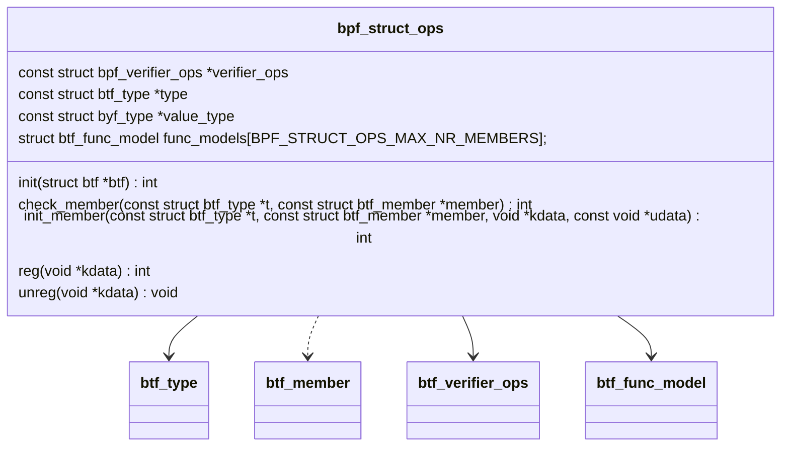
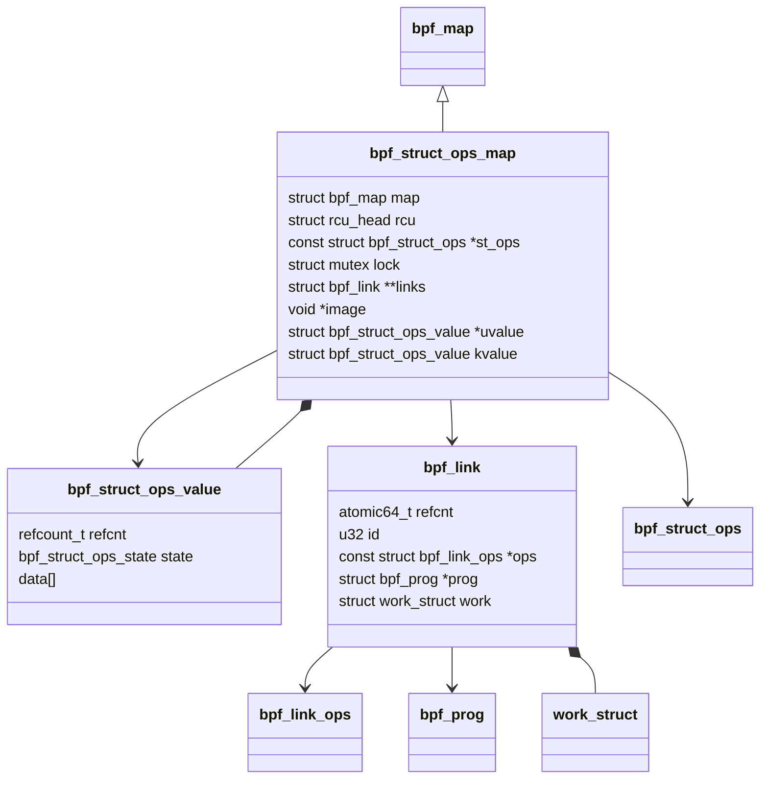
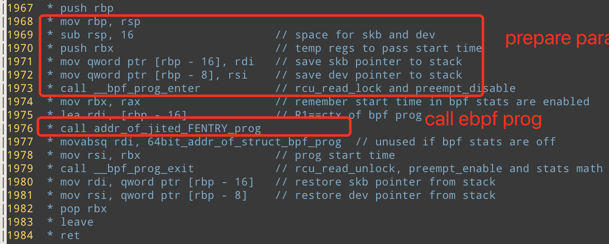
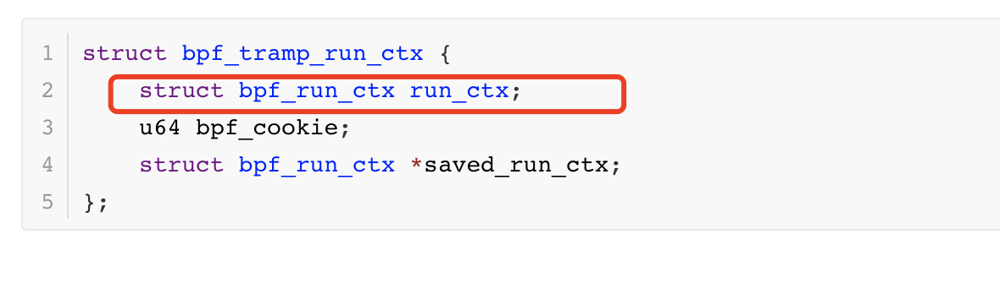

# Map Ops of BPF_MAP_TYPE_STRUCT_OP 

## 数据结构

### 全局数据 bpf_struct_ops 

`./kernel/bpf/bpf_struct_ops.c` 

保存所有的 bpf_struct_op， 按照BTF id 进行索引


目前只实现了 congestion_ops

map_ops实现在 `./kernel/bpf/bpf_struct_ops.c`


### 全局变量 bpf_struct_ops_link_lops

```c
const struct bpf_link_ops bpf_struct_ops_link_lops = {
	.release = bpf_struct_ops_link_release,
	.dealloc = bpf_struct_ops_link_dealloc,
};
```

```c
static void bpf_struct_ops_link_release(struct bpf_link *link)
{
}

//根据link free bpf_trampoline_link
static void bpf_struct_ops_link_dealloc(struct bpf_link *link)
{
	struct bpf_tramp_link *tlink = container_of(link, struct bpf_tramp_link, link);

	kfree(tlink);
}
```


### bpf_struct_ops 

BPF使用该数据结构来描述 struct_ops的内核挂载点，一系列的函数指针, 和数据结构



**struct btf_type type** 

对应着内核结构体，例如 tcp_congestion_ops。 在 `bpf_struct_ops_init`中被设置 ： `type_id = btf_find_by_name_kind(btf, st_ops->name, BTF_KIND_STRUCT);` （以拥塞控制为例，st_ops->name的值为 : `tcp_congestion_ops`

**struct btf_type value_type** 

对应着 `bpf_struct_ops_##name`结构体，例如`struct bpf_struct_ops_tcp_congestion_ops` 。在 `bpf_struct_ops_init`中被设置 ： `value_id = btf_find_by_name_kind(btf, value_name, BTF_KIND_STRUCT);`

**init**

负责初始化该struct_op的BTF信息，在`bpf_struct_ops_init`中被调用,调用路径

-> `bpf_struct_ops_init` 

​	--> `st_ops->init(btf)`

**check_member** 

在verifier中被调用。对于用eBPF实现的struct_op检查其成员是否合法

->`check_struct_ops_btf_id`

​	--> `st_ops->check_member(t, member);` 

**init_member**

在`bpf_struct_ops_map_update_elem` 被调用, 主要负责： 1. 处理非函数指针字段(例如flags) 2. 对函数指针的字段进行验证。（例如验证是否都实现了必要的hook函数等）。

-> `bpf_struct_ops_map_update_elem`

​	--> `err = st_ops->init_member(t, member, kdata, udata);` 

**reg**

在`bpf_struct_ops_map_update_elem`被调用，负责将 eBPF实现的结构体 `kvalue.kdata`注册到对应的内核路径中。（以tcp_congestion_ops为例，调用 `tcp_register_congestion_control(kdata);`方法

-> `bpf_struct_ops_map_update_elem`

​	--> `err = st_ops->reg(kdata);`

### bpf_verifier_ops

```c
struct bpf_verifier_ops {
	/* return eBPF function prototype for verification */
	const struct bpf_func_proto *
	(*get_func_proto)(enum bpf_func_id func_id,
			  const struct bpf_prog *prog);

	/* return true if 'size' wide access at offset 'off' within bpf_context
	 * with 'type' (read or write) is allowed
	 */
	bool (*is_valid_access)(int off, int size, enum bpf_access_type type,
				const struct bpf_prog *prog,
				struct bpf_insn_access_aux *info);
	int (*gen_prologue)(struct bpf_insn *insn, bool direct_write,
			    const struct bpf_prog *prog);
	int (*gen_ld_abs)(const struct bpf_insn *orig,
			  struct bpf_insn *insn_buf);
	u32 (*convert_ctx_access)(enum bpf_access_type type,
				  const struct bpf_insn *src,
				  struct bpf_insn *dst,
				  struct bpf_prog *prog, u32 *target_size);
	int (*btf_struct_access)(struct bpf_verifier_log *log,
				 const struct btf *btf,
				 const struct btf_type *t, int off, int size,
				 enum bpf_access_type atype,
				 u32 *next_btf_id, enum bpf_type_flag *flag);
};
```

**get_func_proto**

当eBPF程序调用eBPF帮助函数时，调用该函数返回帮助函数的函数原型（bpf_func_proto) 也判断特定的程序类型是否支持使用的eBPF帮助函数

-> `do_check`

​	--> `check_helper_call` 

​		---> `if (env->ops->get_func_proto) fn = env->ops->get_func_proto(func_id, env->prog);`

**is_valid_access**

当访问 `btf_ctx`变量的时候，执行的check (验证器验证阶段)

-> `do_check`

​	--> `check_ctx_access`

​		---> ` env->ops->is_valid_access(off, size, t, env->prog, &info)`

**btf_struct_access**

在BPF验证器的验证阶段，当需要access内核数据结构时候调用。确保访问内核数据结构的安全性。(从代码上来看该函数有默认实现)

调用链: 

-> `check_mem_access`
	--> ` if (base_type(reg->type) == PTR_TO_BTF_ID &&!type_may_be_null(reg->type)) `

​		---> `check_ptr_to_btf_access`

​			----> `if (env->ops->btf_struct_access) ret = env->ops->btf_struct_access;`   

### bpf_struct_ops_map 

该数据结构表示一个 STRUCT_OP map。它和 bpf_map的关系就类似，mptcp_sock 和 tcp_sock的关系。（可以简单理解为面向对象的继承）



```c 
struct bpf_struct_ops_map {
	struct bpf_map map;
	struct rcu_head rcu;
	const struct bpf_struct_ops *st_ops;
	/* protect map_update */
	struct mutex lock;
	/* link has all the bpf_links that is populated
	 * to the func ptr of the kernel's struct
	 * (in kvalue.data).
	 */
	struct bpf_link **links;
	/* image is a page that has all the trampolines
	 * that stores the func args before calling the bpf_prog.
	 * A PAGE_SIZE "image" is enough to store all trampoline for
	 * "links[]".
	 */
	void *image;
	/* uvalue->data stores the kernel struct
	 * (e.g. tcp_congestion_ops) that is more useful
	 * to userspace than the kvalue.  For example,
	 * the bpf_prog's id is stored instead of the kernel
	 * address of a func ptr.
	 */
	struct bpf_struct_ops_value *uvalue;
	/* kvalue.data stores the actual kernel's struct
	 * (e.g. tcp_congestion_ops) that will be
	 * registered to the kernel subsystem.
	 */
	struct bpf_struct_ops_value kvalue;
};

```

**image** 

所谓蹦床本质上是一段汇编代码，负责完成 context切换（save 参数）和调用loaded bpf_prog。struct_op 将 links里的所有link(对应于每一个需要)

蹦床例子： 



image保存了该struct_op所有link的蹦床。蹦床的地址，按照moff(成员的字节偏移量)保存在 kvalue.kdata里。

**struct bpf_struct_ops_value *uvalue;**

uvalue 保存`bpf_map_update`传入的value参数的内存内容,

uvalue.data 这一块内存，本质上保存的是一个结构体(和内核结构体对应)： 1. 对于结构体的非函数指针成员，例如flags，或者name等，按照BTF编码后对应内核数据结构的成员。 **2. 对于函数指针，保存的是BPF_PROG的fd**

**struct bpf_struct_ops_value kvalue;** 

kvalue.kdata 按照moff(成员的字节偏移量)保存了所有成员的link的蹦床地址。 

`*(void **)(kdata + moff) = image;`

kvalue. refcnt 这个应用计数，被 `bpf_module_get`使用用来标识由由多少内核代码使用了该模块(struct)

kvalue.data 这一块内存，本质上保存的是一个内核结构体(和内核结构体对应)： 1. 对于结构体的非函数指针成员，同一般的内核结构体。2. 对于函数指针，保存的是对应函数的 image地址(image入口)

### struct bpf_struct_ops_value 

```c
struct bpf_struct_ops_value {
	BPF_STRUCT_OPS_COMMON_VALUE;
	char data[] ____cacheline_aligned_in_smp;
};
```

 data保存的就是实际的内核数据结构 (比如tcp_congestion_ops),  以tcp_congestion_ops 为例，其对应数据结构为 : (由宏自动生成结构体定义，见编程技巧)

```c
struct bpf_struct_ops_tcp_congestion_ops {
    BPF_STRUCT_OPS_COMMON_VALUE;
    struct tcp_congestion_ops data ____cacheline_aligned_in_smp;
};
```

### struct bpf_tramp_link 

```c
struct bpf_tramp_link {
	struct bpf_link link;
	struct hlist_node tramp_hlist;
	u64 cookie;
};
```

额外增加了 cookie字段，以及hlist。估计用Hash表的方式将bpf_link组织起来

```c
struct bpf_tramp_links {
	struct bpf_tramp_link *links[BPF_MAX_TRAMP_LINKS];
	int nr_links;
};
```

 **cookie** 会被保存到 `bpf_tramp_run_ctx` 的bpf_cookie字段中

```c
struct bpf_tramp_run_ctx {
	struct bpf_run_ctx run_ctx;
	u64 bpf_cookie;
	struct bpf_run_ctx *saved_run_ctx;
};
```

## 函数逻辑

## bpf_struct_ops_init

**(推测)将所有struct_op对应的结构体(bpf_struct_ops)（例如 tcp_congestion_ops,注册到内核BTF中）**

`void bpf_struct_ops_init(struct btf *btf, struct bpf_verifier_log *log) `

该函数负责初始化内部的STRUCT_OP相关的BTF信息

由函数`btf_parse_vmlinux`->`bpf_struct_ops_init` 调用

### bpf_struct_ops_map_alloc_check

实现很简单

```c 
static int bpf_struct_ops_map_alloc_check(union bpf_attr *attr)
{
	if (attr->key_size != sizeof(unsigned int) || attr->max_entries != 1 ||
	    attr->map_flags || !attr->btf_vmlinux_value_type_id)
		return -EINVAL;
	return 0;
}
```

1. key必须是4 个字节 (int)
2. max_entries 必须为1 （保存要加载的 bpf_struct 的 fd , 例如 bpf_tcp_congestion_ops) 
3. 不能携带任何 map_flags 
4. 必须携带 btf_vmlinux_value_type_id （对应的内核数据结构) 

ps : 这里我感觉部分的check，和map_create里的check重复了

### bpf_struct_ops_map_alloc

`static struct bpf_map *bpf_struct_ops_map_alloc(union bpf_attr *attr)`

给struct_ops类型的map分配内存并初始化 

**调用逻辑**

-> `const struct bpf_struct_ops *st_ops;` 

-> `struct bpf_struct_ops_map *st_map;` 

-> `	const struct btf_type *t, *vt;`

-> `struct bpf_map *map;` 

-> `st_ops = bpf_struct_ops_find_value(attr->btf_vmlinux_value_type_id);`

​	--> `for each item in bpf_struct_ops`  STRUCT_OP相关的内核数据结构 **保存在全局数据 bpf_struct_ops中重要的hook点** 

​		---> `if (bpf_struct_ops[i]->value_id == value_id)  return bpf_struct_ops[i];`  `btf_vmlinux_value_type_id` 对应着特定的 `BPF_STRUCT_OPS_TYPE_name` 枚举值，对应着特定的 `struct bpf_name` ，例如name 为 tcp_congestion_ops， 那么枚举变量为`BPF_STRUCT_OPS_TYPE_tcp_congestion_ops`  结构体为 `struct bpf_tcp_congestion_ops` 

-> `vt = st_ops->value_type;`   对应着 `bpf_struct_ops_##name`结构体，例如`struct bpf_struct_ops_tcp_congestion_ops` 。在 `bpf_struct_ops_init`中被设置 ： `value_id = btf_find_by_name_kind(btf, value_name, BTF_KIND_STRUCT);`

->`t = st_ops->type`  对应着内核结构体，例如 tcp_congestion_ops。 在 `bpf_struct_ops_init`中被设置 ： `type_id = btf_find_by_name_kind(btf, st_ops->name, BTF_KIND_STRUCT);` （以拥塞控制为例，st_ops->name的值为 : `tcp_congestion_ops`

-> `st_map_size = sizeof(*st_map) + (vt->size - sizeof(struct bpf_struct_ops_value)); `   `bpf_struct_ops_value` 有一些公用的数据结构，比如 refcnt, 这里的 - 操作就是为了把公共部分去掉。实际上是计算 `st_map->kvalue->data`的空间 （保存对应的内核数据结构，例如 tcp_congestion_ops)

-> `st_map = bpf_map_area_alloc(st_map_size, NUMA_NO_NODE);`   **以后如果自己增加新的MAP类型，可以直接调用这个函数来分配内存**

​	--> `__bpf_map_area_alloc(size, numa_node, false);`    ps : false 指的是 mmapable = false 

​		---> `kmalloc_node or __vmalloc_node_range`  如果所需要的内存空间太大的话，会使用 __vmalloc_node_range

-> `st_map->st_ops = st_ops; map = &st_map->map;`

-> `st_map->uvalue = bpf_map_area_alloc(vt->size, NUMA_NO_NODE);`  为 uvalue分配一块内存 **??这块内存的作用**

->`st_map->links = bpf_map_area_alloc(btf_type_vlen(t) * sizeof(struct bpf_links *), NUMA_NO_NODE);`  这个地方分配的大小验证了我之前对type含义的推测。type->vlen(type结构体的memeber数量) 代表着暴露接口的数量， 每一个接口用一个 `bpf_link`表示（即将一段eBPF PROG 挂在到该暴露的接口下，因为bpf_link就是一种对挂载的抽象) ，因此这里要分配的空间大小为 `btf_type_vlen(t) * sizeof(struct bpf_links *)` 

->`st_map->image = bpf_jit_alloc_exec(PAGE_SIZE);`  **根据注释，image保存bpf_link的trampolines**

​	--> `module_alloc(size);` (体系结构相关) 经过查阅资料，module_alloc在module_init中调用。为内核模块分配内存，这也说明了，struct_ops实际上就可以看成一个内核模块。

​		---> `__vmalloc_node_range`  with vm_flags = `VM_FLUSH_RESET_PERMS` , prot = `PAGE_KERNEL_EXEC` (底层硬件相关) 

-> `mutex_init(&st_map->lock);`  protect map_update 

-> `set_vm_flush_reset_perms(st_map->image);` 设置 image对应 vm_struct `VM_FLUSH_RESET_PERMS` 

-> `bpf_map_init_from_attr(map, attr);`  根据attr 初始化其它的通用 map属性

​	--> `map->map_type; map->key_size; map->value_size; map->max_entries; map->map_flags; map->numa_node; map->map_extra;   `

-> `return map `

### bpf_struct_ops_map_update_elem

`static int bpf_struct_ops_map_update_elem(struct bpf_map *map, void *key, void *value, u64 flags);`

**函数逻辑** 

-> 初始化变量

​	--> `struct bpf_struct_ops_value *uvalue, *kvalue;`

​	--> `const struct btf_member *member;`

​	--> `const struct btf_type *t  = st_ops->type;`

​	--> `struct bpf_tramp_links *tlinks = NULL;` 用于 `bpf_struct_ops_prepare_trampoline` 函数的临时变量

​	-->`void *image, *image_end`

-> `if (flags) return -EINVAL`

-> `err = check_zero_holes(st_ops->value_type, value); `  该函数简单来说检查 value 内存区域有没有未初始化bit。**根据`value_type`**里的`btf_member`定义(offset 和 size)。用户传进来的value对应着，`bpf_struct_ops_tcp_congestion_ops` (和value_type相对应)

-> `uvalue = value; err = check_zero_holes(t, uvalue->data);` 该函数简单来说检查 value 内存区域有没有未初始化bit。**根据`st_ops->type`**里的`btf_member`定义(offset 和 size)。

-> `if (uvalue->state || refcount_read(&uvalue->refcnt)) return -EINVAL;`  被update的区域需要是未初始化区域。

-> `tlinks = kcalloc(BPF_TRAMP_MAX, sizeof(*tlinks), GFP_KERNEL); ` 分配内存

-> `uvalue = (struct bpf_struct_ops_value *)st_map->uvalue;` 

-> `kvalue = (struct bpf_struct_ops_value *)&st_map->kvalue;`  kvalue直接保存在 st_map中。

-> `	mutex_lock(&st_map->lock);` lock **位于st_map里的锁**（不是放在bpf_map里的锁) 

-> `memcpy(uvalue, value, map->value_size);`  uvalue 保存`bpf_map_update`传入的value值

-> `udata = &uvalue->data; kdata = &kvalue->data;`

-> `for_each_member(i, st_ops->type, member)`

​	--> `const struct btf_type *mtype, *ptype;`

​	--> `struct bpf_prog *prog; struct bpf_tramp_link *link;`

​	--> `moff = __btf_member_bit_offset(t, member) / 8;`  获取 struct member 距离struct 的 字节偏移量

​	--> `ptype = btf_type_resolve_ptr(btf_vmlinux, member->type, NULL);`   判断用户态传入的memeber是指针类型。根据`struct_op`的文档，用户态需要把BPF_PROG的prog_fd写入 map的value中。**这里的ptype就对应着pfd**。 实际上，struct_ops是一系列函数指针的集合，函数指针的btf类型也应该是 ptr。

​	--> `if (ptype == module_type) ` ...**.?? module_type暂时放一下**，没有看到具体的用法

​	--> `err = st_ops->init_member(t, member, kdata, udata);`  **重要hook点,调用具体struct_ops的init_member方法**。主要负责： 1. 处理非函数指针字段(例如flags) 2. 对函数指针的字段进行验证。（例如验证是否都实现了必要的hook函数等）。

​	--> `if (err > 0) continue;` The ->init_member() has handled this member. 例如handle name, 或者是handle flags（以tcp拥塞控制为例) 。**eBPF的struct_ops是允许暴露部分成员变量的**，例如flags, name等。对于这种类型的 member应该有具体的struct op的 init_member来处理。

​	--> `if (!ptype || !btf_type_is_func_proto(ptype)) `  /* All non func ptr member must be 0 */

​		---> `if (memchr_inv(udata + moff, 0, msize)) `  err = -EINVAL;

​	--> `prog_fd = (int)(*(unsigned long *)(udata + moff));` 根据`struct_op`的文档，用户态需要把BPF_PROG的prog_fd写入 map的value中。

​	--> `prog = bpf_prog_get(prog_fd);` 根据prog fd获取`bpf_prog`

​	--> `if (!prog_fd) continue;`  对于不设置的函数 prog_fd设置为0即可。

​	--> `if (prog->type != BPF_PROG_TYPE_STRUCT_OPS) || prog->aux->attach_btf_id != st_ops->type_id || prog->expected_attach_type != i) err = -EINVAL;` 说明了STRUCT_OP类型的prog, `prog->aux->attach_btf_id`和` prog->expected_attach_type`的含义。

​	--> `link = kzalloc(sizeof(*link), GFP_USER);` 给link分配空间 `struct bpf_tramp_link *link`

​	--> `bpf_link_init(&link->link, BPF_LINK_TYPE_STRUCT_OPS, &bpf_struct_ops_link_lops, prog);`  初始化类型为 `BPF_LINK_TYPE_STRUCT_OPS`的bpf_link

​	--> `st_map->links[i] = &link->link;`  st_map中保存的是`bpf_link`而非`bpf_trampoline_link` 但其实也能够根据link地址拿到trampoline_link的地址

​	--> `err = bpf_struct_ops_prepare_trampoline(tlinks, link, &st_ops->func_models[i], image, image_end);` 

​		---> `tlinks[BPF_TRAMP_FENTRY].links[0] = link;`

​		---> `tlinks[BPF_TRAMP_FENTRY].nr_links = 1;`

​		---> `flags = model->ret_size > 0 ? BPF_TRAMP_F_RET_FENTRY_RET : 0;`

​		---> `return arch_prepare_bpf_trampoline(NULL, image, image_end, model, flags, tlinks, NULL);`  体系结构相关，**生成该bpf_link的蹦床(本质上是一段汇编代码，实现context save和调用JIT的eBPF程序**, 生成的蹦床最终保存在 `st_maps->image`中。（详情见 bpf_link中该函数的笔记）

​	--> `*(void **)(kdata + moff) = image;`   **kdata保存着每一个prog(struct_op对应的函数的bpf_prog)的蹦床在`st_maps->image`中的地址。** 

​	--> `image += err;`  `bpf_struct_ops_prepare_trampoline`返回的该bpf_link的蹦床的大小（汇编代码的字节数) 

-> `refcount_set(&kvalue->refcnt, 1);`  设置 `st_map.kvalue`的引用计数

-> `bpf_map_inc(map);` **增加bpf_map的引用计数** `atomic64_inc(&map->refcnt);`

-> `set_memory_ro((long)st_map->image, 1); set_memory_x((long)st_map->image, 1);` 设置 image的读写权限

-> `err = st_ops->reg(kdata);` **重要Hook点，调用特定struct_op的reg方法**

-> `	smp_store_release(&kvalue->state, BPF_STRUCT_OPS_STATE_INUSE);`

-> `kfree(tlinks);`

-> `mutex_unlock(&st_map->lock);`

### (推测)注册 struct_op中可以使用的内核函数

调用函数 ` register_btf_kfunc_id_set` 

```c 
BTF_SET_START(bpf_tcp_ca_check_kfunc_ids)
BTF_ID(func, tcp_reno_ssthresh)
BTF_ID(func, tcp_reno_cong_avoid)
BTF_ID(func, tcp_reno_undo_cwnd)
BTF_ID(func, tcp_slow_start)
BTF_ID(func, tcp_cong_avoid_ai)
BTF_SET_END(bpf_tcp_ca_check_kfunc_ids)
static int __init bpf_tcp_ca_kfunc_init(void)
{
	return register_btf_kfunc_id_set(BPF_PROG_TYPE_STRUCT_OPS, &bpf_tcp_ca_kfunc_set);
}
```


## 编程技巧

### 利用宏自动生成 struct 定义


### 使用空结构体标记地址,配合 container_of使用


