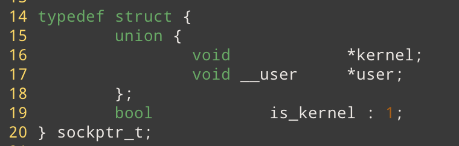
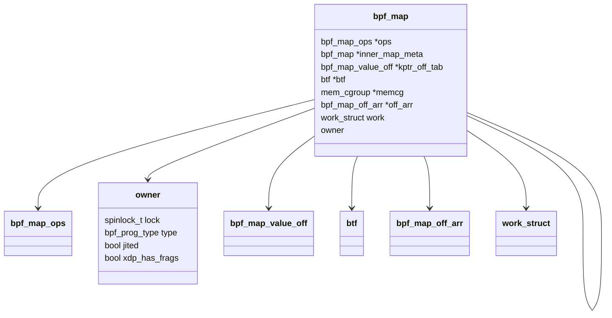
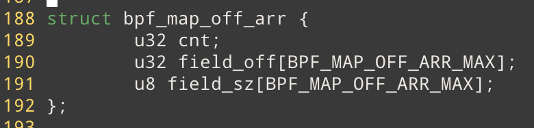
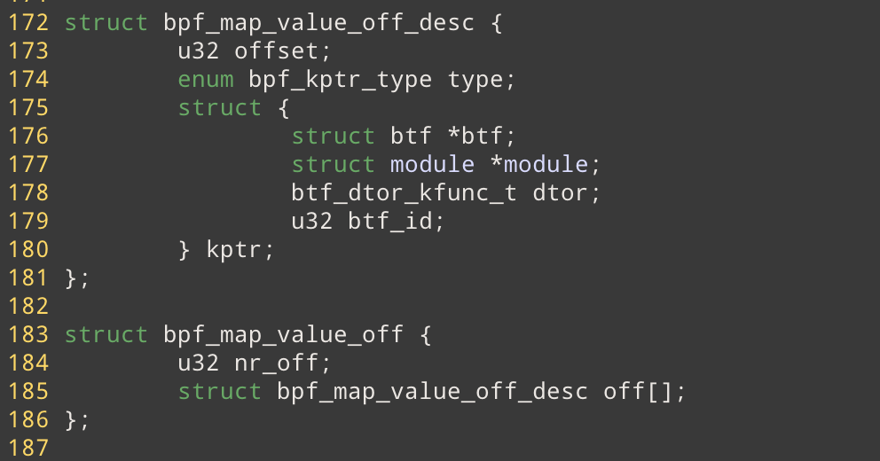
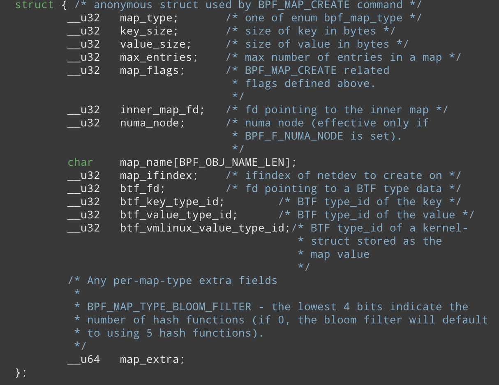
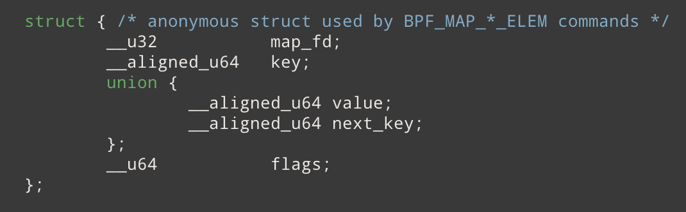
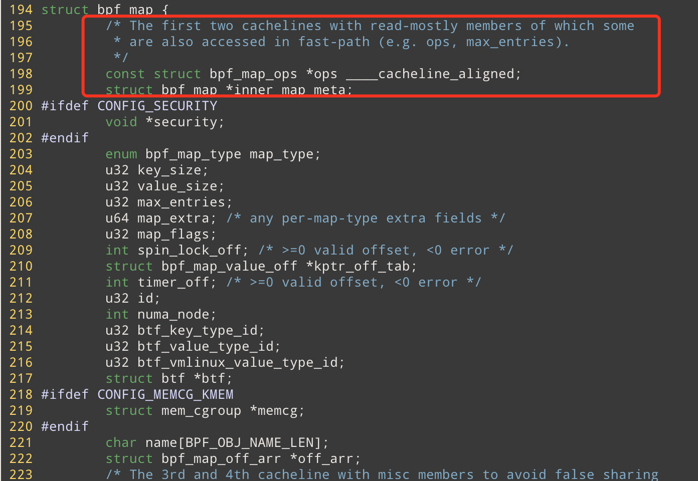
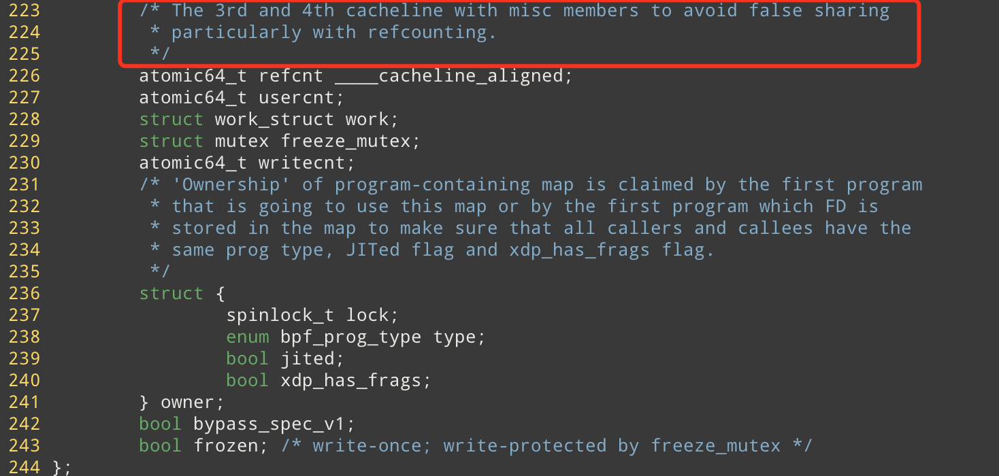

# eBPF MAP Kernel 

## 数据结构

### bpfptr_t 

```c
typedef sockptr_t bpfptr_t;
```



用一个结构体来统一表示内核态指针和用户态指针。因为这些指针经常设计内核态和用户态的数据交换。

### bpf_map 

`struct bpf_map` 是BPF MAP的核心数据结构，定义在 ./include/linux/bpf.h 中



**u32 spin_lock_off** 

`bpf_spin_lock`在value结构体中的偏移量(以字节为单位)， **从这个字段也可以看出，value里只能有一个 bpf_spin_lock**

**struct bpf_map_off_arr *off_arr;** 



这个结构体里保存着 valb特殊成员 (目前有，`bpf_spin_lock` , `bpf_timer` ,`bpf_kptr`（可以有多个） )的 offset(相对于 value struct的字节偏移量) 和 size(大小) 信息。 并按照 offset 进行排序（filed_off数组，和filed_size数组) 。特殊成员由枚举类型标识 : 

**struct bpf_map_value_off *kptr_off_tab;** 



目前map的value好像允许存放 kernel function（module or ..) 的指针了？ 可以存放多个，也就是说很多 kernel模块可以通过 eBPF暴露出去。（很奇怪的一点事，struct_op 要求不存在 value_id, 那这个特性的作用是什么？） 这个成员变变量保存着 bpf_kptr 的描述信息。 

**atomic64_t writecnt;** 

写计数器

在 `bpf_update_map` 中 ``err = bpf_map_new_fd(map, f_flags);` `

**u32 btf_vmlinux_value_type_id;**

通过btf_id找到对应的 内核数据结构`sturct bpf_struct_ops`(STRUCT_OP)。保存在 btf.ids section 里

**struct owner** 

这个数据结构应该是用来表示使用了这个map的prog的。(猜测)

### bpf_map_ops 

`struct bpf_map_ops` 是一组抽象的接口，抽象了不同MAP所需要的共有的方法。对于BPF_MAP来说这是很重要的hook点。`bpf_map_ops`里的方法包括，`bpf_map_update, bpf_map_delete` 等。


## 代码逻辑

### map_create 

用户态通过eBPF系统调用 创建eBPF map 

**函数参数** 



**调用逻辑** (一般情况下只看成功的部分，错误处理暂时跳过)

-> `int numa_node = bpf_map_attr_numa_node(attr);`   判断是否需要把map创建在特定的numa_node上，默认是 NUMA_NO_NODE

-> `struct bpf_map *map` 

-> `attr`参数检查。检查attr的属性和BPF_MAP_TYPE是否匹配，检查flag是否合法，numa_node是否合法。例如 如果提供了`attr->btf_vmlinux_vbalue_type_id` ，那么type必须是 `BPF_MAP_TYPE_STRUCT_OPS` 

->`map = find_and_allco_map(attr)`  **根据 BPF_MAP_TYPE 查找并初始化MAP** 

​	--> `const struct bpf_map_ops *ops`  不同类型的map，ops的函数接口一样，但是实现不一样，**是很重要的hook点**

​	--> `type = array_index_nospec(type, ARRAY_SIZE(bpf_map_types));` 

​	--> `ops = bpf_map_types[type];`  **根据type查找对应map的ops, 也就是hook op的地方。**bpf_map_types是一个全局数组定义在 <linux/bpf_types.h> 中，如果要增加新的map或者修改已有的map,需要修改该头文件。

​	--> `if (ops->map_alloc_check) err = ops->map_alloc_check(attr)`  在alloc前进行检查

​	--> `if (attr->map_ifindex) ops = &bpf_map_offload_ops`  **判断是否需要将map卸载到硬件上**

​	--> `map = ops->map_alloc(attr)` 分配并初始化map。具体的初始化方法和具体的map相关 **重要hook点**

​	-->`map->ops = ops; map->map_type = type`  **挂载ops**

-> `bpf_obj_name_cpy(map->name, attr->map_name, sizeof(attr->map_name));` 

-> **初始化同步信息** (几个同步字段的作用需要进一步研究)

​	--> `atomic64_set(&map->refcnt, 1);` 猜测和map的生命周期有关
​	--> `atomic64_set(&map->usercnt, 1);`
​	--> `mutex_init(&map->freeze_mutex);`
​	--> `spin_lock_init(&map->owner.lock);`
​	--> `map->spin_lock_off = -EINVAL;` **`bpf_spin_lock`在value结构体中的偏移量(以字节为单位)**。 在下面的 `map_check_btf`中进行设置, **这个字段和 bpf_spin_lock 相关(eBPF并发控制)**
​	--> `map->timer_off = -EINVAL;`

-> 设置`bpf_map`中的BTF信息  `if (attr->btf_key_type_id || attr->btf_value_type_id || attr->btf_vmlinux_type_id)`

​	--> `struct btf *btf` 

​	--> `btf = btf_get_by_fd(attr->btf_fd); map->btf = btf` 获取加载的 btf信息。（在加载 map之前要先加载整个.o文件的BTF） 

​	--> `attr->btf_value_type_id ? `  `err = map_check_btf(map, btf, attr->btf_key_type_id,  attr->btf_value_type_id);` 检查bpf map key 和 value的btf信息。 **只有携带value信息的map才需要进行 map_check_btf**

​		---> `const struct btf_type *key_type, *value_type;`     

​		---> `u32 key_size, value_size;` 

​		---> `btf_key_id ? key_type = btf_type_id_size(btf, &btf_key_id, &key_size);   `  在btf相关的代码中， `size_type`的含义是使用size属性的 kind, 例如 INT, STRUCT等。`btf_type_id_size`这个函数的含义指的是，解析携带size属性的btf_type（显然key,value 都需要有size)。**同时该函数也会去掉const等修饰符，直接获取数据类型表征的BTF**

​		---> `!btf_key_id?` 部分maps要求key不指定btf_id, 在这种情况下，要求 `map->ops->map_check_btf != NULL`  (由map自己再做一次类型检查？)

​		---> `value_type = btf_type_id_size(btf, &btf_value_id, &value_size);` 解析value 的 size 类型的 `btf_type `

​		---> `map->spin_lock_off = btf_find_spin_lock(btf, value_type)`  查找spin_lock在value结构体中的字节偏移量, 

​		---> `if (map_value_has_spin_lock(map)) `  如果 value中含有 `bpf_spin_lock` 。检查该spin_lock是否是有效的，只有特定的MAP类型(HASH, ARRAY, CGROUP_STORAGE 等)才允许设置 spin_lock。 检查spin_lock是否再范围内

​		---> `map->timer_off = btf_find_timer(btf, value_type);`  查找timer 在value结构体中的字节偏移量 **暂时跳过，后续需要再找一下timer的用例**

​		---> `map->kptr_off_tab = btf_parse_kptrs(btf, value_type);`  类似 timer 和 spin_lock。**（现在可以在eBPF MAP的value里放kptr ? )**

​		---> `map->ops->map_check_btf ? ret = map->ops->map_check_btf(map, btf, key_type, value_type);`  通用校验结束，执行特殊校验(和map类型有关，挂载在ops类型中)

​	--> `map->btf_key_type_id = attr->btf_key_type_id;` 

​	--> `map->btf_value_type_id = attr->btf_value_type_id;` 

​	--> `map->btf_vmlinux_value_type_id = attr->btf_vmlinux_value_type_id;`

-> `err = bpf_map_alloc_off_arr(map);` `bpf_spin_lock; bpf_timer; bpf_kptr` 的信息都保存在 off_arr 成员变量中。调用该方法保存 offset 和 size信息，并按照offset进行排序。

-> `err = security_bpf_map_alloc(map);`  create map 里的 LSM钩子

-> `err = bpf_map_alloc_id(map);` 为 bpf_map分配id 

-> `	bpf_map_save_memcg(map);`  cgroup相关，暂时跳过，**再看一下cgroup相关的文档**。猜测是记录cgoup分配的内存信息。

-> `err = bpf_map_new_fd(map, f_flags);`  分配 fd 

### map_update_elem 

用户态通过 update 系统调用 更新 bpf map 

系统调用参数



**调用逻辑** 

-> `bpfptr_t ukey = make_bpfptr(attr->key, uattr.is_kernel);`  内核态指针和用户态指针不同。用 `struct bpfptr_t` 来统一表示。

-> `bpfptr_t uvalue = make_bpfptr(attr->value, uattr.is_kernel);`

-> `struct bpf_map *map; void *key, value; struct fd f`

-> `f = fdget(ufd)` 通过 fd 获取 struct fd. 

-> `map = __bpf_map_get(f);`  获取 ufd 对应的 bpf_map; 实际上是 

​	--> `f.file->private_data;` 

-> `bpf_map_write_active_inc(map);`   `map->writecnt` 原子增 1 

-> `!(map_get_sys_perms(map, f) & FMODE_CAN_WRITE)) ? err` 检查写权限

-> `(attr->flags & BPF_F_LOCK) && !map_value_has_spin_lock(map) ? err`  如果 update 的 flag 里有 `BPF_F_LOCK` 那么value里必须包含自旋锁，通过在 map_careate中解析得到的offset进行判断

-> `	key = ___bpf_copy_key(ukey, map->key_size);`  分配内核空间， 将key从用户态拷贝到内核态

​	--> `kvmemdup_bpfptr(ukey, key_size);` 

​		---> `void *p = kvmalloc(len, GFP_USER | __GFP_NOWARN);` 

​		---> `copy_from_bpfptr(p, src, len)` 

-> `value_size = bpf_map_value_size(map);`  计算map的value_size。**特别注意的是，对于per cpu类型其size为 map->value_size * cpu_num** 这也验证了，用户态对 percpu的map类型调用 update ，返回的是所有 CPU的value组合而成的数组。**需要在用户态做进一步的聚合**

​	--> for per cpu `return round_up(map->value_size, 8) * num_possible_cpus();` 

​	--> for fd array (array of map,  prog array, hash of maps) ` return sizeof(u32);`

​	--> 其它 `map->value_size;`

-> `value = kvmalloc(value_size, GFP_USER | __GFP_NOWARN);`  分配内存

-> `copy_from_bpfptr(value, uvalue, value_size) != 0` 将需要 update 的 value 从用户态拷贝到内核态

-> `err = bpf_map_update_value(map, f, key, value, attr->flags);` 调用特定map的update函数。 （目前到这里都没有涉及并发控制) ,  writecnt 这个院子变量的用途也暂且不明。


## 编程技巧

### 缓存友好代码



1. 把访问频率高的，只读数据尽量放在一起（放在一个cache line中） 提高访问效率



2. 一些写频率不一致的变量，拉开存储间隔，避免cache false sharing。(关于false sharing的文章见 doc里 linux cache)

### kernel 内判断指针地址是否合法


这里主要使用 IS_ERR 宏。 该宏会判断地址是否超出特定的地址边界 

