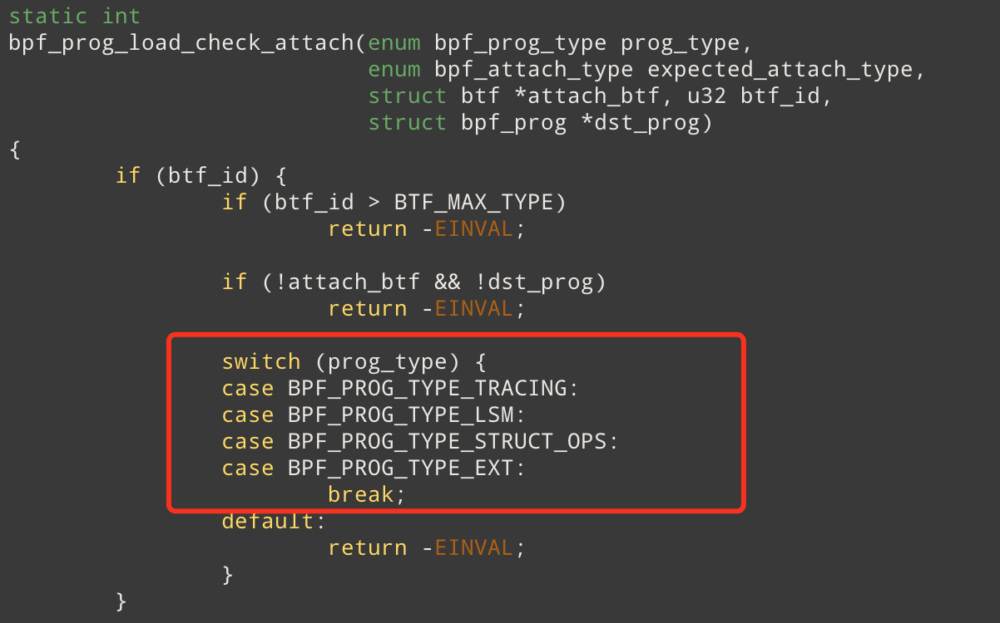
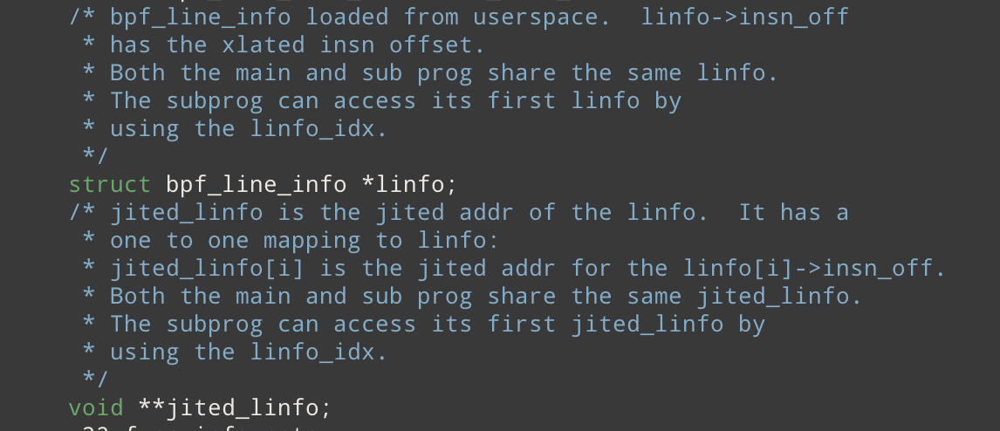
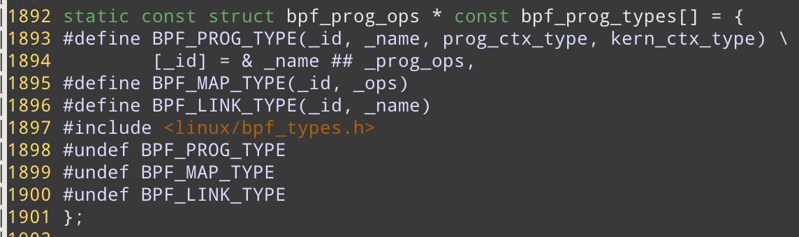

# eBPF_prog_kernel 

## 数据结构

### **bpf_prog**

参数解释， attach_btf, dst_prog 应该表示被attach的内核函数/模块的btf_id, 或者被attach的eBPF程序。因为从` bpf_prog_load_check_attach`函数来看，只有一下几类函数可以设置这两个值

### bpf_prog_aux 

**jited_linfo 和 linfo** 

jited_linfo从注释来看， JIT可以理解成把 BPF指令逐一映射为机器指令

## 主要函数

### BPF_PROG_LOAD

**调用逻辑**

`bpf_prog_load`  系统调用，加载eBPF程序

-> `struct bpf_prog *prog, *dst_prog = NULL;`

-> 参数，权限，license检查

->   ` ? dst_prog = bpf_prog_get(attach_prog_fd)`  or ` ? attach_btf = bpf_get_btf_vmlinux()`

->`bpf_prog_load_fixup_attach_type(attr)` 为了做兼容，兼容一些旧版本的eBPF程序不需要指定 expected_attach_type

-> `bpf_prog_load_check_attach(type, expected_attach_type, attach_btf, attach_btf_id, dst_prog) `  , 检查attach的类型和prog_type 是否匹配，prog_type和 attach_btf, dst_prog是否匹配, 参数合法性检查

-> `prog = bpf_prog_alloc(bpf_prog_size(attr->insn_cnt), GFP_USER);`   为prog分配内存。 gfp_flags : GFP_KERNEL_ACCOUNT |  GFP_USER (代表为用户态分配的内存但是内核可以直接访问)

​	--> `prog = bpf_prog_alloc_no_stats(size, gfp_extra_flags)`   为 `bpf_prog`结构体除了 bpf_prog_stats 之外的成员分配内存

​		--->  `struct bpf_prog_aux *aux; struct bpf_prog *fp;`

​		---> `fp->aux->prog = fp;`  bpf_prog_aux 辅助数据结构的prog成员变量同时指向 bpf_prog

​		---> `prog->stats = alloc_percpu_gfp(struct bpf_prog_stats, gfp_flags);`    每一个CPU都有一份 bpf_prog_stats （记录一些bpf程序的状态信息

​        ---> `for_each_possible_cpu` 初始化 ` prog->stats`

-> 根据系统调用传入的参数`attr`初始化 `prog`和`prog->aux`的字段，例如`prog->expected_attach_type, prog->aux->attach_btf = attach_btf`

-> `prog->aux->user = get_current_user();`  初始化加载该Prog的用户信息

-> `copy_from_bpfptr(prog->insns, make_bpfptr(attr->insns, uattr.is_kernel),  bpf_prog_insn_size(prog))`  从用户态把eBPF字节码拷贝到内核态内存中

-> `(bpf_prog_is_dev_bound(prog->aux))? bpf_prog_offload_init(prog, attr);`  把bpf程序卸载到硬件例如智能网卡上执行

-> `find_prog_type(type, prog)` **查找load的eBPF程序类型内核是否支持，并设置内核预定义的设置**。设置prog->type

​	--> `type = array_index_nospec(type, ARRAY_SIZE(bpf_prog_types)); `  全局变量 `bpf_prog_types` 保存着内核支持的所有BPF程序类型及其对应的信息(例如 op )

​	--> `ops = bpf_prog_types[type];`  

​    --> `bpf_prog_is_dev_bound(prog->aux) ? prog->aux->ops = &bpf_offload_prog_ops; : prog->aux->ops = ops` **ops是bpf_prog相关的重要hook点，在这里设置通过查找array来设置对应的Hook** 

​	--> `prog->type = type`

-> `err = bpf_check(&prog, attr, uattr);` **运行eBPF验证器** 做一些验证同时还要做一写 relocate的操作，以后再看

-> `prog = bpf_prog_select_runtime(prog, &err);` 选择运行环境 JIT 或者是解释器（优先使用JIT)

​	--> `bpf_prog_select_func(fp)` 

​		---> `fp->bpf_func = __bpf_prog_ret0_warn;`  如果JIT则使用默认的函数，该函数直接返回0什么都不干, 并打印警报表示JIT没有生效 。因为如果JIT成功， bpf_func 会被 bpf_int_jit_compile 函数替换

 	--> for `!bpf_prog_is_dev_bound(fp->aux)`

​	    --->  `*err = bpf_prog_alloc_jited_linfo(fp);` 分配空间

​		---> `fp = bpf_int_jit_compile(fp);`  体系结构相关, 做一一映射,  设置 `fp->bpf_func` 。 如果JIT失败该函数返回没有被JIT的program, 使得能够回退回解释器。

​		---> `bpf_prog_jit_attempt_done(fp);` 检查JIT是否成功

​    -->` bpf_check_tail_call(fp)` 检查尾调用的程序类型是否匹配

​		--->`bpf_prog_map_compatible(map, fp)` 

-> `err = bpf_prog_alloc_id(prog);` 分配全局唯一的 prog_id 

-> `bpf_prog_kallsyms_add(prog);`  暴露该 bpf_prog的地址 (暴露给 kallsyms) 在 bpf_prog_new_fd之前执行否则会出问题(有相关的patch讨论这个问题)。 因此可以用 eBPF去 trace BPF程序

-> `perf_event_bpf_event(prog, PERF_BPF_EVENT_PROG_LOAD, 0);` 猜测：添加bpf相关的perf event

-> `bpf_audit_prog(prog, BPF_AUDIT_LOAD);` 记录相关的审计信息

-> `err = bpf_prog_new_fd(prog);` 生成 fd 

### BPF_PROG_ATTACH

## 编程技巧

### 通过宏文件来自动化生成结构体

通过宏来控制包含头文件里不同的内容，从而根据头文件里的宏定义自动化地生成全局变量

