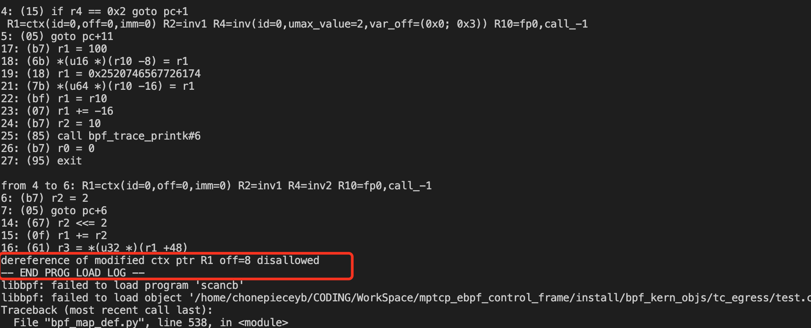
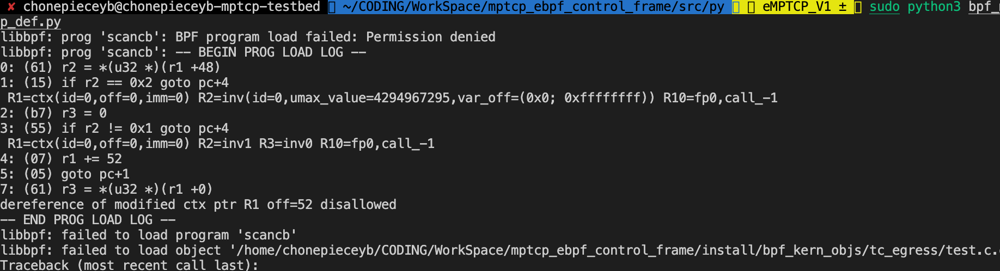

# eBPF 无法通过验证例子

## example1 由于C代码和实际编译的字节码不一致

**场景** 

1. TC 有一个cb数组  ctx->cb[5] 
2. cb[0] 存放一个 index 属于 [1,5)
3. 根据cb[0] 的index 拿到cb数组的某一个值

**C代码** 

```c 
#include "common.h"

SEC("tc")
int scancb(struct __sk_buff *ctx) {
    //scan cb
    __u32 curr_id = ctx->cb[0];
    __u32 target;
#pragma unroll
    for (int i = 1; i < 5; i++) {
        if (curr_id == i) {
            target = ctx->cb[i];
            break;
        }
    }
    //use target
    bpfprintk("target %d", target);
    return 0;
}
```

**编译后的字节码** 

```assembly
test.c.o:	file format ELF64-BPF


Disassembly of section tc:

0000000000000000 scancb:
;     __u32 curr_id = ctx->cb[0];
       0:	r4 = *(u32 *)(r1 + 48)
;         if (curr_id == i) {
       1:	if r4 s> 2 goto +6 <LBB0_3>
       2:	r2 = 1
       3:	if r4 == 1 goto +10 <LBB0_8>
       4:	if r4 == 2 goto +1 <LBB0_5>
       5:	goto +11 <LBB0_9>

0000000000000030 LBB0_5:
       6:	r2 = 2
       7:	goto +6 <LBB0_8>

0000000000000040 LBB0_3:
       8:	if r4 == 3 goto +4 <LBB0_6>
       9:	if r4 == 4 goto +1 <LBB0_7>
      10:	goto +6 <LBB0_9>

0000000000000058 LBB0_7:
      11:	r2 = 4
      12:	goto +1 <LBB0_8>

0000000000000068 LBB0_6:
      13:	r2 = 3

0000000000000070 LBB0_8:
;             target = ctx->cb[i];
      14:	r2 <<= 2
      15:	r1 += r2
      16:	r3 = *(u32 *)(r1 + 48)

0000000000000088 LBB0_9:
      17:	r1 = 100
;     bpfprintk("target %d", target);
      18:	*(u16 *)(r10 - 8) = r1
      19:	r1 = 2675266157534142836 ll
      21:	*(u64 *)(r10 - 16) = r1
      22:	r1 = r10
      23:	r1 += -16
      24:	r2 = 10
      25:	call 6
;     return 0;
      26:	r0 = 0
      27:	exit
```

**原因分析** 

看一下汇编后的代码， r1寄存器存放的是 ctx指针。

1. C代码 `__u32 curr_id = ctx->cb[0]` 是能通过验证的，对应于汇编语句 `r4 = *(u32 *)(r1 + 48)` 可以看到汇编语句只是从r1存放的起始地址计算cb数组的地址，并且做一个解引用的操作。curr_id存放在r4寄存器中

2. 但是C代码循环体（伪循环，实际是循环展开）里的操作是不能通过验证的。以 curr_id == 1为例，跳转到LBB0_5。对应汇编代码 14-16行

   

​	此时r2值为1， r2 <<= 2 是因为cb 是一个 u32的数组（左移动四位）。关键在于第 15句 r1 += r2 修改了 r1的指针，导致了验证不通过。理想情况下我们希望汇编这么写 `r3 = *(u32 *)(r1 + 52)` 而不是对r1进行修改。

报错如下： 



可以看到就是提示报错就是因为修改了 r1 寄存器（存放ctx的指针）。但是这个报错针对的是编译后的字节码，而非原本的C代码。

## example2 

如果将上一个例子 不要使用 for 循环，C代码更改为： 

```c 
#include "common.h"

SEC("tc")
int scancb(struct __sk_buff *ctx) {
    //scan cb
    __u32 curr_id = ctx->cb[0];
    __u32 target = 0;
    if (curr_id == 1) {
        target = ctx->cb[1];
    }

    if (curr_id == 2) {
        target = ctx->cb[2];
    }
    //use target
    bpfprintk("target %d", target);
    return 0;
}
char _license[] SEC("license") = "GPL";
```

使用常数引用 cb 数组

```assembly
test.c.o:	file format ELF64-BPF


Disassembly of section tc:

0000000000000000 scancb:
;     __u32 curr_id = ctx->cb[0];
       0:	r2 = *(u32 *)(r1 + 48)
;     if (curr_id == 1) {
       1:	if r2 == 2 goto +4 <LBB0_3>
       2:	r3 = 0
       3:	if r2 != 1 goto +4 <LBB0_5>
;         target = ctx->cb[1];
       4:	r1 += 52
       5:	goto +1 <LBB0_4>

0000000000000030 LBB0_3:
;         target = ctx->cb[2];
       6:	r1 += 56

0000000000000038 LBB0_4:
       7:	r3 = *(u32 *)(r1 + 0)

0000000000000040 LBB0_5:
       8:	r1 = 100
;     bpfprintk("target %d", target);
       9:	*(u16 *)(r10 - 8) = r1
      10:	r1 = 2675266157534142836 ll
      12:	*(u64 *)(r10 - 16) = r1
      13:	r1 = r10
      14:	r1 += -16
      15:	r2 = 10
      16:	call 6
;     return 0;
      17:	r0 = 0
      18:	exit
```

可以看到汇编后， 第4、6行仍然修改了r1寄存器

所以依然报错: 

