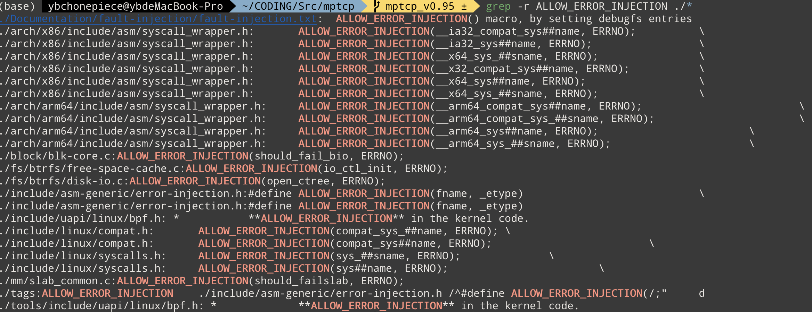
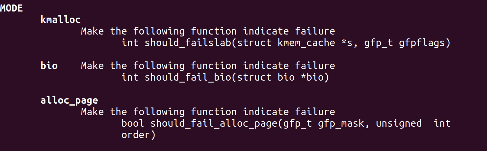
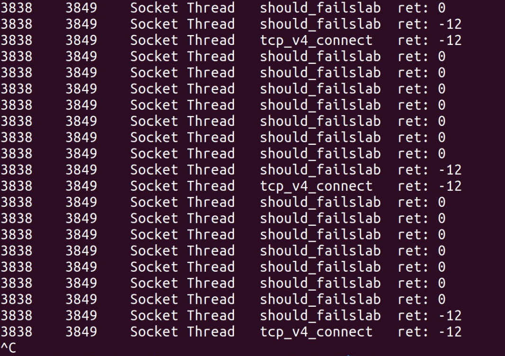

# 利用BPF技术以及kprobe修改函数返回值

## bpf_override_return

利用bpf技术修改函数返回值，必须使用bpf库提供的函数bpf_override_return。

其定义和说明如下： 

```c
/*
 * bpf_override_return
 *
 * 	Used for error injection, this helper uses kprobes to override
 * 	the return value of the probed function, and to set it to *rc*.
 * 	The first argument is the context *regs* on which the kprobe
 * 	works.
 *
 * 	This helper works by setting the PC (program counter)
 * 	to an override function which is run in place of the original
 * 	probed function. This means the probed function is not run at
 * 	all. The replacement function just returns with the required
 * 	value.
 *
 * 	This helper has security implications, and thus is subject to
 * 	restrictions. It is only available if the kernel was compiled
 * 	with the **CONFIG_BPF_KPROBE_OVERRIDE** configuration
 * 	option, and in this case it only works on functions tagged with
 * 	**ALLOW_ERROR_INJECTION** in the kernel code.
 *
 * 	Also, the helper is only available for the architectures having
 * 	the CONFIG_FUNCTION_ERROR_INJECTION option. As of this writing,
 * 	x86 architecture is the only one to support this feature.
 *
 * Returns
 * 	0
 */
static long (*bpf_override_return)(struct pt_regs *regs, __u64 rc) = (void *) 58;
```

其中 regs 是 bpf kprobe 的环境参数，rc 是修改的返回值。

从说明文档我们可以知道 bpf_override_return 的原理： 

1. 通过修改 PC(程序计数器)，***使得被 probe的函数不会执行 **(个人理解有点类似通过修改指令的方式拦截probe的函数)，并且用 **rc 的值来替代原函数的返回值**， 因此这一技术经常用来 error injection（后文会提到） 
2. 要使用该函数，编译内核的时候必须设置CONFIG_BPF_KPROBE_OVERRIDE 为 yes ，（按照说明目前只有 x86架构的机器支持这一特性）
3. 只能对标记**ALLOW_ERROR_INJECTION** ，的函数使用 bpf_override_return 

这个函数的原理不难理解，现在简单讨论一下**ALLOW_ERROR_INJECTION** 

### **ALLOW_ERROR_INJECTION** 

首先在 mptcp-0.95的内核中，被打上该标记的函数并不多： 

以下是对 **ALLOW_ERROR_INJECTION**  标记的检索结果



而 ALLOW_ERROR_INJECTION 根据源码其实是一段宏定义

```c
#ifdef CONFIG_FUNCTION_ERROR_INJECTION
/*
 * Whitelist ganerating macro. Specify functions which can be
 * error-injectable using this macro.
 */
#define ALLOW_ERROR_INJECTION(fname, _etype)				\
static struct error_injection_entry __used				\
	__attribute__((__section__("_error_injection_whitelist")))	\
	_eil_addr_##fname = {						\
		.addr = (unsigned long)fname,				\
		.etype = EI_ETYPE_##_etype,				\
	};
#else
#define ALLOW_ERROR_INJECTION(fname, _etype)
#endif
#endif

```

### bpf_override_return的设计初衷

bpf 为了保证安全性，该函数的使用收到了较为严格的限制，该函数的文档中也说明，该函数的初衷是 error injection ,方便注入error，使得程序在需要的时候停止，其本质是为了方便 测试 和 调试

## bcc inject 

bcc 的 inject工具比较好的应用了 bpf_override_return 

这个工具对底层的三个函数 进行 kprobe,  并修改其返回值，使得返回指定的 errno,达到注入错误，并使得整条调用链失败。

三个函数分别对应注入的三种模式 (参数 mode )



因为这三个函数属于底层的函数，大部分的函数都会调用到。

### inject 的主要功能

inject 的功能可以描述为： 

用户可以指定 一条函数调用链以及调用链上每一个函数的参数条件，当条件满足的时候，根据用户选择的模式（底层的注入函数，三个模式选一个），让底层的注入函数返回特定的 errno, 达到让整条调用链失败的效果

## inject的测试和 bpf_override_return的测试

下面我基于bcc inject 工具做了一个简单的实验，验证 bpf_override_return的实际作用

实验步骤： 

1. 我使用 kmalloc 模式，并且设置，当 tcp_v4_connect 函数被调用的时候，底层的 `should_failslab`会返回 指定的 error，使得 tcp_v4_connect调用失败。命令为： `sudo inject kmalloc -v 'tcp_v4_connect()'
2. 我打开浏览器，作为触发实验的对象
3. 我使用 bcc trace 工具，追踪 tcp_v4_connect()函数的返回值，以及 should_failslab 的返回值，命令为： `sudo trace -L 3849 'r::should_failslab "ret: %d",retval' 'r::tcp_v4_connect() "ret: %d", retval' ` (-L 指定浏览器对应的线程)

实验结果： 

1. 无法通过浏览器访问网页 （因为 tcp_v4_connect()调用失败了） 
2. 追踪结果的分析： 



从追踪结果我们可以看到，tcp_v4_connect函数和部分 should_failedslab 函数返回值为 -12 , 查询，该返回值对应的errno是


是 和 kmalloc错误的含义相同。

这个简单的小实验证明了，bpf_override_return是有效的

## bpf_override_return的应用

我们明确，该函数的主要作用是错误注入。

并且该函数的使用条件还是很严苛的。目前**我们无法直接使用** 

但是这并不意味着该函数没用。我目前对该函数应用设想主要在未来修改内核阶段： 

1. **我们可以在指定的地方，设置相应的钩子函数，并给钩子函数打上相应的ALLOW_ERROR_INJECTION标签** 
2. **钩子函数的返回值对应着下一段程序的分支** 
3. **我们通过kprobe 以及 bpf_override_return 来控制 钩子函数的返回值，以此来达到根据参数值跳过某一函数的执行，或者决定函数分支的效果** 

举个例子： 

假设我们要修改mptcp_established_option函数

```c
void mptcp_established_option(args...) {
   if (not my_hook(args...)) {
     return;
   }
}
int  my_hook(args...) {
  return 0;
}
```

My_hook 是一个钩子函数，我们把mptcp_established_option参数传递进去，但是什么也不做，默认返回0（不跳过mptcp_established_option执行）

我们可以利用 bpf kprobe , 根据mptcp_established_option的参数，决定是否跳过 mptcp_established_option的执行。我们可以利用 bpf_override_return 修改 my_hook 的返回值，来达到这一效果。


以上只是一个例子，也只是我的设想，但是这种做法对性能的损耗并没有实际验证过。


## 给 tcp_v4_connect注入错误的源码

最后附上 inject 给tcp_v4_connect 注入错误的 c 源码： 

这段源码的重点在于 should_failslab_entry 函数

其中后缀带 entry 是 kprobe 

后缀是 exit 是 kretprobe

```c
#include <linux/mm.h>

struct pid_struct {
    u64 curr_call; /* book keeping to handle recursion */
    u64 conds_met; /* stack pointer */
    u64 stack[2];
};
BPF_HASH(m, u32, struct pid_struct);
BPF_ARRAY(count, u32, 1);
int tcp_v4_connect_entry(struct pt_regs *ctx)
{
        u32 pid = bpf_get_current_pid_tgid();
        
        /*
         * Early exit for probability case
         */
        if (false)
               return 0;
        /*
         * Top level function init map
         */
        struct pid_struct p_struct = {0, 0};
        m.insert(&pid, &p_struct);
        

        struct pid_struct *p = m.lookup(&pid);

        if (!p)
                return 0;

        /*
         * preparation for predicate, if necessary
         */
         
        /*
         * Generate entry logic
         */
        

        if (p->conds_met >= 2)
                return 0;
        if (p->conds_met == 0 && (true)) {
                p->stack[0] = p->curr_call;
                p->conds_met++;
        }

        p->curr_call++;

        return 0;
}
int tcp_v4_connect_exit(struct pt_regs *ctx)
{
        u32 pid = bpf_get_current_pid_tgid();

        struct pid_struct *p = m.lookup(&pid);

        if (!p)
                return 0;

        p->curr_call--;

        /*
         * Generate exit logic
         */
        
        if (p->conds_met < 1 || p->conds_met >= 3)
                return 0;

        if (p->stack[p->conds_met - 1] == p->curr_call)
                p->conds_met--;
        
        
        /*
         * Top level function clean up map
         */
        m.delete(&pid);
        
        return 0;
}
int should_failslab_entry(struct pt_regs *ctx, struct kmem_cache *s, gfp_t gfpflags)
{
        u32 overridden = 0;
        int zero = 0;
        u32* val;

        val = count.lookup(&zero);
        if (val)
            overridden = *val;

        /*
         * preparation for predicate, if necessary
         */
         
        /*
         * If this is the only call in the chain and predicate passes
         */
        if (2 == 1 && (true) && overridden < -1) {
                count.atomic_increment(zero);
                bpf_override_return(ctx, -ENOMEM);
                return 0;
        }
        u32 pid = bpf_get_current_pid_tgid();

        struct pid_struct *p = m.lookup(&pid);

        if (!p)
                return 0;

        /*
         * If all conds have been met and predicate passes
         */
        if (p->conds_met == 1 && (true) && overridden < -1) {
                count.atomic_increment(zero);
                bpf_override_return(ctx, -ENOMEM);
        }
        return 0;
}

```

