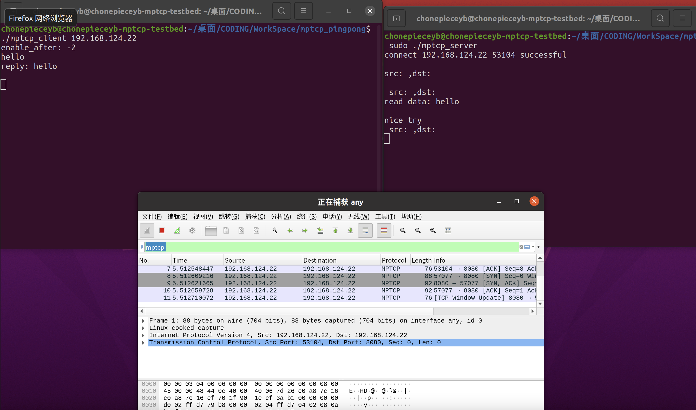
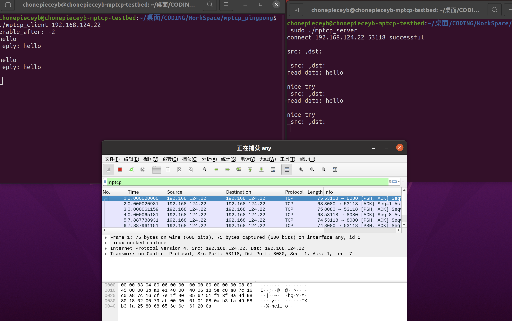
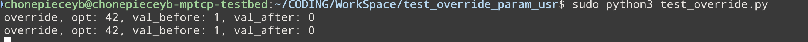
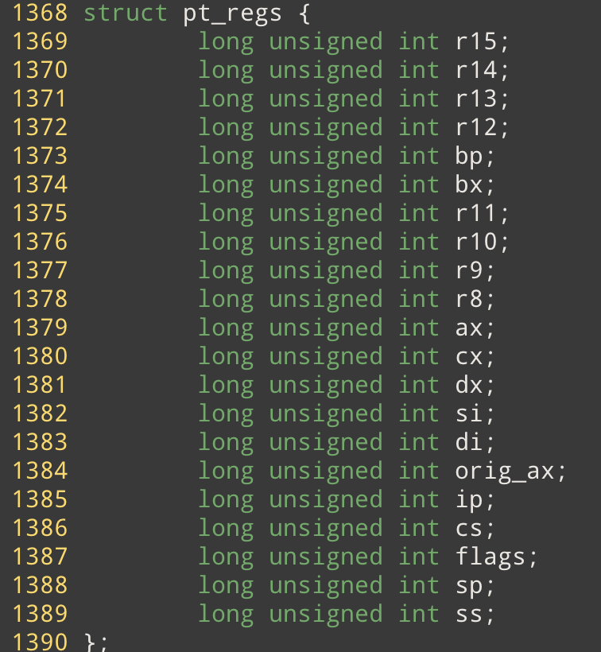
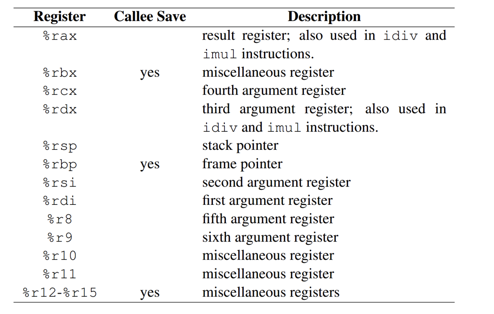
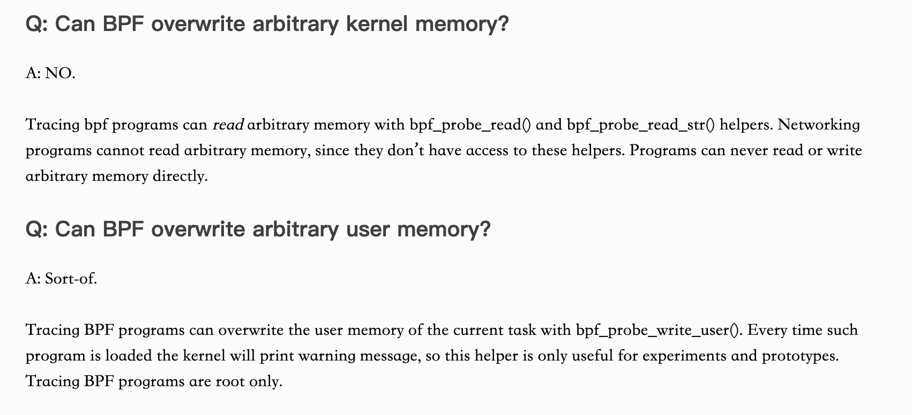
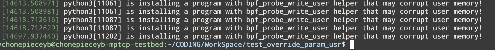

# 利用bpf修改用户空间函数参数

## 前言 

最近成功利用bpf，结合 uprobe 修改用户态系统调用的函数参数。结论可以概括为： 

1. 可以利用bpf提供的 bpf_probe_write_user 来实现这一目标，可以修改用户态的库函数，自己写的用户态程序的函数等(不局限于C语言)
2. bpf目前仅提倡该函数用在测试和debug中，使用 bpf_probe_write_user 函数，会在日志中打印警告信息

## 修改函数参数

linux 大量使用了 C 语言，因此本次针对C 语言的函数修改。我们知道 C 语言中，函数参数有两种类型： 

1. 按值传递的普通参数 （int) 
2. 指针 （void*)

本次我实验成功的是第二种，对于第一种，我有两种思路，但是没有成功，我后面会稍微讨论一下。

### 修改指针类型的参数

我们知道，指针是变量的地址，如果参数是指针的话，我们的思路很简单： 

**获取变量的地址，并利用 bpf_probe_write_user 修改内存的内容** 

本次实验，修改 `int setsockopt(int sockfd, int level, int optname, const void *optval, socklen_t optlen)` 参数optval的值

核心代码如下： 

```c
#include <linux/ptrace.h>
BPF_PERF_OUTPUT(events);

struct Event {
  int opt;
  int val_after;
  int val_before;
};

int override_setsockopt(struct pt_regs *ctx, int sockfd, int level, int optname, const void *optval) {
    if (optname ==  42) {
        int before = *(int*)optval;
        int after = 0;
        void *optv = (void*)optval; // remove const
        if (bpf_probe_write_user(optv, &after, sizeof(int))) {
            return -1;
        }
        struct Event e = {optname, *(int*)optval, before};
        events.perf_submit(ctx, &e, sizeof(e));
    }
    return 0;
}
```

其中： 

`void *optv = (void*)optval;` 这一行去除 const 限制

这段代码的含义就是，每当 setsockopt 被调用的时候，会被 uprobe 拦截，判断 optname 是不是 42(MPTCP_ENABLED),  如果是强行设置改选项的值为 0 （不启动 mptcp_enabled) , 为了方便观测，我将 optname, optval 的原始值 和 以及修改后指针指向内存的值返回到用户态。

值得一提的是： 

`bpf_probe_write_user(optv, &after, sizeof(int))` 

写内存我们需要知道写多少长度，在 C 语言中, void* 指针（单纯表示内存地址）作为参数往往需要配合地址长度，从这个角度来说修改void*类型的指针是比较容易的。

#### **实验** 

我使用师兄写的 mptcp_pingpong 来进行实验，并使用 wireshark 抓 pingpong 程序通信的 packet，判断抓到的packet协议类型是不是mptcp

Mptcp pingpong 默认使用了mptcp协议，我利用 bpf程序强制讲 mptcp_enable 选项的值设置为 0 

因此预期的实验效果是： **使用 bpf程序之前，能够抓到 pingpong 的 mptcp 协议包， 而启动 bpf 程序后抓不到mptcp协议包** 

#### **实验结果** 

**使用bpf程序前** 




从下方的wireshark 可以看到抓到了mptcp协议包 （目的ip 是 192.168.124.22) 

**使用 bpf程序之后**





可以看到只抓到了 tcp的包，而没有 mptcp的包

说明 setsockopt 被 bpf 程序拦截并禁用了 mptcp 

### 非指针类型的参数

对于非指针类型的参数，因为他们是 copy by value 我们修改了 uprobe 函数的参数值，也无法修改原始函数的参数值。

对于 x86架构的机器，有两个思路

首先我们看一下 pt_regs 在 x86架构下的定义： 



可以看到 pt_regs 保存着uprobe之前函数调用的寄存器信息。

查询x86架构寄存器的使用方案，可以得到： 



有两个关键信息： 

1. 对于前6个参数，参数值保存在寄存器中。（因此也可以通过寄存器来获取参数，这也是 bcc 的 trace 利用 arg占位符来获取参数之的原理，可以考虑之后加到 my_trace中） 
2. sp寄存器是堆栈指针寄存器保存栈顶的地址，gcc编译器默认将参数从右到左压栈

因此我们有两个思路：

1. 修改对应寄存器的值
2. 利用 sp 指针，计算相应参数在堆栈中的地址，获取地址并修改堆栈内容，来达到修改参数值的效果这也是文章（ https://cloud.tencent.com/developer/article/1790913） 

然而我目前： 

1. 方案1 还没测试过，但我觉得大概率是不能成功的
2. 方案2 我试过了，但是并不能读出正确的内存的值

还是以 setsockopt 为例 ，我首先希望通过 sp 寄存器来获取 optname 这个参数的值(第三个参数）： 

根据https://zhuanlan.zhihu.com/p/27339191 文章的叙述，x86架构，堆栈顶应该是 父函数的返回地址，往下依次是从左到右的各个参数： 

代码如下：

```c 
if (optname ==  42) {
	u64 sp = ctx->sp;
	u64 addr = sp + sizeof(void*) + sizeof(int) + sizeof(int) + sizeof(int);
	int opt = 0;
	bpf_probe_read_user(&opt, sizeof(int), (void*)addr);
}
```

然而我并不能读到正确的 optname ， 我利用文章 https://cloud.tencent.com/developer/article/1790913， 将最后的写操作改为读操作也并不能得到正确的结果。

我对汇编还不是特别熟悉，知道了sp寄存器的值，我还不能正确读到堆栈的地址，如果能做到这一步，应该是可以实现修改这种类型的参数值的。（sp 保存段内地址便宜，而ss 保存堆栈的段地址） 

然而即使上述都成功了，我觉得这种方式也不太好，因为根据地层的寄存器来修改参数值，受到体系结构的限制比较大，不同的体系结构的寄存器使用方式都不同。

### bpf不具备拦截的功能

根据内核的文档： https://www.kernel.org/doc/html/latest/bpf/bpf_design_QA.html#q-can-bpf-overwrite-arbitrary-user-memory



内核并不支持利用 bpf 修改内存， 也不提供这个功能。因此利用bpf修改用户态内存这种方式有待商榷，还需要考虑到效率问题，和一些其他的安全性问题（比如多线程，竞争冒险）

使用 bpf_probe_write_user, 在日志中会出现： 




## 代码

最后附上，修改指针类型参数的代码： 

```python 
from bcc import BPF
import sys
import argparse

def gen_tgid_filter(tgid):
    tgid_str = ""
    if tgid != None :
        tgid_str = """
if (__tgid != %d) { return 0; }
        """%tgid
    return tgid_str

def gen_pid_filter(pid):
    pid_str = ""
    if pid != None :
        pid_str = """
if (__pid != %d) { return 0; }
        """%pid
    return pid_str

program = """
#include <linux/ptrace.h>
BPF_PERF_OUTPUT(events);

struct Event {
  int opt;
  int val_after;
  int val_before;
};

int override_setsockopt(struct pt_regs *ctx, int sockfd, int level, int optname, const void *optval) {
    u64 __pid_tgid = bpf_get_current_pid_tgid();
    u32 __tgid = __pid_tgid >> 32;
    u32 __pid = __pid_tgid; // implicit cast to u32 for bottom half
    //tgid
    %s
    //pid
    %s
    if (optname ==  42) {
        int before = *(int*)optval;
        int after = 0;
        void *optv = (void*)optval; // remove const
        if (bpf_probe_write_user(optv, &after, sizeof(int))) {
            return -1;
        }
        struct Event e = {optname, *(int*)optval, before};
        events.perf_submit(ctx, &e, sizeof(e));
    }
    return 0;
}
"""

def print_event(cpu, data, size):
  event = bpf["events"].event(data)
  print("override, opt: %d, val_before: %d, val_after: %d"%(event.opt, event.val_before, event.val_after))

if __name__ == '__main__' :
    parser = argparse.ArgumentParser(description = "Attach to functions and print trace messages.")
    parser.add_argument("-p", "--pid", type = int, metavar = "PID",
                  dest = "tgid", help = "id of the process to trace (optional)")
    parser.add_argument("-L", "--tid", type = int, metavar = "TID",
                  dest = "pid", help = "id of the thread to trace (optional)")
    args = parser.parse_args()
    program = program%(gen_tgid_filter(args.tgid), gen_pid_filter(args.pid))

    bpf = BPF(text = program)
    bpf.attach_uprobe(name = "c" , sym = "setsockopt", fn_name = "override_setsockopt")
    bpf["events"].open_perf_buffer(print_event)

    while True:
        try:
            bpf.perf_buffer_poll()
        except KeyboardInterrupt:
            exit()
```

