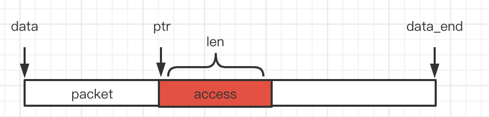
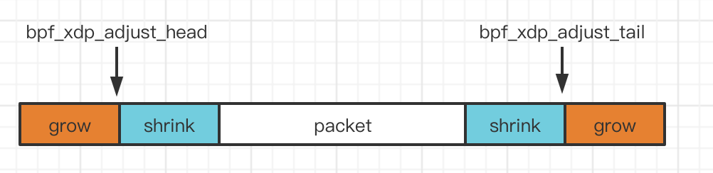
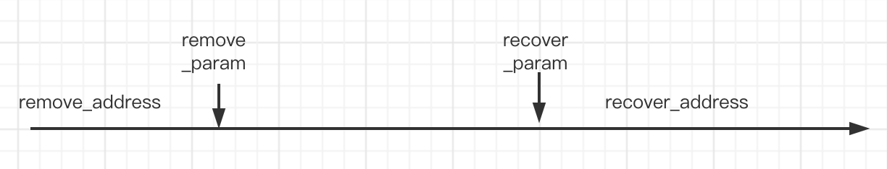
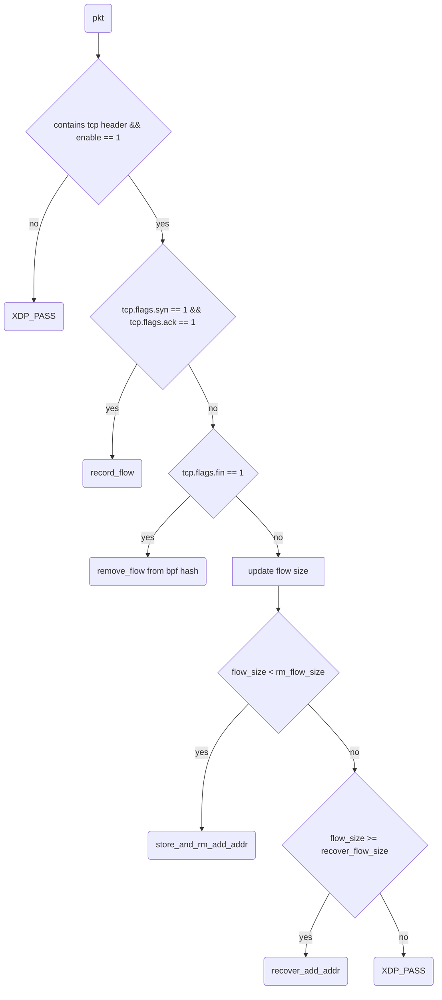
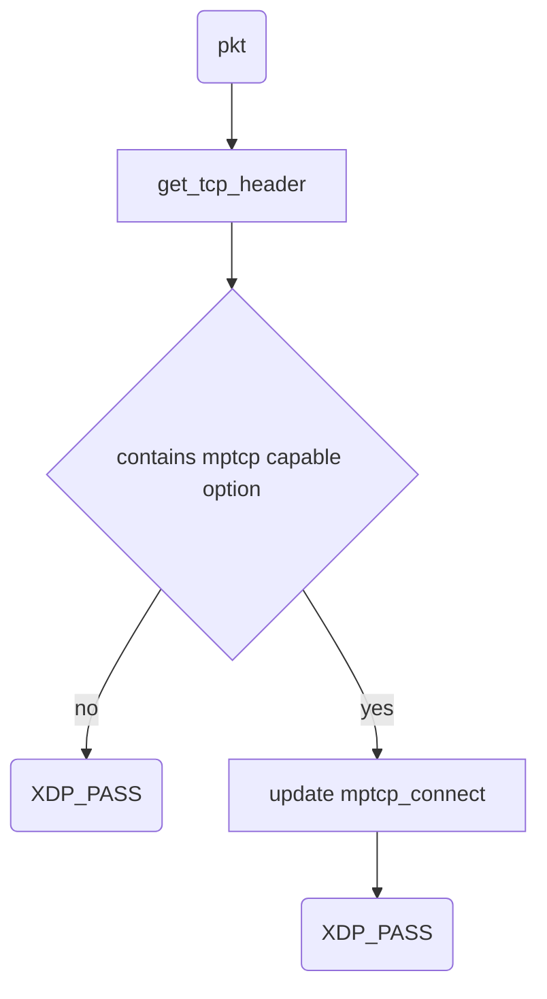
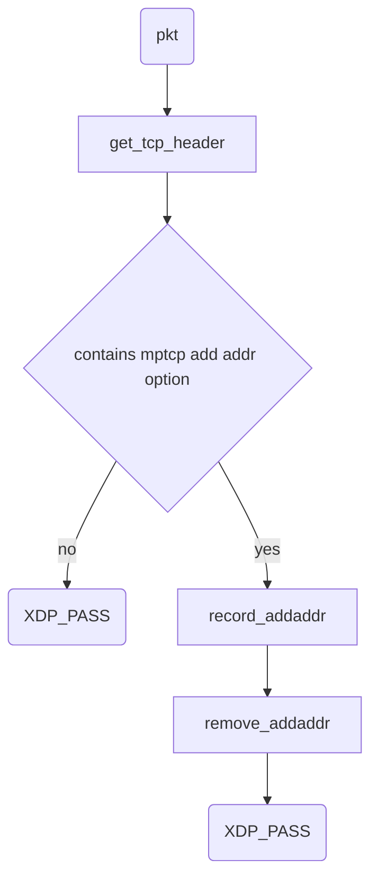
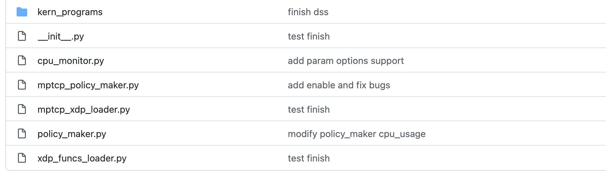
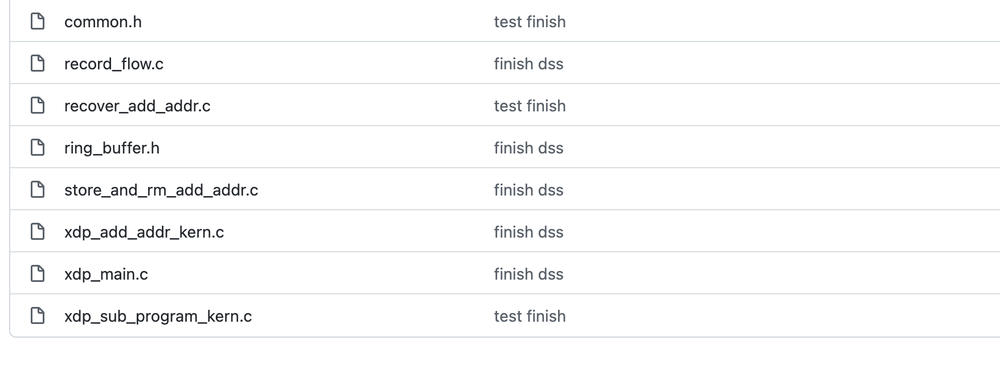
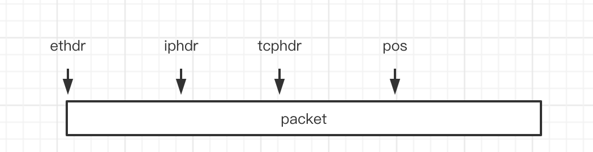
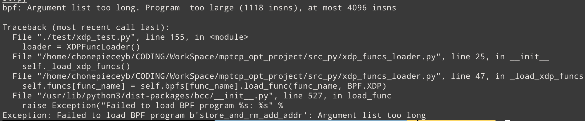

# 利用XDP修改packet的实践

[toc]

## EBPF和XDP基础

XDP全称是eXpress Data Path(高速数据路径)，位于网卡接收数据包之后，内核网络栈之前，常被用做高效的包处理、包转发、负载均衡等。本文主要是xdp在包处理方面的实践。

xdp可以**访问并修改**整个packet的内容，xdp处理完packet之后，返回action码，执行不同的操作，action码如下： 

```c
/* User return codes for XDP prog type.
 * A valid XDP program must return one of these defined values. All other
 * return codes are reserved for future use. Unknown return codes will
 * result in packet drops and a warning via bpf_warn_invalid_xdp_action().
 */
enum xdp_action {
	XDP_ABORTED = 0,  //bpf异常
	XDP_DROP,     //将包丢弃
	XDP_PASS,     //重新交给内核处理
	XDP_TX,       //反射，将包从原有的nic重新发送回去
	XDP_REDIRECT, //重定向，定向到不同的cpu, XSK等..
};

```

本文主要是对数据包进行修改，不涉及包的转发，因此返回码只是用了 XDP_PASS(将packet交给内核处理) 和 XDP_DROP （将包丢弃） 

### directly packet access 

XDP目前使用了 directly packet access 技术，可以直接通过指针访问并修改packet的内容。使用这项技术的要点在于，**使用指针之前必须对指针进行验证** 

首先，xdp操作对象是： 

```c
/* user accessible metadata for XDP packet hook
 * new fields must be added to the end of this structure
 */
struct xdp_md {
	__u32 data;
	__u32 data_end;
	__u32 data_meta;
	/* Below access go through struct xdp_rxq_info */
	__u32 ingress_ifindex; /* rxq->dev->ifindex */
	__u32 rx_queue_index;  /* rxq->queue_index  */
};
```

在本文中主要使用 data 和 data_end ，这是两个指针，分别指向 packet 的头部和尾部，如下图所示： 



验证指的是： 

假设 ： 

1. 我们要访问的packet区域（上图红色的区域）的开始指针为 ptr
2. 区域长度(bytes)为len

**我们在使用ptr之前必须**： 

判断区域是否超过 data_end，即

```c
if ((void*)ptr + len > data_end) {
    //如果ptr不是有效的指针
    return;
}
// access ptr here
```

**特别值得注意的是，这种验证伴随着编程的全程，只要我们使用了一个新的指针，就必须验证这个指针，否则无法通过验证器的验证** 并且经常会不知道错在哪里，针对这点有一个比较好的编程方案，后文会提及。

#### example 

举一个更具体的例子，假设有一个包最外层是 以太网头， 我们要访问以太网头，那么我们的代码如下： 

```c
void *data_end = (void *)(long)ctx->data_end;
void *data = (void *)(long)ctx->data;

struct ethhdr *eth = data;

/* Byte-count bounds check; check if current pointer + size of header
    * is after data_end.
*/
if ((void*)(eth + 1) > data_end) {
     return -1;
}
//access eth here
```

### 修改packet的大小

xdp支持修改packet的大小，但是只能在packet的开头，或者包的结尾，

增加或者减少packet的大小，并且一旦修改大小之后，之前验证过的所有指针都失效了，必须要重新验证。

ebpf提供了帮助函数来完成包大小的修改： 

```c
/*
 * bpf_xdp_adjust_head
 *
 * 	Adjust (move) *xdp_md*\ **->data** by *delta* bytes. Note that
 * 	it is possible to use a negative value for *delta*. This helper
 * 	can be used to prepare the packet for pushing or popping
 * 	headers.
 *
 * 	A call to this helper is susceptible to change the underlying
 * 	packet buffer. Therefore, at load time, all checks on pointers
 * 	previously done by the verifier are invalidated and must be
 * 	performed again, if the helper is used in combination with
 * 	direct packet access.
 *
 * Returns
 * 	0 on success, or a negative error in case of failure.
 */
static long (*bpf_xdp_adjust_head)(struct xdp_md *xdp_md, int delta) = (void *) 44;

/*
 * bpf_xdp_adjust_tail
 *
 * 	Adjust (move) *xdp_md*\ **->data_end** by *delta* bytes. It is
 * 	possible to both shrink and grow the packet tail.
 * 	Shrink done via *delta* being a negative integer.
 *
 * 	A call to this helper is susceptible to change the underlying
 * 	packet buffer. Therefore, at load time, all checks on pointers
 * 	previously done by the verifier are invalidated and must be
 * 	performed again, if the helper is used in combination with
 * 	direct packet access.
 *
 * Returns
 * 	0 on success, or a negative error in case of failure.
 */
static long (*bpf_xdp_adjust_tail)(struct xdp_md *xdp_md, int delta) = (void *) 65;
```

这两个分别从packet 头部 和 尾部对packet的大小进行修改。如下图所示:



### ebpf里的函数调用

ebpf对函数调用做出了严格的限制，这主要出于安全考虑，基本上常用的库函数都无法使用。

bpf支持的函数调用类型如下： 

1. bpf帮助函数
2. 由`static __always_inline `修饰的自己定义的内联函数
3. 宏函数，包括自己定义的宏函数，或者是内核头文件定义的宏函数（比如计算校验和的宏函数，contain_of) 

简单理解我们能在ebpf中调用的函数，要么是bpf定义好的帮助函数，要么就是内联的函数。因此在项目中定义的函数，都有 `static __always_inline`修饰。

### ebpf尾调用

由于ebpf单个程序的最大长度为 4k(4096)条指令。使用尾调用可以： 

1. 解决ebpf单个程序最大长度限制的问题。ebpf最多支持32次尾调用。
2. 更好地划分程序的结构，让代码更加易于开发和维护

尾调用和常规的函数调用不同： 

1. 如果一个函数执行了尾调用，那么被调用函数和调用函数的 **bpf程序类型相同** 
2. 一个函数执行尾调用，跳转到另一个bpf程序之后，函数**不会返回调用函数的执行流**

example: 

现在有两个bpf程序，类型都是BPF_XDP， test1 和 test2, test1 尾调用 test2， 如下： 

```c
int test1(struct xdp_md *ctx)
{
    xdp_actions.call(ctx, 0);  //尾调用test2
    
    //之后的代码不会被执行
}

int test2(struct xdp_md *ctx)
{
    
}
```

#### 使用尾调用

（bcc) 

首先有一种bpf映射，专门为尾调用设计： 

`BPF_PROG_ARRAY`

它的key是整数，value是被尾调用的bpf程序的文件描述符。

具体的流程： 

1. 要声明 BPF_PROG_ARRAY 类型的 bpf 映射
2. 在用户态**给对应的index**写入bpf程序程序描述符
3. bpf程序中，在适当的时候执行该映射的 call 方法，进行尾调用

其中 1 和 3 都比较好理解。主要是2: 

我们写完一段bpf程序之后，首先要将其编译成 ELF 文件，然后将其加载到 bpf 虚拟机中。加载成功之后，我们能够获得被加载程序的文件描述符，fd。 2 中做的就是在用户态，将相应的文件描述符写入BPF_PROG_ARRAY 对应的索引中。

值得注意的是（个人理解），尾调用相当于执行一段新的bpf程序，因此**调用前的临时变量无法访问**，合理划分程序结构，在适当的地方进行尾调用对于提升计算效率来说十分重要。

### BPF虚拟文件系统

当使用多个bpf程序时，bpf程序之间需要进行数据通信。数据通信可以通过 BPF 虚拟文件系统来实现。在bcc中为 BPF_TABLE_PINNED。

其定义如下：

```c
BPF_TABLE_PINNED(_table_type, _key_type, _leaf_type, _name, _max_entries, "/sys/fs/bpf/xyz")
```

作用是： 

如果bpf虚拟文件系统下该table存在（由路径指定），那么使用已经存在的table, 否则创建一个新的table并且挂在到文件系统中。

## 主要设计

### 整体设计

整体的思路可以概括为： 对于每一条mptcp主流，记录并不断更新主流大小，拦截所有的 mptcp add address option并保存，当主流大小达到指定的阈值时，将之前保存的 option 重新放入ack包中。

通过拦截并恢复 add address option，让client在一段时间内无法感知server额外的地址，从而实现对于特定大小的流阻止子流建立的效果。

如下图所示： 



横坐标代表流的大小，有两个关键的决策变量： 

1. remove_param 
2. recover_param 

对于一条特定的流，流由tcp 4元组 (源地址，源端口号，目的地址，目的端口号) 唯一标识，假设当前流大小为x , 由上图所示： 

1. 当 x < remove_param 时，移除收到的packet中的 mptcp add address option ，并保存到 bpf hash 中
2. 当 x >= recover_param 时，**逐一**将之前保存的 add address option 重新放置回收到包的 tcp options 中，让client能重新感知client新的地址

ps: 可以同时维护 $10^7$条主流

### XDP程序

整个XDP程序，由 4 个 xdp 子程序组成，分别是：

1. xdp_main , 主程序
2. record_flow, 将mptcp主流记录到bpf hash的子程序
3. store_and_rm_add_addr，将add address 选项从packet中移除，并保存到bpf hash的子程序
4. recover_add_addr, 将保存的 add address 选项，重新放置回接收到的packet的子程序

(这些bpf程序在同名的 .c 文件中)

#### xdp_main

在主程序 xdp_main中，符合特定条件时通过 bpf 尾调用，调用 record_flow, store_and_rm_add_addr,recover_add_addr 这三个子程序。主流程如下图所示： 



整个流程图还是比较简单的，解释一下流程图里的几个重要的判断节点： 

1. `contains tcp header && enable == 1`  我们只处理tcp包，enable是一个全局的开关，如果 enable == 0 . 那么后面的机制就失效了
2. `tcp.flags.syn == 1 && tcp.flags.ack == 1`  XDP程序是运行在client上的，即主流的建立是由 client 发送 syn包并携带 mp_capable选项，xdp作用在接受路径上，所以如果收到了服务端的 syn + ack 包，那么这个packet就**有可能是**（具体是不是还要看是否携带mp_capable，由子程序判断）主流上的第二个包，因此尾调用 recover_flow, 尝试记录子流
3. `tcp_flags.fin == 1` 我们使用bpf hash来跟踪当前系统中的所有的mptcp主流，但是hash的容量是有限的，因此一旦收到fin包我们就要主动删除记录的流，释放资源
4. `flow_size < rm_flow_size` , rm_flow_size 即决策变量 remove_param，符合条件时，尾调用 store_and_rm_add_addr
5. `flow_size >= recover_flow_size` , recover_flow_size 即决策变量，recover_param， 符合条件时，尾调用 recover_add_addr 

主程序和其它被尾调用的bpf子程序通过bpf hash来进行数据的交换： 记录流，记录add address选项，恢复流...， 这个bpf hash是核心的数据结构。

#### 核心数据结构

这个bpf_hash 定义如下

```c
BPF_TABLE_PINNED("hash", struct mptcp_connect, struct ring_buffer, mptcp_connects, MAX_CONNECT_SIZE, "/sys/fs/bpf/mptcp_connects");

struct mptcp_connect {
    __be32      saddr;
    __be32	daddr;
    __be16	source;
    __be16	dest;
} __attribute__((__packed__));

struct xdp_mp_add_addr {
	__u8	kind;
	__u8	len;
#if defined(__LITTLE_ENDIAN_BITFIELD)
	__u8	ipver:4,
		sub:4;
#elif defined(__BIG_ENDIAN_BITFIELD)
	__u8	sub:4,
		ipver:4;
#else
#error	"Adjust your <asm/byteorder.h> defines"
#endif
	__u8	addr_id;
	struct in_addr	addr;
	//__be16		port;
} __attribute__((__packed__));

// 永远保持最新的 16 个， 类似滑动窗口
// 因为一张网卡有一个xdp程序，所以不需要并发控制
struct ring_buffer {
    __u64 last_ack;
    __u64 recvd;
    __u32 consumer;   
    __u32 producer;   //next to be produce 
    struct xdp_mp_add_addr buff[RING_MAX_SIZE];
};
```

1. 这个bpf hash 是一个 pinned table , 挂载在bpf 虚拟文件系统中，是的多个bpf程序可以通过该bpf hash 进行数据通信

2. hash key 为 `mptcp_connect` 其实就是 tcp 四元组
3. hash value, 是一个称为 ring buffer 的数据结构： 
   * last_ack : 上一次接收到的主流的 mptcp dss 选项 ack 的值，使用该值来计算并更新流的大小
   * recvd: 目前估算的接收到的数据包的总大小（bytes) 即流的大小
   * buff : 这是一个环形队列，队列元素是 mptcp add address 选项，队列大小为 16 
   * consumer: 环形队列消费者指针
   * producer: 环形队列生产者指针

该数据结构的重点就是这个环形队列，该队列的作用是： 

最多保存该mptcp主连接**最近的接收到的RING_MAX_SIZE**个mptcp add address 选项。最近的意思是，假设目前队列已满，但是还是收到了新的 add address, 那么会将最老的 add address 选项删除，写入新的 add address 选项。

ring buffer 的完整定义如下： 

```c
#define RING_MAX_SHIFT 4
#define RING_MAX_SIZE (1 << RING_MAX_SHIFT)
#define RING_MASK ((RING_MAX_SIZE) - 1)

//0 : we can consume, means producer > consumer  
static __always_inline int check_cons(struct ring_buffer *b) {
    return !(b->consumer < b->producer);   //if consumer < producer return 0   
}


//once call this func and buff is full, the earliest item must be droped even if confirm isnot be called 
static __always_inline struct xdp_mp_add_addr* ring_buff_prod (struct ring_buffer *b) {
    if ((b->producer - b->consumer) == RING_MAX_SIZE) b->consumer++;
    //produce
    return &(b->buff[b->producer & RING_MASK]);
}

static __always_inline void ring_buff_confirm_prod(struct ring_buffer *b) {
    b->producer++;
}

//should call check_cons first 
static __always_inline const struct xdp_mp_add_addr* ring_buff_cons(struct ring_buffer *b) {
    return &(b->buff[b->consumer & RING_MASK]);
}

static __always_inline void ring_buff_confirm_cons(struct ring_buffer *b) {
    b->consumer++;
}
```

通过帮助函数： check_cons， ring_buff_prod， ring_buff_confirm_prod ， ring_buff_cons， ring_buff_confirm_cons

为了保证队列的一致性，我将生产和消费的过程都拆分成两个步骤： 

1. 尝试 生产/消费
2. 确认 生产/消费

#### record flow 

(./kern_programs/record_flow.c)

record_flow bpf程序的作用是**记录新的mptcp主流** , 这个bpf程序比较简单，主要流程如下图所示:



这里的 update mptcp_connect,  mptcp_connect 是上文提到的维护的核心数据结构 bpf hash的名称, 可以理解为插入一个新的key。

#### store_and_rm_add_addr

(./kern_programs/store_and_rm_add_addr.c)

该bpf子程序的作用是： 

1. 判断是否携带 add address options
2. 如果携带，将 add address options 保存到对应的 ring buffer中，并将其全部更改为 nop(即删除该选项)

流程图如下： 



这个bpf程序也比较简单，比较关键的地方在于，remove add addr 选项并不是通过减少 packet空间，将add addr 选项的字节删除，而是通过用 nop(tcp options中用来表示空选项的选项，常用来作为填充和对齐)覆盖 add addr 的字节来实现的。这样做开销是最小的，在第一部分我们提到，xdp 只能从packet头或者尾扩展空间。

#### recover_add_addr 

(./kern_programs/recover_add_addr.c)

这个bpf子程序功能描述起来很简单：将之前保存的 add addr 选项重新放置到收到的packet的 tcp options中。虽然功能简单，但是由于bpf的种种限制，具体编码实现的时候有点复杂。

核心问题是如何恢复，这里涉及到以下难点： 

1. 收到的ack包是很有可能携带数据的
2. tcp选项的长度是不固定的
3. 前文所述，想要扩展空间只能从头部或者尾部扩展

由于packet携带数据，因此我们只能使用 `bpf_xdp_adjust_head`从头部开始调整空间，然后将原有的包往前“平移“到新的空间，多余的空间插入 add address option。如下图所示： 


（具体的请参考代码） 

### 工程结构

随着项目增大，一个合适的工程结构，对于之后的开发，新模块的加入，代码的阅读来说都是十分重要的。这个项目是基于 bcc 开发的，这里经过我的探索和实践，摸索出了一套合适（还有待改进）工程结构，这里对此进行阐述。

目录结构如下： 



和 xdp 有关的文件是： 

1. kern_programs ： 存放着所有的内核态bpf程序
2. xdp_funcs_loader.py : 全自动化的 bpf 程序编译脚本
3. mptcp_xdp_loader.py : 调用xdp_funcs_loader.py， 用户最终使用的加载 xdp程序的脚本

其中 kern_programs 文件夹内容如下： 



#### kern_programs

首先在前文，我提到bpf支持的函数调用类型很有限，因此在本项目中我采用： 

1. 共有的内联函数（static __always_inline) 都抽象到公共的头文件中，common.h(一些通用的内联函数和宏函数)， ring_buffer.h(环形队列相关的数据结构定义和方法)
2. bpf子程序（主程序和被尾调用的程序），一个子程序使用一个.c文件，并且子程序的bpf函数名和文件名相同（这个可以带来很大的好处）
3. xdp bpf 主程序统一命名为 xdp_main 

以 record_flow.c 为例子： 

其bpf函数定义如下： 

```c
int record_flow(struct xdp_md *ctx) {
    void *data_end = (void *)(long)ctx->data_end;
    void *data = (void *)(long)ctx->data;
    
    __u32 default_action = XDP_PASS; /* Default action */

    struct hdr_cursor nh = {.pos=data};
    int res, tcphl;
    struct ethhdr *eth; 
    struct iphdr *iph;
    struct tcphdr *tcph;
    
    tcphl = res = is_tcp_packet(&nh, data_end, &eth, &iph, &tcph);
    .....
}
```

#### xdp_funcs_loader

bcc 提供最大的便利，就是让我们能够方便地编译bpf程序，并将其加载到bpf虚拟机中。上文提到，所有的bpf子程序的名称和文件名称是相通的。因此我们扫描 kern_programs 文件夹下的所有的 .c 文件，我们就能够知道所有的 bpf 程序，并获取它们的文件描述符, 这样我们能实现不需要修改编译脚本，自动化地编译所有的bpf子程序，为之后添加新的bpf子程序提供了便利。

```python
PYTHON_SRC_DIR = os.path.abspath(os.path.dirname(__file__))
PROJECT_DIR = os.path.abspath(os.path.dirname(PYTHON_SRC_DIR))

KERN_PROGRAM_DIR = os.path.join(PYTHON_SRC_DIR, 'kern_programs')
XDP_MAIN_FUNC = "xdp_main"

FILE_BLACK_LIST = ["xdp_sub_program_kern.c", "xdp_add_addr_kern.c"]
#FILE_WHITE_LIST = ["recover_add_addr.c"]
FILE_WHITE_LIST = None

XDP_PROG_ARRAY = "xdp_actions"
TAIL_CALL_DICT = {
    "record_flow" : 0,
    "store_and_rm_add_addr" : 1,
    "recover_add_addr" : 2
}
```

上面是这个脚本的变量定义的部分： 

1. FILE_BLACK_LIST 和 FILE_WHITE_LIST 指定我们跳过或者是只编译某些.c文件 ，这为调试带来了极大的便利
2. TAIL_CALL_DICT 这是定义了尾调用中索引和文件描述符的关系。

总结一下，通过一些trick 我们就能实现以最小的修改代价实现自动化编译并加载bpf程序，充分发挥bcc的优势，同时也让项目工程结构更加清晰。

### 决策

前文我们提到了有三个决策变量： 

1. enable ：全局开关
2. remove_param
3. recover_param

这三个决策变量保存在一个 pinned table 中： 

```c
BPF_TABLE_PINNED("array", u32, int, mptcp_policy_context, 3, "/sys/fs/bpf/mptcp_policy_context")
```

因此决策做的事就是，在用户态通过某些计算，将这三个变量写入 mptcp_policy_context中，而内核态的xdp程序会从 mptcp_policy_context 读取决策变量，这样就实现动态更改内核态xdp程序行为的目的。

对此我也进行了一些封装： 

其中： 

1. policy_maker.py 封装了各种决策器, 目前有 constant 决策器(写入固定的参数)， 和 cpu决策器（根据cpu利用率，动态调整recover_param） 
2. mptcp_policy_maker.py ， 调用 policy_maker.py 中的方法，封装了将决策器计算的值写入 mptcp_poinly_context中

换言之，如果要新增新的决策器，我们修改policy_maker.py即可，同时修改mptcp_policy_maker.py中对应的配置： 

```python 
MODE_DICT = {
    "constant" : ConstantProxyMaker,
    "cpu-usage" : CPUUsageProxyMaker
}

#key : 决策器名， value: 类名
```

#### 开发新的policy maker

新的policy maker类应该具备以下方法和属性

```python 
class NewPolicyMaker
   self.permanent #决策器是否长期存在, true ：长期存在， false: 仅进行一次决策
   self.interval. #如果 self.permanent = true, 该值表示决策的频率

   #决策函数，return (remove_param, recover_param)
   def make_decision(self):
        psss 
```

具体的请参照 policy_maker.py中的例子

### 其它编程技巧

#### 解决循环问题

我们目前使用的bpf是无法使用循环的，有一个比较方便的替代方案： 

```c
#pragma unroll 40
for (int i = 0; i < 40; i++) {
    ....
}
```

这里的 40 是循环次数，这个循环次数是一个可以在编译期决定的值，不能是一个变量。#pragma unroll 实际上只是在编译期由编译器将循环展开，这样在bpf验证器看来是没有循环的。

在本项目中比较典型的就是，扫描tcp options。 我们知道 tcp选项长度是不固定的，每个选项也是不固定的，然而bpf又不允许使用循环。因此我只能采用逐字节扫描的方式，配合 goto 和 #pragma unroll 实现。

比如判断 tcp options 中是否携带 mptcp dss 选项的代码如下： 

```c
#define CHECK_MP_DSS(next, curr, opt_l, pos, de){\
    if (curr >= opt_l) {\
        goto out_of_bound;\
    }\
    if (next == curr) {\
        struct mp_dss *tmp = pos;\
        if ((void*)(tmp + 1) > de) {\
            goto out_of_bound;\
        }\
        if (tmp->kind == 30 && tmp->sub == 2){\
            goto out;\
        }\
        if (tmp->kind == 0 || tmp->kind == 1) {\
            pos += 1;\
            next += 1;\
        }\
        else {\
            pos += tmp->len;\
            next+= tmp->len;\
        }\
    }\
}\

static __always_inline int carry_mp_dss(struct hdr_cursor *nh,
        void *data_end,
        int opt_length,
        struct mp_dss **mp_dss) {
    //if contains  mptcp option return 0
    void *start = nh->pos;
    int next = 0;
    #pragma unroll 40
    for (int i = 0; i < 40; i++) {
        CHECK_MP_DSS(next, i, opt_length, start, data_end);
    }

out_of_bound: 
    return -2;
out: 
    nh->pos = start;
    *mp_dss = (struct mp_dss*)start;
    return 0;
}
```

#### memcpy

在recover_add_addr子程序中，我们需要**"平移header"**, 这是通过将原有的header保存到临时空间中，然后再复制回去实现的。此时memcpy能起比较重要的作用。

但是bpf是不能直接调用memcpy的，我们只能调用 ` __builtin_memcpy(dst,src,4)`

这是一个宏函数，特别值得注意的是，最后一个参数必须是编译期定值，不能是一个变量，否则是无法通过bpf验证器验证的

#### 计算校验和

计算校验和可以直接使用 linux kernel 的宏函数。定义在： 

`#include <net/checksum.h>`

头文件中。

```c
static inline void csum_replace2(__sum16 *sum, __be16 old, __be16 new)
{
	*sum = ~csum16_add(csum16_sub(~(*sum), old), new);
}


static inline __sum16 csum16_add(__sum16 csum, __be16 addend)
{
	u16 res = (__force u16)csum;

	res += (__force u16)addend;
	return (__force __sum16)(res + (res < (__force u16)addend));
}
```

csum_replace2 比较直观。特别要提醒的是 csum16_add 计算得到的值还需要再按位取反才是tcp header字段中的 csum 

## 遇到的问题和解决策略

### directly packet access 及其验证

这个问题是开发xdp程序中最容易犯的错误，归根到底我们再写代码的过程中一定要时刻牢记： **使用指针之前必须对指针进行验证**。

举个例子： 

还是以扫描 tcp options 中是否携带 mp capable 为例: 

```c
#define CHECK_MP_DSS(next, curr, opt_l, pos, de){\
    if (curr >= opt_l) {\
        goto out_of_bound;\
    }\
    if (next == curr) {\
        struct mp_dss *tmp = pos;\
        if ((void*)(tmp + 1) > de) {\
            goto out_of_bound;\
        }\
        if (tmp->kind == 30 && tmp->sub == 2){\
            goto out;\
        }\
        if (tmp->kind == 0 || tmp->kind == 1) {\
            pos += 1;\
            next += 1;\
        }\
        else {\
            pos += tmp->len;\
            next+= tmp->len;\
        }\
    }\
}\

static __always_inline int carry_mp_dss(struct hdr_cursor *nh,
        void *data_end,
        int opt_length,
        struct mp_dss **mp_dss) {
    //if contains  mptcp option return 0
    void *start = nh->pos;
    int next = 0;
    #pragma unroll 40
    for (int i = 0; i < 40; i++) {
        CHECK_MP_DSS(next, i, opt_length, start, data_end);
    }

out_of_bound: 
    return -2;
out: 
    nh->pos = start;
    *mp_dss = (struct mp_dss*)start;
    return 0;
}
```

上面是正确的代码，但是如果我们修改为： 

```c
#define CHECK_MP_DSS(next, curr, opt_l, pos, de){\
    if (curr >= opt_l) {\
        goto out_of_bound;\
    }\
    if (next == curr) {\
        struct mp_dss *tmp = pos;\
        /*
        //将这部分删除
        if ((void*)(tmp + 1) > de) {\
            goto out_of_bound;\
        }\
        */
        if (tmp->kind == 30 && tmp->sub == 2){\
            goto out;\
        }\
        if (tmp->kind == 0 || tmp->kind == 1) {\
            pos += 1;\
            next += 1;\
        }\
        else {\
            pos += tmp->len;\
            next+= tmp->len;\
        }\
    }\
}\
    
    static __always_inline int carry_mp_dss(struct hdr_cursor *nh,
        void *data_end,
        int opt_length,
        struct mp_dss **mp_dss) {
    //if contains  mptcp option return 0
    void *start = nh->pos;
    int next = 0;
    /*
    	增加一个总的判断
    */
    if (start + opt_length > data_end) {
    	return;
    }
    #pragma unroll 40
    for (int i = 0; i < 40; i++) {
        CHECK_MP_DSS(next, i, opt_length, start, data_end);
    }

out_of_bound: 
    return -2;
out: 
    nh->pos = start;
    *mp_dss = (struct mp_dss*)start;
    return 0;
}
```

验证器就会报错。而且很难找到错误

原因在于，我们自认为在最外层做一次总的判断就够了（判断start），但是bpf验证器并没有那么聪明，它关注的是我们使用的指针 tmp, 因此即使我们最外层做了验证，不在每次使用tmp的时候都进行验证，bpf验证器是不会高兴的。

因此一种比较好的实践是： 

采用扫描的方法： 

定义

```c
struct hdr_cursor {
    void *pos;
};
```

1. 从packet开始到结束，扫描packet， pos 就是扫描线，每次扫描都进行验证
2. 用新的变量记录下已经验证过的pos (记录重要的节点)

入下图所示： 



ethdr , iphdr tcphdr 分别是 以太网，ip, tcp 的头部指针，都是 pos 曾经扫描过的地方。

### bpf代码复杂度问题



上面这个是bpf验证器的报错，很有误导性。

报错的真实原因我认为是： 

bpf程序的圈复杂度太高了，可以简单理解为，分支太多，嵌套的条件判断太多。因为我暂时还没有阅读bpf验证器的源码，比较好的解决方法只有，尽量减少条件判断和嵌套的条件判断，如果一段bpf程序过于复杂那么就拆分成多个 bpf程序，然后使用尾调用。

## 总结

这个项目思路简单，难度在于真正的代码开发和调试，所谓的写代码5min ，调试2h。为了提升bpf程序的开发效率，除了积累总结大量开发经验之外，阅读bpf验证器的源码，弄清楚bpf验证器的实现是很关键的。因为很多时候编译很容易能通过，但是验证不容易通过，报错信息也十分模棱两可。