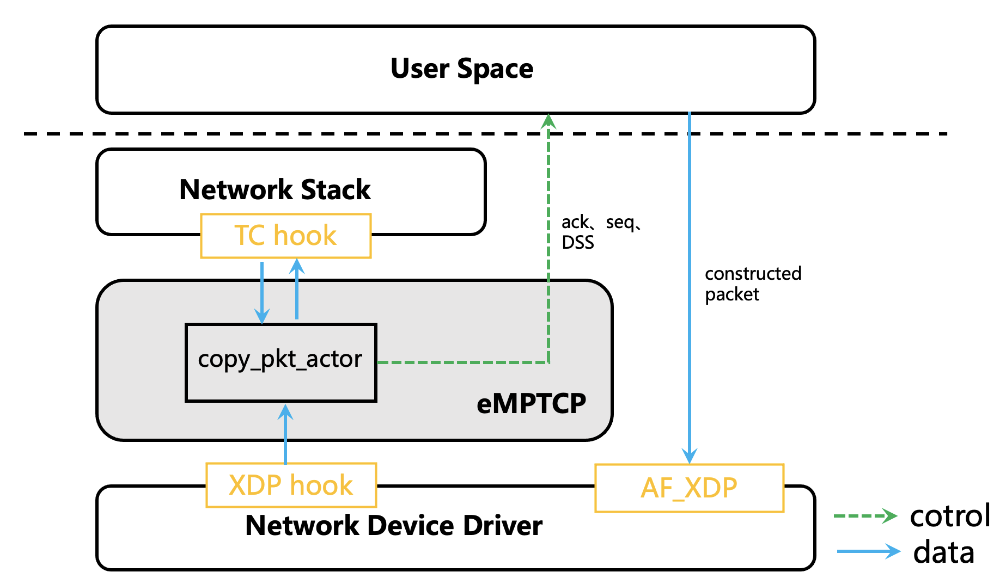

# 包复制技术

## 为什么需要包复制技术(挑战)

* MPTCP通过引入新的TCP选项将TCP拓展为MPTCP

* TCP选项字段容量有限，最多只有40个字节，同一个包在部分情况下无法同时放置多个MPTCP选项字段（例如 携带数据的DSS字段(20字节) 加上 timestamp选项（10字节），MPTCP V1 ADD_ADDR选项（16字节））。因此在MPTCP的设计下，一些控制选项例如ADD_ADDR往往会放在冗余的ack中。为了避免这些冗余ack影响正常传输的拥塞控制窗口，MPTCP协议规定MPTCP实现不能将带有MPTCP选项的重复ack视为拥塞控制信号，于此同时MPTCP也不应该连续发送两个以上的重复ack作为MPTCP控制信号。

* eMPTCP基于包修改来控制MPTCP的行为，因此如果eMPTCP配置的流量没有数据包的时候，eMPTCP就失效了，例如，使用eMPTCP将一条子流设置为backup子流，这条子流上不会有数据发送，基于包修改不能将备用的子流恢复为数据流，因此需要包复制技术，为已经停止数据传输的子流构造控制报文。

* XDP/TC的触发方式是包驱动，每次收到/发出一个包，XDP/TC程序根据包的内容，对包进行修改然后返回动作值，决定丢包，将包交给协议栈等。但是XDP/TC无法将收到的一个packet分割为多个packet，也无法构造packet，XDP/TC不能直接用来实现包复制。

## 包复制技术核心

为了解决上述挑战，我们设计了基于AF_XDP 和XDP/TC的包复制机制。如下图所示： 首先，我们需要构造出能够被对方内核协议栈接收的数据包，构造数据包最大的挑战在于，TCP头部的seq和ack, 以及MPTCP选项的DSS字段，需要是合法的。在MPTCP场景下, 为了构造出数据包我们首先需要选择一条子流，获取当前时刻最新的TCP seq和ack，除此之外还要获取最新的MPTCP DSS字段的值。然后使用获取的值构造出数据包，并在这个数据包中添加 ADD_ADDR或者MP_PRIO选项实现控制MPTCP行为的目的。为此我们为eMPTCP增加了 pkt_copy actor来捕获这些值，进行数据包的复制。由于我们使用了数据流中最新的 seq、ack、DSS来构造数据包，构造出的数据包会成为冗余的ACK，但是根据MPTCP协议的规定，冗余的ack并不会被视为拥塞信号，因此该机制不会影响拥塞控制窗口。再构造数据包之后，我们使用AF_XDP作为数据包的发送路径。AF_XDP允许我们绕过内核网络栈，将数据包直接通过网卡发送出去，这样就避免了网络协议栈的处理开销。

### 包复制技术的代价

包复制技术的代价，包括利用XDP/TC捕获最新的seq、ack、dss并将其传输到用户态，在用户态构造数据包，利用AF_XDP将数据包直接从网卡发送出去。捕获关键数据，利用eBPF高效的包处理，eBPF基于perf_event实现的用户态内核态高效通信，代价很低。在发送路径上，AF_XDP直接从网卡发送数据，减少了网络栈的处理开销。对于控制报文而言，因为报文较小（通常在80个字节以内），构造数据包的开销也很低。因此我们提出的包复制技术能够以极低的代价，构造控制报文，控制网络协议的行为。
