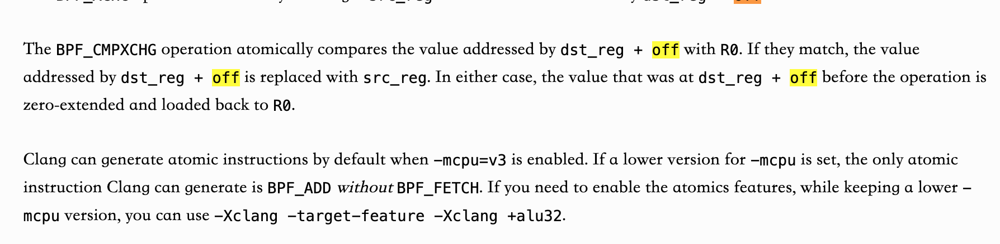

# BPF Documents

## 权威文档或开发记录

[kernel-tree](https://kernel.googlesource.com/pub/scm/linux/kernel/git/bpf/bpf-next)

[xdp meta 内核开发提交记录](https://git.kernel.org/pub/scm/linux/kernel/git/torvalds/linux.git/commit/?id=de8f3a83b0a0fddb2cf56e7a718127e9619ea3da)

[libbpf tc attach API](https://patchwork.kernel.org/project/netdevbpf/patch/20210512103451.989420-3-memxor@gmail.com/)

[eBPF指令集](https://docs.kernel.org/bpf/instruction-set.html)

eBPF启动原子操作 

[kernel5.6eBPF支持struct_ops和拥塞控制](https://lwn.net/Articles/811631/)

[kernel5.13eBPF支持调用内核函数](https://lwn.net/Articles/856005/)

[引入struct_ops的patch](https://lore.kernel.org/bpf/20191214004737.1652076-1-kafai@fb.com/)

[BTF kernel 文档](https://docs.kernel.org/bpf/btf.html)

[BPF Iterator 文档](https://docs.kernel.org/bpf/bpf_iterators.html)

[BPF kptr支持](https://lwn.net/Articles/900749/)

## 教程

[eBPF程序类型](https://arthurchiao.art/blog/bpf-advanced-notes-1-zh/)

[BTF简介与入门实践](https://www.containiq.com/post/btf-bpf-type-format)

[eBPF BTF kernel 文档的中文翻译](https://www.ebpf.top/post/kernel_btf/)

[BTF vmlinux功能概述](https://www.ebpf.top/post/intro_vmlinux_h/)

[eBPF ring buffer用法](https://www.ebpf.top/post/bpf_ring_buffer/)

[eBPF TCP相关程序类型教程sock_op, struct_op](https://arthurchiao.art/blog/bpf-advanced-notes-5-zh/)

## 问题定位&解决(stack overflow)

[tc 无法正确 redirect](https://stackoverflow.com/questions/63352978/why-dont-bpf-redirect-work-correctlyxdp)

[af_xdp](https://stackoverflow.com/questions/72329171/bpf-map-type-xskmap-element-not-set-even-though-xsk-socket-create-succeeds)

[af_xdp need wakeup](https://stackoverflow.com/questions/60828204/af-xdp-how-does-xdp-use-need-wakeup-work-e-g-how-to-reduce-ksoftirqd-load)

[Userspace程序的bpf_ktime_get_ns](https://stackoverflow.com/a/60976989)

## Linux源码相关

[Linux 内核API(看/写代码的时候，跨函数查阅)](https://www.kernel.org/doc/html/v5.19/core-api/index.html)

[Linux 内核源码在线阅读网站(支持宏，函数，变量的搜索)](https://elixir.bootlin.com/linux/latest/source)

[Linux 内核揭秘(Linunx inside汉化版)](https://github.com/MintCN/linux-insides-zh)

[Linux 性能调优和tracing工具使用思维导图(密码:linux)](https://www.processon.com/view/link/62ef5b4e0791292e9d378261#map)

[Linux 中断机制学习资料(softirq,tasklet)](https://www.cnblogs.com/arnoldlu/p/8659972.html)

[Linux workqueue CMWQ 介绍](https://www.jianshu.com/p/4f25d39fdff4)

[Linux 内核代码中的双向链表list_head介绍](https://www.linuxidc.com/Linux/2011-10/44627.htm)

[Linux 内核等待队列 Wait queue介绍](https://www.cnblogs.com/gctech/p/6872301.html)

[Linux rcu机制介绍(链表操作常见)](https://zhuanlan.zhihu.com/p/113999842)

[Linux kernel链表，字符串常见API](https://www.cnblogs.com/lifexy/p/10175143.html)

[Linux per cpu变量的原理及其实现(内含重新编译某个.o文件的方法)](https://zhuanlan.zhihu.com/p/340985476)

[Linux 内核内存回收机制](https://zhuanlan.zhihu.com/p/72998605)

[Linux cache机制(文章比较老但是看完能有一个大致的理解](https://developer.aliyun.com/article/338201)

[Linux 内核之旅-内核网络相关博客](http://kerneltravel.net/categories/%E5%86%85%E6%A0%B8%E7%BD%91%E7%BB%9C/)

[Linux zero-copy network](https://lwn.net/Articles/726917/.)

[Linux spin_lock和raw_spin_lock](https://blog.csdn.net/DroidPhone/article/details/7395983)

[Linux kernel run document](https://docs.kernel.org/RCU/whatisRCU.html#rcu-overview)

[Linux 内核变更记录总结](https://kernelnewbies.org/LinuxVersions)

[Linux 内存屏障](https://www.kernel.org/doc/Documentation/memory-barriers.txt)

## eBPF use case 
[使用EBPF来进行TCP拥塞控制](https://www.ebpf.top/post/ebpf_struct_ops/)

[MPTCP: Extending kernel functionality with eBPF and Netlink(使用eBPF的struct op来扩展MPTCP scheduler)](https://lpc.events/event/16/contributions/1354/)

## eBPF视频
[LPC2022 eBPF & Networking](https://www.youtube.com/watch?v=andvNRUAAs0&t=5237s)
